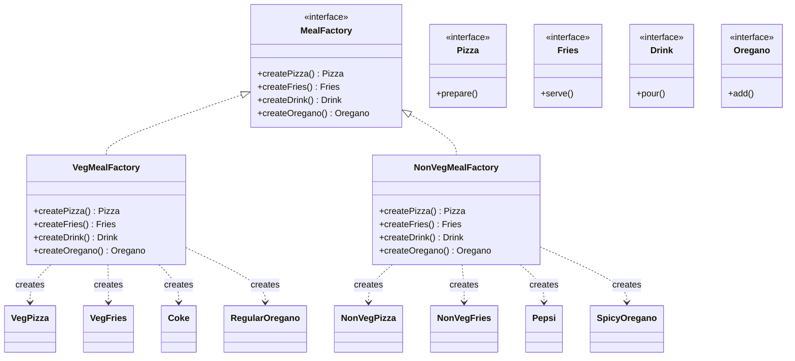

# Meal System - Abstract Factory Design Pattern

A simple demonstration of the Abstract Factory Design Pattern in Java for creating families of related food and drink items.

## Table of Contents
- [Overview](#overview)
- [Design Pattern](#design-pattern)
- [Problem Statement](#problem-statement)
- [Solution](#solution)
- [Project Structure](#project-structure)
- [Class Diagram](#class-diagram)
- [Implementation Details](#implementation-details)
- [How to Run](#how-to-run)
- [Example Output](#example-output)
- [Key Benefits](#key-benefits)
- [When to Use](#when-to-use)
- [Real-World Project Examples](#real-world-project-examples)


## Overview

This project demonstrates the Abstract Factory Design Pattern through a meal system that creates different types of meals (Veg and Non-Veg). Each meal consists of a Pizza, Fries, Drink, and Oregano. The abstract factory handles the creation of these related objects, ensuring they belong to the same "theme" (e.g., a Veg Pizza with Veg Fries and Coke).

## Design Pattern

**Pattern Type:** Creational Design Pattern

**Intent:** Provide an interface for creating families of related or dependent objects without specifying their concrete classes.

## Problem Statement

A restaurant system needs to create different sets of meals. A Veg Meal should consist of Veg Pizza, Veg Fries, Coke, and Regular Oregano, while a Non-Veg Meal should consist of Non-Veg Pizza, Non-Veg Fries, Pepsi, and Spicy Oregano.

**Challenges:**
- The system should be independent of how its products are created, composed, and represented.
- The system should be configured with one of multiple families of products.
- A family of related product objects is designed to be used together, and you need to enforce this constraint.

## Solution

The Abstract Factory Pattern provides:

- **Abstract Factory (MealFactory)**: Interface for operations that create abstract product objects.
- **Concrete Factory (VegMealFactory, NonVegMealFactory)**: Implements the operations to create concrete product objects.
- **Abstract Products (Pizza, Fries, Drink, Oregano)**: Interfaces for a type of product object.
- **Concrete Products**: Implement the Product interfaces (e.g., VegPizza, NonVegPizza).
- **Client**: Uses only interfaces declared by Abstract Factory and Abstract Product classes.

## Project Structure

```
src/
└── AbstractFactoryDesignDemo.java  # Contains all interfaces and implementations
```

## Class Diagram



## Implementation Details

### 1. Abstract Products

```java
interface Pizza {
    void prepare();
}

interface Fries {
    void serve();
}

interface Drink {
    void pour();
}

interface Oregano {
    void add();
}
```

### 2. Concrete Products (Veg Family)

```java
class VegPizza implements Pizza {
    public void prepare() {
        System.out.println("Preparing Veg Pizza");
    }
}

class VegFries implements Fries {
    public void serve() {
        System.out.println("Serving Veg Fries");
    }
}

class Coke implements Drink {
    public void pour() {
        System.out.println("Pouring Coke");
    }
}

class RegularOregano implements Oregano {
    public void add() {
        System.out.println("Adding Oregano");
    }
}
```

### 3. Concrete Products (Non-Veg Family)

```java
class NonVegPizza implements Pizza {
    public void prepare() {
        System.out.println("Preparing Chicken Pizza");
    }
}

class NonVegFries implements Fries {
    public void serve() {
        System.out.println("Serving Loaded Chicken Fries");
    }
}

class Pepsi implements Drink {
    public void pour() {
        System.out.println("Pouring Pepsi");
    }
}

class SpicyOregano implements Oregano {
    public void add() {
        System.out.println("Adding Spicy Oregano");
    }
}
```

### 4. Abstract Factory

```java
interface MealFactory {
    Pizza createPizza();
    Fries createFries();
    Drink createDrink();
    Oregano createOregano();
}
```

### 5. Concrete Factories

```java
class VegMealFactory implements MealFactory {
    public Pizza createPizza() { return new VegPizza(); }
    public Fries createFries() { return new VegFries(); }
    public Drink createDrink() { return new Coke(); }
    public Oregano createOregano() { return new RegularOregano(); }
}

class NonVegMealFactory implements MealFactory {
    public Pizza createPizza() { return new NonVegPizza(); }
    public Fries createFries() { return new NonVegFries(); }
    public Drink createDrink() { return new Pepsi(); }
    public Oregano createOregano() { return new SpicyOregano(); }
}
```

## How to Run

### Compilation

```bash
# Navigate to the src directory
cd src

# Compile the Java file
javac AbstractFactoryDesignDemo.java

# Run the demo class
java AbstractFactoryDesignDemo
```

## Example Output

```
Preparing Veg Pizza
Serving Veg Fries
Pouring Coke
Adding Oregano
Preparing Chicken Pizza
Serving Loaded Chicken Fries
Pouring Pepsi
Adding Spicy Oregano
```

## Key Benefits

- **Consistency**: Ensures that products from the same family are used together.
- **Isolation**: Concrete classes are isolated from the client.
- **Easy Product Exchange**: Changing a product family is easy (just use a different factory).
- **Promotes consistency among products**: Products from a family are designed to work together.

## When to Use

- When a system should be independent of how its products are created, composed, and represented.
- When a system should be configured with one of multiple families of products.
- When a family of related product objects is designed to be used together.
- When you want to provide a class library of products, and you want to reveal only their interfaces, not their implementations.

## Real-World Project Examples

Here are some real-world scenarios where the Abstract Factory pattern is commonly applied to handle families of related products:

### 1. Cross-Platform UI Widget Toolkit
* **Scenario**: An application needs to run on multiple operating systems (Windows, macOS, Linux) or support multiple visual themes (Light, Dark, High-Contrast), ensuring that buttons, text fields, and scrollbars look and behave consistently according to the environment.
* **Abstract Factory**: `UIWidgetFactory`
* **Concrete Factories**: `WindowsWidgetFactory`, `MacOSWidgetFactory`, `LinuxWidgetFactory`
* **Abstract Products**: `Button`, `TextField`, `ScrollBar`
* **Concrete Products**: `WindowsButton`, `MacOSButton`, `WindowsTextField`, `MacOSTextField`, etc.
* **Why it fits**: The application codebase remains OS-agnostic by using the `UIWidgetFactory` interface. The factory is instantiated dynamically at startup based on the detected operating system, guaranteeing that Windows buttons are never accidentally paired with macOS text fields.

### 2. Multi-Cloud Infrastructure Provisioner
* **Scenario**: A cloud deployment tool (like Terraform or a custom deployment agent) needs to provision computing instances, block storage, and virtual network components across multiple cloud providers (AWS, Google Cloud, Azure).
* **Abstract Factory**: `CloudResourceFactory`
* **Concrete Factories**: `AWSResourceFactory`, `GCPResourceFactory`, `AzureResourceFactory`
* **Abstract Products**: `ComputeInstance`, `StorageBucket`, `VirtualNetwork`
* **Concrete Products**:
  * AWS: `EC2Instance`, `S3Bucket`, `VPC`
  * GCP: `ComputeEngineInstance`, `CloudStorageBucket`, `VPCNetwork`
* **Why it fits**: The deployment engine handles the orchestrations using abstract interfaces. The target provider configuration selects the concrete factory, ensuring all created resources belong to the same cloud environment.

### 3. Database Abstraction Layer (ORM / Multi-Database Drivers)
* **Scenario**: A backend framework needs to support operations on multiple database systems (MySQL, PostgreSQL, Oracle) seamlessly. It must ensure that connection wrappers, query command executors, and transaction managers match the targeted engine.
* **Abstract Factory**: `DbFactory`
* **Concrete Factories**: `MySqlDbFactory`, `PostgreSqlDbFactory`, `OracleDbFactory`
* **Abstract Products**: `DbConnection`, `DbCommand`, `DbTransaction`
* **Concrete Products**: `MySqlConnection`, `MySqlCommand`, `PostgreSqlConnection`, `PostgreSqlCommand`, etc.
* **Why it fits**: It isolates the database-specific driver logic from the core business logic. Setting up database configuration instantiates the corresponding factory, ensuring that commands and connections are fully compatible.

### 4. Game Engine Theme Generators (World / Biome Builder)
* **Scenario**: An adventure game generates levels dynamically based on the current biome/theme (e.g., Space/Sci-Fi, Medieval/Fantasy, Post-Apocalyptic). Each biome contains a matching set of enemies, environmental hazards, background music, and treasure chests.
* **Abstract Factory**: `LevelThemeFactory`
* **Concrete Factories**: `SciFiThemeFactory`, `MedievalThemeFactory`, `ApocalypticThemeFactory`
* **Abstract Products**: `Enemy`, `Hazard`, `LootChests`, `SoundTrack`
* **Concrete Products**:
  * Medieval: `Orc`, `SpikeTrap`, `WoodenChest`, `MedievalThemeMusic`
  * Sci-Fi: `AlienCyborg`, `LaserGrid`, `SteelCrate`, `SynthWaveMusic`
* **Why it fits**: It prevents mixing themes (e.g., spawning a cybernetic alien inside a medieval castle). The level generator asks the factory to produce the elements of a level, guaranteeing theme consistency.

