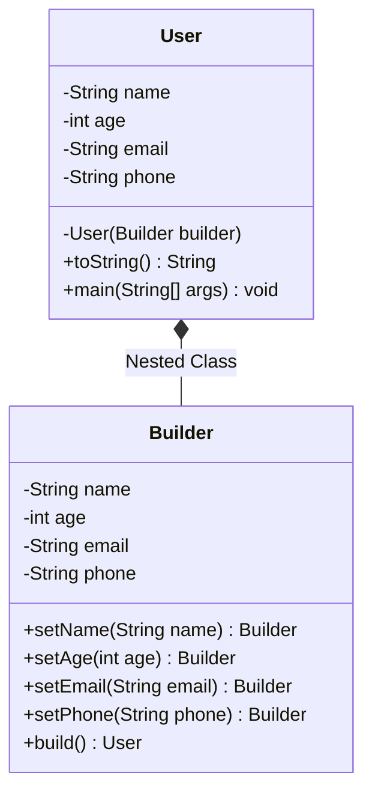

# User Creation System - Builder Design Pattern

A simple demonstration of the Builder Design Pattern in Java for creating complex objects step-by-step with safety, immutability, and validation.

## Table of Contents
- [Overview](#overview)
- [Design Pattern](#design-pattern)
- [Problem Statement](#problem-statement)
- [Solution](#solution)
- [Project Structure](#project-structure)
- [Class Diagram](#class-diagram)
- [Implementation Details](#implementation-details)
- [How to Run](#how-to-run)
- [Example Output](#example-output)
- [Key Benefits](#key-benefits)
- [When to Use](#when-to-use)
- [Real-World Project Examples](#real-world-project-examples)

## Overview

This project demonstrates the Builder Design Pattern using a `User` creation system. A `User` object has mandatory parameters (like `name` and `age`) and optional parameters (like `email` and `phone`). The nested `Builder` class allows constructing the `User` object incrementally, validating the state before instantiation, and ensuring the final object remains immutable.

## Design Pattern

**Pattern Type:** Creational Design Pattern

**Intent:** Separate the construction of a complex object from its representation so that the same construction process can create different representations.

## Problem Statement

When designing objects with numerous parameters (both optional and mandatory), developers often face the following design issues:
- **Telescoping Constructors**: Writing multiple constructor overloads to support different combinations of parameters. This becomes unmanageable and hard to maintain as parameters increase.
- **Unreadable Client Code**: Constructor calls with multiple parameters of the same type are prone to positioning errors (e.g., passing email in place of phone).
- **Mutator Pollution**: Using a default constructor and calling setters afterward makes the object mutable, risking thread-safety and allowing objects to exist in a partially-constructed or invalid state.

## Solution

The Builder Pattern addresses these challenges by:
- Creating a nested static `Builder` helper class that mimics the parameters of the outer class.
- Exposing fluent setter-like methods on the builder that return the builder instance (`return this`), enabling method chaining.
- Utilizing a private constructor in the target class (`User`) that accepts the `Builder` instance, preventing direct instantiation.
- Executing validation rules inside the builder's `build()` method to ensure the target object is only created when all constraints are satisfied.

## Project Structure

```
src/
└── User.java  # Contains the User class and its nested static Builder class
```

## Class Diagram



## Implementation Details

### User Class with Static Nested Builder

```java
public class User {

    private final String name;
    private final int age;
    private final String email;
    private final String phone;

    // Private constructor ensures instantiation only through the Builder
    private User(Builder builder) {
        this.name = builder.name;
        this.age = builder.age;
        this.email = builder.email;
        this.phone = builder.phone;
    }

    public static class Builder {

        private String name;
        private int age;
        private String email;
        private String phone;

        // Setter-like methods returning 'this' for method chaining
        public Builder setName(String name) {
            this.name = name;
            return this;
        }

        public Builder setAge(int age) {
            this.age = age;
            return this;
        }

        public Builder setEmail(String email) {
            this.email = email;
            return this;
        }

        public Builder setPhone(String phone) {
            this.phone = phone;
            return this;
        }

        // build() validates state and instantiates the concrete User
        public User build() {
            if (name == null) {
                throw new IllegalStateException("Name is required");
            }
            if (age <= 0) {
                throw new IllegalStateException("Age must be positive");
            }
            return new User(this);
        }
    }

    @Override
    public String toString() {
        return "User{name='" + name + "', age=" + age +
                ", email='" + email + "', phone='" + phone + "'}";
    }
}
```

### Client Usage

```java
User user = new User.Builder()
        .setName("Tushar")
        .setAge(25)
        .setEmail("tushar@gmail.com")
        .setPhone("9876543210")
        .build();
```

## How to Run

### Compilation

```bash
# Navigate to the src directory
cd src

# Compile the Java file
javac User.java

# Run the User class containing the main method
java User
```

## Example Output

```
User{name='Tushar', age=25, email='tushar@gmail.com', phone='9876543210'}
```

## Key Benefits

- **Immutability**: The target object's fields are declared `private final` with no setter methods, ensuring thread safety and preventing state corruption.
- **Readability & Fluency**: Client code reads like a sentence, making construction straightforward and less error-prone.
- **Single Responsibility Principle**: Isolates the construction logic and validation checks from the business logic of the target class.
- **Step-by-Step Construction**: Permits deferred execution where an object can be built across multiple steps or conditions and only built when ready.

## When to Use

- When an object has a large number of parameters (e.g., > 4), especially when many of them are optional.
- When you want to enforce immutability on a complex object after its creation.
- When object construction requires strict validation rules (e.g., validating dependent fields before instantiation).
- When the configuration of the object requires complex assembly or sub-components.

## Real-World Project Examples

### 1. HTTP Client Request Building (`java.net.http.HttpRequest`)
* **Scenario**: Modern HTTP client libraries need to construct requests containing headers, HTTP methods, body payload types, caching headers, authentication tokens, and timeout configurations.
* **Builder**: `HttpRequest.Builder`
* **Target Class**: `HttpRequest`
* **Why it fits**: Creating an HTTP request directly with a constructor would be unwieldy since headers, cookies, query parameters, and method types are optional. The builder allows constructing it incrementally (e.g., `.uri(...)`, `.header(...)`, `.POST(...)`) and builds a read-only request ready to be sent.

### 2. SQL Query Generator
* **Scenario**: Databases or ORM frameworks dynamically generate SQL queries based on client inputs. These queries need SELECT clauses, JOIN conditions, WHERE filters, ORDER BY specifications, and LIMIT offsets.
* **Builder**: `SqlQueryBuilder`
* **Target Class**: `SqlQuery`
* **Why it fits**: Instead of manipulating strings manually (which introduces SQL injection vulnerabilities and formatting bugs), a fluent builder interface (e.g., `.select("id", "name")`, `.from("users")`, `.where("age > 18")`) handles construction step-by-step and produces a clean, parameterized SQL string.

### 3. Document / Report Generator (e.g., PDF, HTML, Excel)
* **Scenario**: An application generates professional reports that contain headers, tables, charts, pagination, footers, custom page sizing, margins, and watermarks.
* **Builder**: `ReportBuilder`
* **Target Class**: `ReportDocument`
* **Why it fits**: Since reports vary widely, a builder pattern allows adding parts dynamically (e.g., `.addHeader("Monthly Sales Summary")`, `.addTable(salesData)`, `.includeWatermark("CONFIDENTIAL")`). The compiler or builder validates that the report layout rules are met before rendering.

### 4. Notification & Email Dispatcher
* **Scenario**: An enterprise notification module constructs messages sent to users. An email has standard properties (To, Subject, Body) and optional properties (CC, BCC, Attachments, Priority Level, HTML Template).
* **Builder**: `EmailNotificationBuilder`
* **Target Class**: `EmailNotification`
* **Why it fits**: The builder simplifies creating custom emails. The client can chain `.to("user@example.com")`, `.subject("Alert")`, and conditionally call `.attach(invoiceFile)` if an invoice is ready. The validation ensures that at least one recipient is specified before dispatching.
