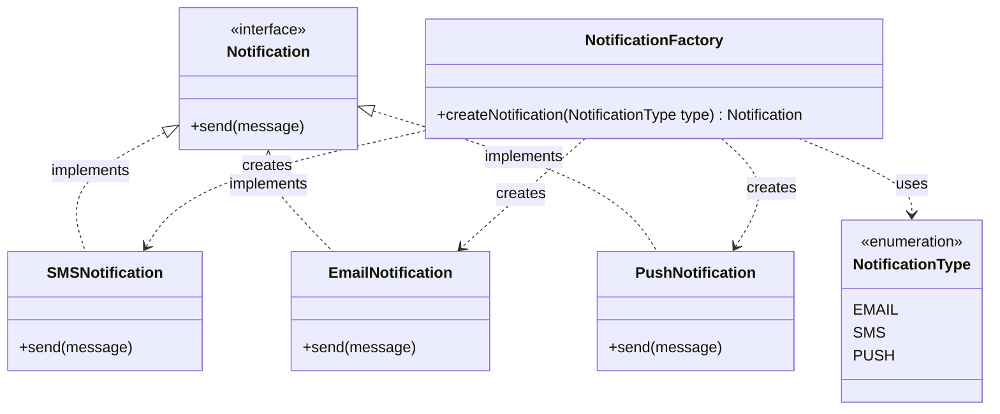

# Notification System - Factory Design Pattern

A simple demonstration of the Factory Design Pattern in Java for creating different types of notifications.

## Table of Contents
- [Overview](#overview)
- [Design Pattern](#design-pattern)
- [Problem Statement](#problem-statement)
- [Solution](#solution)
- [Project Structure](#project-structure)
- [Class Diagram](#class-diagram)
- [Implementation Details](#implementation-details)
- [How to Run](#how-to-run)
- [Example Output](#example-output)

## Overview

This project demonstrates the Factory Design Pattern through a notification system that creates SMS, Email, and Push notifications. The factory handles object creation logic, keeping the client code simple and decoupled.

## Design Pattern

**Pattern Type:** Creational Design Pattern

**Intent:** Define an interface for creating objects, but let subclasses decide which class to instantiate.

## Problem Statement

A notification system needs to send different types of notifications (SMS, Email, Push). Creating these objects directly in client code leads to tight coupling and makes it difficult to add new notification types.

**Challenges:**
- Client code shouldn't know about concrete notification classes
- Object creation logic should be centralized
- Adding new notification types shouldn't require changing client code

## Solution

The Factory Pattern provides:

- **Product Interface (Notification)**: Common interface for all notifications
- **Concrete Products**: SMS, Email, Push notification implementations
- **Factory (NotificationFactory)**: Creates notification objects based on type
- **Client**: Uses factory to get notifications without knowing concrete classes

## Project Structure

```
src/
└── FactoryPatternDemo.java  # Contains all interfaces, implementations, and enum
```

## Class Diagram



## Implementation Details

The entire implementation is encapsulated within a single file to keep the project clean and self-contained:

### 1. Notification Type Enum

```java
enum NotificationType {
    EMAIL,
    SMS,
    PUSH
}
```

### 2. Product Interface

```java
interface Notification {
    void send(String message);
}
```

### 3. Concrete Products

```java
class EmailNotification implements Notification {
    public void send(String message) {
        System.out.println("Sending Email: " + message);
    }
}

class SmsNotification implements Notification {
    public void send(String message) {
        System.out.println("Sending SMS: " + message);
    }
}

class PushNotification implements Notification {
    public void send(String message) {
        System.out.println("Sending Push Notification: " + message);
    }
}
```

### 4. Notification Factory

```java
class NotificationFactory {

    public static Notification createNotification(NotificationType type) {
        if (type == null) {
            throw new IllegalArgumentException("Notification type cannot be null");
        }

        switch (type) {
            case EMAIL:
                return new EmailNotification();
            case SMS:
                return new SmsNotification();
            case PUSH:
                return new PushNotification();
            default:
                throw new IllegalArgumentException("Unknown notification type: " + type);
        }
    }
}
```

### 5. Demo Application

```java
public class FactoryPatternDemo {

    public static void main(String[] args) {

        Notification notification =
                NotificationFactory.createNotification(NotificationType.EMAIL);

        notification.send("Welcome to our app!");

        Notification sms =
                NotificationFactory.createNotification(NotificationType.SMS);

        sms.send("Your OTP is 1234");
    }
}
```

## How to Run

### Compilation

```bash
# Navigate to the src directory
cd src

# Compile the Java file
javac FactoryPatternDemo.java

# Run the demo application
java FactoryPatternDemo
```

## Example Output

```
Sending Email: Welcome to our app!
Sending SMS: Your OTP is 1234
```

## Key Benefits

- **Encapsulation**: Object creation logic is centralized in one place.
- **Type Safety**: Using Java `enum` instead of raw strings prevents typos and ensures only valid types can be requested.
- **Loose Coupling**: Client code interacts with notifications solely via the `Notification` interface.
- **Easy Extension**: Adding a new channel only requires declaring a new enum value, implementing the `Notification` interface, and adding a case in the Factory.

## When to Use

- When you don't know the exact types of objects needed beforehand.
- When object creation logic is complex or subject to validation.
- When you want to centralize object creation to ensure modularity.
- When you need to decouple object creation from usage.