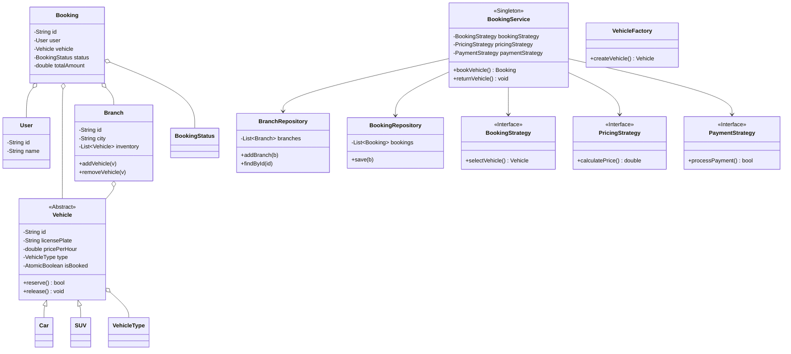
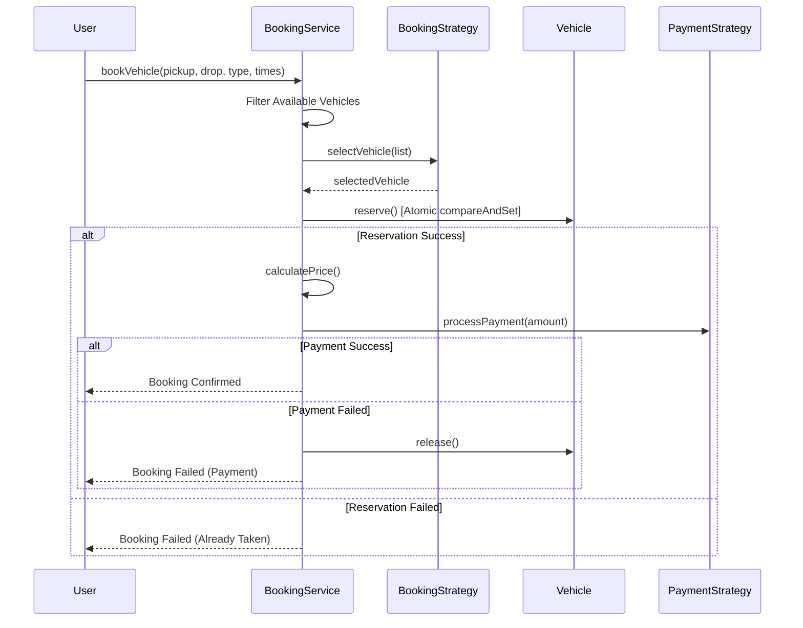

# Car Rental System Design - Interview Guide

## 30-Second Explanation

"I designed a distributed Car Rental System that manages vehicle inventory across multiple branches. The system utilizes the **Singleton Pattern** for a centralized Booking Service and the **Factory Pattern** for vehicle creation. To handle high-concurrency booking requests, I implemented an **Atomic State Management** strategy using `AtomicBoolean`, ensuring thread-safe reservations without the overhead of heavy locks. The system is highly flexible, using the **Strategy Pattern** for dynamic pricing, payment processing, and vehicle selection logic."

---

## Questions to Ask Interviewer

### Functional Requirements
1. Can a user pickup from one branch and return to another? (Requirement: Yes)
2. What vehicle types are supported? (Requirement: Car, SUV, etc.)
3. How is pricing calculated? (Requirement: Hourly with round-up logic)
4. Do we need to support different selection strategies? (e.g., Cheapest first)

### Non-Functional Requirements
1. How should we handle concurrent booking for the same car?
2. Is the system supposed to be extensible for new vehicle types?
3. Should we store booking history?

---

## Core Components

### Class Diagram



### Class Design

```text
BookingService (Singleton)
  - branchRepo, bookingRepo
  - bookVehicle(user, pickup, drop, type, times)
  - returnVehicle(bookingId)

Vehicle (Abstract)
  - id, licensePlate, pricePerHour, isBooked: AtomicBoolean
  - reserve(), release()

Branch
  - id, city, inventory: List<Vehicle>

Booking
  - id, user, vehicle, status, totalAmount

Strategies
  - PricingStrategy (Hourly, Distance)
  - BookingStrategy (Cheapest, LeastBooked)
  - PaymentStrategy (CreditCard, Cash)
```

---

## System Flow



---

## Design Patterns Used

### 1. Strategy Pattern
Used to decouple algorithms from the business logic.
- **Pricing**: `HourlyPricingStrategy` calculates fees based on duration.
- **Selection**: `CheapestFirstStrategy` finds the most economical option for the user.
- **Payment**: Supports multiple gateways like `CreditCardPayment`.

### 2. Factory Pattern
**VehicleFactory** centralizes the instantiation of concrete vehicle objects (`Car`, `SUV`), making it easy to add new types like `Truck` or `Bike` without changing the service logic.

### 3. Singleton Pattern
**BookingService** is a singleton to ensure a single, consistent point of truth for managing global bookings and inventory movements between branches.

---

## Expected Cross-Questions

### Q1: How do you prevent two people from booking the same car?

**Answer**:
Used `AtomicBoolean` for the `isBooked` property in the `Vehicle` class. The `reserve()` method uses `compareAndSet(false, true)`, which is an atomic hardware-level operation. If two threads call it simultaneously, only one will succeed and get `true`, while the other gets `false` and is notified that the vehicle is already taken.

### Q2: How does the "Round-Up" pricing logic work?

**Answer**:
In `HourlyPricingStrategy`, I calculate the duration in minutes and use `Math.ceil(minutes / 60.0)`. This ensures that even a 1-minute overstay results in an extra hour's charge, which is a common business requirement in car rentals.

### Q3: How do you handle a vehicle moving between branches?

**Answer**:
The `returnVehicle` method takes the `dropBranch` from the booking details. It removes the vehicle from the `pickupBranch` inventory and adds it to the `dropBranch` inventory, effectively updating the global state of the fleet.

### Q4: Why use setter injection for strategies instead of constructor?

**Answer**:
Setter injection allows for **runtime strategy swapping**. For example, the system could switch from "Cheapest First" to "Highest Rated" during a holiday season without restarting the service or re-instantiating the singleton.

---

## SOLID Principles Applied

1.  **SRP**: `Vehicle` manages its own availability state; `Branch` manages inventory; `BookingService` manages the flow.
2.  **OCP**: New vehicle types or pricing models can be added by implementing interfaces/extending classes.
3.  **LSP**: `Car` and `SUV` can be used interchangeably wherever a `Vehicle` is expected.
4.  **DIP**: `BookingService` depends on `PricingStrategy` interface, not a concrete implementation.

---

## Summary - One Line Answer

"I built a thread-safe car rental system using AtomicBoolean for concurrency, Strategy pattern for flexible pricing/selection, and a Factory for extensible vehicle management across multiple branches."
