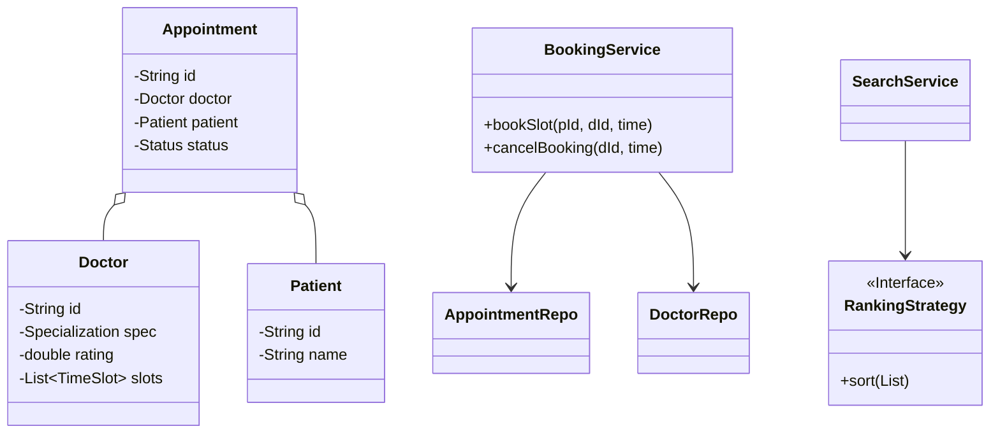
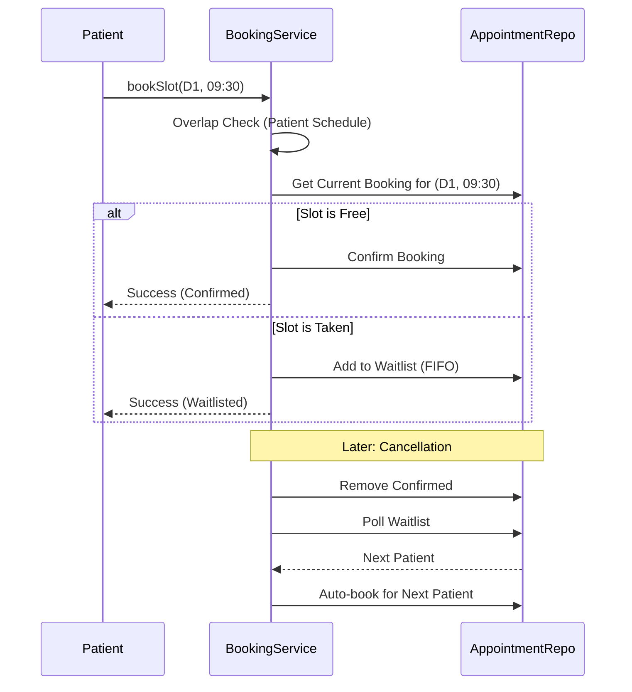

# FlipMed - Doctor Appointment Booking System

## 30-Second Explanation

"I designed FlipMed, a specialized doctor appointment platform for machine coding rounds. The system features a **Layered Architecture** with in-memory repositories. Key highlights include a **Strategy Pattern** for dynamic search ranking (Time vs Rating), an **Atomic-like Waitlist Management** system for high-concurrency slots, and automated **Waitlist Promotion** upon cancellations. It strictly enforces business constraints such as preventing patient overlaps and ensuring FIFO order for waiting queues."

---

## Architecture & Diagrams

### Class Diagram

### Booking & Waitlist Flow

---

## Design Patterns Used

### 1. Strategy Pattern
**RankingStrategy**: Decouples the sorting logic from the search service. This allows switching between `RatingRankingStrategy` (Rating Desc) and `TimeRankingStrategy` (Time Asc) at runtime, essential for flexible search results.

### 2. Repository Pattern
Uses in-memory `HashMap` storage to decouple data persistence from business logic, making the system easily adaptable for future database integration.

---

## Expected Cross-Questions

### Q1: How do you handle patient overlapping appointments?
**Answer**: Before any booking is confirmed, the `BookingService` performs an `overlap check` by iterating through the patient's existing confirmed appointments for the day. If a booking exists with the same `startTime`, a custom `FlipMedException` is thrown.

### Q2: How does the automatic Waitlist Promotion work?
**Answer**: When `cancelBooking` is called, the system immediately polls the FIFO queue associated with that specific `Doctor + StartTime`. If a patient is found, a new `Appointment` is generated and saved automatically, ensuring the slot is never wasted.

### Q3: Why use a composite key (DoctorID + StartTime) for appointments?
**Answer**: Since appointments are unique to a doctor and a specific time, this key allows for $O(1)$ lookups when checking slot availability or processing cancellations, significantly improving performance over list-based searching.

### Q4: How would you make this thread-safe for a production environment?
**Answer**: I would replace the standard `HashMap` with `ConcurrentHashMap` and use `ReentrantLocks` or `synchronized` blocks around the booking critical section to prevent race conditions where two patients might book the same slot simultaneously.

---

## Summary - One Line Answer

"I built an extensible appointment system using Strategy and Repository patterns, featuring automated FIFO waitlist management and strict schedule validation."
