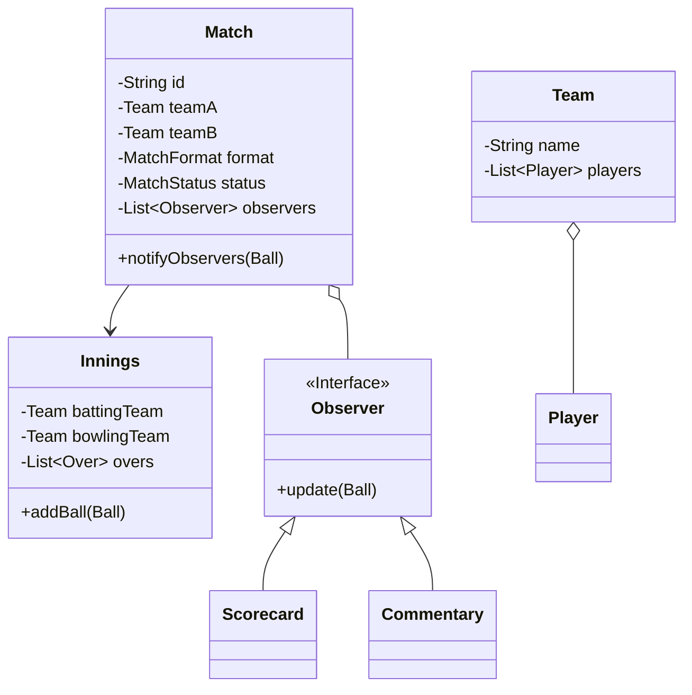
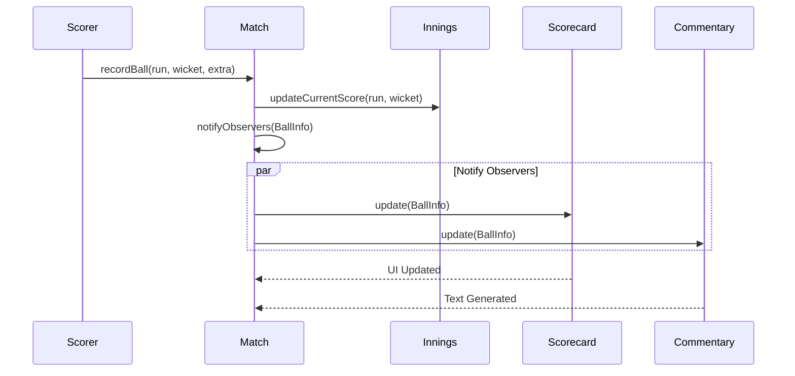

# CricBuzz - Live Scoreboard System

## 30-Second Explanation

"I designed a real-time cricket scoreboard system using an **Event-Driven Architecture**. The core of the system is built on the **Observer Pattern**, where a single ball event triggers automatic updates to the scorecard, commentary, and statistics modules. I utilized the **Strategy Pattern** to handle various match formats (T20, ODI, Test) and the **State Pattern** to manage the match lifecycle. This ensures that the system is highly extensible, allowing new formats or display elements to be added without modifying the core scoring logic."

---

## Architecture & Diagrams

### Class Diagram

### Ball Update Flow (Observer Pattern)

---

## Design Patterns Used

### 1. Observer Pattern
The **Match** (Subject) maintains a list of **Display Elements** (Observers). When a ball is bowled, the Match notifies all observers, allowing the Scorecard and Commentary to update independently and concurrently.

### 2. Strategy Pattern
**MatchFormatStrategy**: Handles the variation in rules between T20, ODI, and Test matches (e.g., maximum overs, balls per over, innings count).

### 3. State Pattern
Manages the transition of the match through states like `SCHEDULED`, `IN_PROGRESS`, `INNINGS_BREAK`, and `COMPLETED`, ensuring that scoring only happens when the match is live.

---

## Expected Cross-Questions

### Q1: How do you handle "Extras" like No-Balls or Wides?
**Answer**: I treat `Ball` as a rich object that contains flags for extras. If a No-Ball occurs, the `Innings` logic ensures the ball count doesn't increment, while the `Scorecard` observer adds the penalty run to the total.

### Q2: How do you manage strike rotation?
**Answer**: Strike rotation is part of the `Innings` state. After every odd number of runs or at the end of an over (6 legitimate balls), the system swaps the `Striker` and `Non-Striker` references within the `Innings` object.

### Q3: How would you scale this for millions of concurrent viewers?
**Answer**: In a production environment, the `notifyObservers` would push events to a message broker like **Kafka** or **Redis Pub/Sub**. Frontend clients would then receive updates via **WebSockets**, preventing the core scoring engine from being bogged down by display logic.

### Q4: How do you handle "Undo" for a wrong entry?
**Answer**: I would implement the **Memento Pattern** or a **Command Pattern** with a stack. Each ball would be a Command object that can be "undone," reverting the state of the Innings and triggering a "Correction" event to the observers.

---

## Summary - One Line Answer

"I built a decoupled, event-driven scoreboard system using the Observer pattern to ensure real-time consistency across scorecard and commentary feeds."
