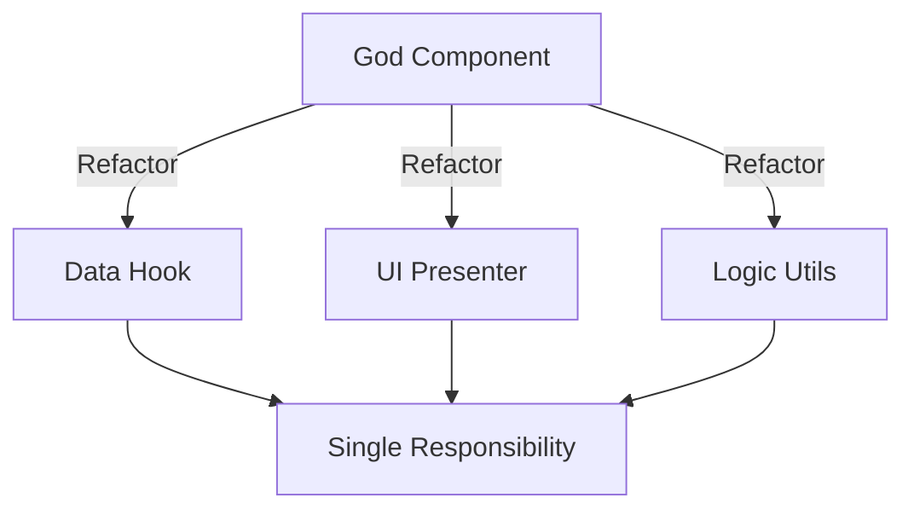

# [Topic 1 of 41] — SRP (Single Responsibility Principle)

## 1. PROBLEM
In frontend development, we often create "God Components" that handle data fetching, state management, complex business logic, and UI rendering all in one file. This makes the component nearly impossible to test, reuse, or debug when something breaks.

## 2. CONCEPT
The Single Responsibility Principle states that a module, class, or function should have only one reason to change. In React terms, a component should do one thing: either manage data, handle layout, or display specific UI elements.

## 3. REAL-WORLD FRONTEND EXAMPLE
**React Custom Hooks vs Components:** Instead of a `UserList` component fetching API data and rendering the list, we move the API logic to a `useUsers` hook and the rendering to a `UserView` component.

## 4. CODE EXAMPLE (React + TypeScript)

```typescript
// 1. Data Responsibility (Custom Hook)
const useUsers = () => {
  const [users, setUsers] = React.useState([]);
  React.useEffect(() => {
    fetch("/api/users").then(res => res.json()).then(setUsers);
  }, []);
  return { users };
};

// 2. Formatting Responsibility (Utility)
const formatUserName = (name: string) => name.toUpperCase();

// 3. Rendering Responsibility (UI Component)
const UserList = () => {
  const { users } = useUsers();
  return (
    <ul>
      {users.map(user => (
        <li key={user.id}>{formatUserName(user.name)}</li>
      ))}
    </ul>
  );
};
```

## 5. WHEN TO USE [YES]
- When a component exceeds 100-150 lines of code.
- When you find yourself writing the same logic (like API calls) in multiple components.
- When you want to unit test logic without rendering the DOM.

## 6. WHEN NOT TO USE [NO]
- For extremely simple components (e.g., a static Button or Label).
- Over-engineering small projects where "one-file-per-feature" is faster to maintain.

## 7. CONNECTS TO
- **Container / Presentational Pattern** (Direct implementation of SRP).
- **Custom Hook Pattern**.
- **Facade Pattern** (To hide complex logic behind a simple interface).

## 8. INTERVIEW QUESTIONS

### BEGINNER
**Q: What does SRP mean in the context of a React component?**
**Ideal Answer:** It means a component should have one primary responsibility. If a component is fetching data, sorting that data, and styling it, it has three reasons to change. SRP suggests splitting these into a Hook (fetching), a Utility function (sorting), and a View component (styling).

### INTERMEDIATE
**Q: How does SRP improve the testability of a frontend application?** [FIRE]
**Ideal Answer:** By separating logic from UI, we can write pure unit tests for logic (like formatting or calculation) without needing a heavy DOM testing library. For example, testing a `formatCurrency` utility is much faster and more reliable than testing a `PriceDisplay` component that includes the formatting logic internally.

### ADVANCED
**Q: You are refactoring a legacy "Dashboard" component that is 2000 lines long. How do you apply SRP without breaking the system?**
**Ideal Answer:** I would follow a "bottom-up" approach: 
1. Extract pure utility functions (date formatting, math).
2. Identify independent UI chunks and turn them into atomic components.
3. Move state management and API calls into custom hooks.
4. Use a Mediator or a Main Dashboard component to simply compose these small parts together. This minimizes risk as each extracted part can be verified independently.

### RAPID FIRE
1. **Q: Does SRP increase the number of files in a project?** 
   A: Yes, but it decreases the complexity of each individual file.
2. **Q: Can a single file have multiple responsibilities if they are small?** 
   A: Technically yes, but it risks growing into a "God file." It's better to separate early.
3. **Q: Is SRP the same as "Separation of Concerns"?** 
   A: They are closely related; SoC is the goal, SRP is the principle to achieve it.

---

## VISUALIZATION


