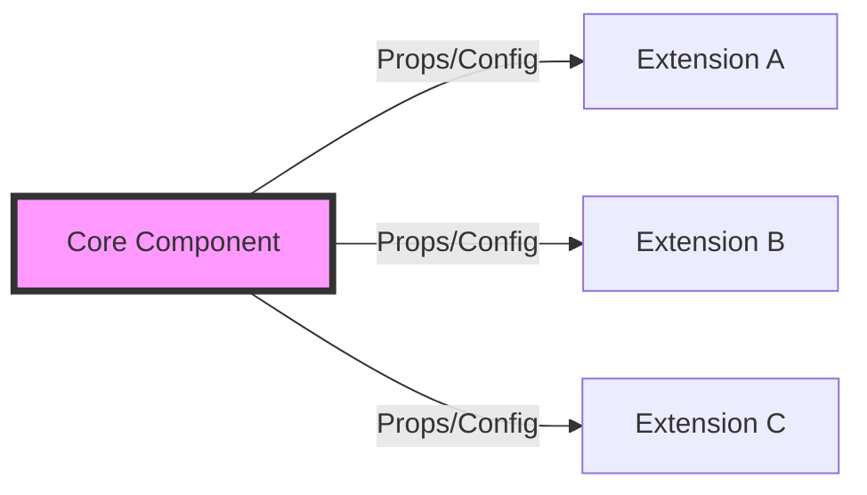

# [Topic 2 of 41] — OCP (Open/Closed Principle)

## 1. PROBLEM
Every time we want to add a new feature (like a new type of button or a new chart type), we have to open the existing component and add more `if/else` or `switch` cases. This risks breaking existing functionality that was already working.

## 2. CONCEPT
Software entities (components, modules) should be **Open for extension** but **Closed for modification**. You should be able to add new behavior without touching the original source code of the component.

## 3. REAL-WORLD FRONTEND EXAMPLE
**UI Component Libraries:** A `Button` component that accepts a `variant` prop or a `Theme` provider. You don't edit the `Button.tsx` file to add a "Ghost" style; you extend it via props or higher-order components.

## 4. CODE EXAMPLE (React + TypeScript)
See [OCPExample.tsx](file:///c:/Users/tushar.seth/Desktop/LLD/Frontend%20Low%20Level%20Design/1.%20Design%20Principles/02-OCP/OCPExample.tsx) for the implementation.

```typescript
interface RoleProps {
  label: string;
  icon: string;
}

// Component is CLOSED for modification
const RoleBadge = ({ label, icon }: RoleProps) => (
  <span>{icon} {label}</span>
);

// OPEN for extension via composition
const AdminBadge = () => <RoleBadge label="Admin" icon="shield" />;
```

## 5. WHEN TO USE [YES]
- When creating reusable library components (Buttons, Inputs, Modals).
- When handling multiple variations of a feature (e.g., different payment methods).
- When building a plugin-based architecture.

## 6. WHEN NOT TO USE [NO]
- For one-off components that will never have variants.
- If the "extension" logic becomes so complex that it's harder to read than a simple `if`.

## 7. CONNECTS TO
- **Strategy Pattern**
- **Decorator Pattern**
- **Compound Components**

## 8. INTERVIEW QUESTIONS

### BEGINNER
**Q: What does "Open for extension, Closed for modification" mean?**
**Ideal Answer:** It means we should design our components so that new features can be added by adding new code (extending), rather than changing the code that already exists and is tested (modifying).

### INTERMEDIATE
**Q: How do React 'Props' and 'Composition' help in following OCP?** [FIRE]
**Ideal Answer:** Props allow us to pass data and even other components (composition) into a parent. Instead of hardcoding a `Header` inside a `Layout`, we can pass a `header` prop. This makes the `Layout` component closed for modification but open for extension.

### ADVANCED
**Q: Design a notification system that supports Toast, Modal, and Email alerts using OCP.**
**Ideal Answer:** I would create a `NotificationProvider` that accepts a `strategy` object. Each notification type would implement a common `NotificationStrategy` interface. To add a new type, I wouldn't touch the Provider; I'd just create a new strategy and pass it in.

### RAPID FIRE
1. **Q: Does OCP prevent all bug regressions?** 
   A: No, but it significantly reduces them by isolating new changes.
2. **Q: Is a switch-case statement always a violation of OCP?** 
   A: Yes, if it lives inside a core component that must be edited to add new cases.
3. **Q: Can HOCs help with OCP?** 
   A: Yes, they wrap components to add behavior without modifying the original.

---

## VISUALIZATION


