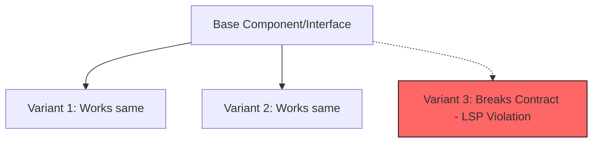

# [Topic 3 of 41] — LSP (Liskov Substitution Principle)

## 1. PROBLEM
We often create component hierarchies where a child component (subclass) breaks the expectations of the parent. For example, a `PrimaryButton` that suddenly requires a mandatory `onClick` while the base `Button` makes it optional. This causes runtime errors when components are swapped.

## 2. CONCEPT
Objects of a superclass should be replaceable with objects of its subclasses without breaking the application. In React, this means if Component B extends Component A, B should be able to do everything A does without changing the behavior in a way that surprises the caller.

## 3. REAL-WORLD FRONTEND EXAMPLE
**React Prop Spreading:** If you build a custom `Input` component that wraps a native `<input>`, it should support all standard HTML input props (like `onChange`, `value`, `placeholder`). If your custom input breaks `onChange`, it violates LSP.

## 4. CODE EXAMPLE (React + TypeScript)
See [LSPExample.tsx](file:///c:/Users/tushar.seth/Desktop/LLD/Frontend%20Low%20Level%20Design/1.%20Design%20Principles/03-LSP/LSPExample.tsx) for the implementation.

```typescript
// Base Props
interface BasicButtonProps {
  label: string;
  onClick: () => void;
}

// VIOLATION: SecureButton requires 'token' and crashes if called like a BasicButton
// COMPLIANCE: Ensure subclasses/variants honor the base contract

const BasicButton = ({ label, onClick }: BasicButtonProps) => (
  <button onClick={onClick}>{label}</button>
);

// This is safe because it still accepts the base props
const LoadingButton = ({ label, onClick, isLoading }: BasicButtonProps & { isLoading: boolean }) => (
  <button onClick={onClick} disabled={isLoading}>
    {isLoading ? "Loading..." : label}
  </button>
);
```

## 5. WHEN TO USE [YES]
- When creating "wrapper" components for UI libraries or native HTML elements.
- When using inheritance (rare in modern React, but common in class-based or OOP logic).
- When implementing polymorphism (swapping one component for another).

## 6. WHEN NOT TO USE [NO]
- If two components are fundamentally different (e.g., a `Button` and a `Link`). Don't force them into the same hierarchy just because they look similar.

## 7. CONNECTS TO
- **Adapter Pattern**
- **Composite Pattern**
- **Interface Segregation Principle**

## 8. INTERVIEW QUESTIONS

### BEGINNER
**Q: What is the core idea of LSP?**
**Ideal Answer:** It means that if you have a base component, any specialized version of it should be able to stand in its place without the parent component or the caller knowing the difference.

### INTERMEDIATE
**Q: Why is 'prop spreading' (e.g., ...props) important for LSP in React?** [FIRE]
**Ideal Answer:** It ensures that the wrapper component remains compatible with the underlying element. If I wrap a native `button`, spreading props ensures that standard attributes like `type`, `aria-label`, or `form` still work, preserving the "contract" of a button.

### ADVANCED
**Q: How do you handle a situation where a subclass needs to restrict a behavior of the parent (e.g., a ReadOnlyInput)?**
**Ideal Answer:** Technically, restricting behavior can violate LSP if the caller expects a writable input. Instead of inheritance, I would use **Composition**. I would create a base `Display` component and have both `Input` and `ReadOnlyView` use it, rather than having `ReadOnlyInput` inherit from and "break" a regular `Input`.

### RAPID FIRE
1. **Q: Is LSP only for Class-based components?** 
   A: No, it applies to any interface or prop-contract in functional React too.
2. **Q: Does LSP encourage composition over inheritance?** 
   A: Yes, because inheritance often leads to LSP violations in UI development.
3. **Q: What happens if you violate LSP?** 
   A: You get "surprise" bugs where swapping a component causes a crash or unexpected state.

---

## VISUALIZATION


