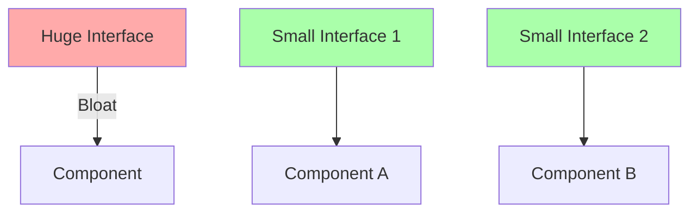

# Topic 4: Interface Segregation Principle (ISP)

## 1. PROBLEM
Components often receive massive "God Objects" as props (e.g., a full `User` object). This makes the component tightly coupled to the data structure, harder to test, and causes unnecessary re-renders when unrelated fields change.

## 2. CONCEPT
A component should only know about the props it actually needs to function. Split large interfaces into smaller, specific ones. It is better to have many small, specific interfaces than one large, general-purpose one.

## 3. REAL-WORLD FRONTEND EXAMPLE
**Profile Card:** Instead of passing the whole `User` object (with email, address, password), create a `ProfileCardProps` that only includes `name` and `avatarUrl`.

## 4. CODE EXAMPLE (React + TypeScript)
See [ISPExample.tsx](file:///c:/Users/tushar.seth/Desktop/LLD/Frontend%20Low%20Level%20Design/1.%20Design%20Principles/04-ISP/ISPExample.tsx) for the implementation.

```typescript
// VIOLATION: Forced to pass the entire User object
interface User {
  id: string;
  name: string;
  avatar: string;
  settings: any; // and 50 other fields
}

const UserTitle = ({ user }: { user: User }) => <h1>{user.name}</h1>;

// COMPLIANCE: Segregated Interface
interface NameOnly {
  name: string;
}

const BetterUserTitle = ({ name }: NameOnly) => <h1>{name}</h1>;
```

## 5. WHEN TO USE
- When a component is becoming a "Prop-Junkie" (taking in huge objects).
- When you want to use the same component with different types of data.
- When building highly decoupled systems.

## 6. WHEN NOT TO USE
- If splitting interfaces leads to extreme "Prop Drilling" where you have to manually map 20 fields one by one. In that case, passing a well-defined sub-object might be cleaner.

## 7. CONNECTS TO
- **DIP (Dependency Inversion)**
- **SRP (Single Responsibility)**
- **Composite Pattern**

## 8. INTERVIEW QUESTIONS

### BEGINNER
**Q: What does ISP solve in React?**
**Ideal Answer:** It prevents components from being tightly coupled to large data structures. By only asking for the props they need, components become easier to test, mock, and reuse across different parts of the app.

### INTERMEDIATE
**Q: How does ISP help with performance in React?**
**Ideal Answer:** While ISP is primarily an architecture principle, it helps performance by reducing unnecessary re-renders. If a component depends on a large `user` object and you update the `user.lastLogin` field, a component that only needs `user.name` might still re-render if not optimized. If it only accepted `name` as a prop, it's easier to see exactly when it needs to update.

### ADVANCED
**Q: You have a "Smart Component" (Container) that fetches a massive JSON response. How do you distribute this data to "Dumb Components" (Presentational) using ISP?**
**Ideal Answer:** I would use **Destructuring** and **Data Mapping**. Instead of passing the whole JSON to every child, the Container should be responsible for picking the specific fields each child needs. This ensures the children are segregated from the API response structure.

### RAPID FIRE
1. **Q: Is ISP mostly a TypeScript concern?** 
   A: It's a design concern, but TypeScript makes it explicit via interfaces.
2. **Q: Does ISP lead to more interfaces?** 
   A: Yes, but they are smaller and more meaningful.
3. **Q: Can ISP be applied to Custom Hooks?** 
   A: Absolutely. A hook should return only the values/methods the caller needs.

---

## VISUALIZATION


