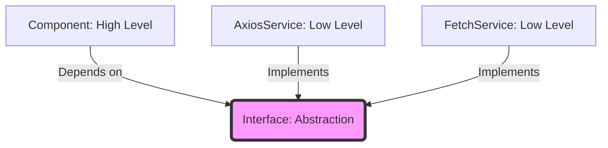

# Topic 5: Dependency Inversion Principle (DIP)

## 1. PROBLEM
In traditional development, high-level modules (UI components) often depend directly on low-level modules (API callers, storage engines, specific libraries). If you change your API library from `axios` to `fetch`, or your database from Firebase to Supabase, you have to rewrite your UI components. This makes the system rigid and hard to test.

## 2. CONCEPT
1. High-level modules should not depend on low-level modules. Both should depend on **abstractions**.
2. Abstractions should not depend on details. Details (concrete implementations) should depend on abstractions.

In React, this often means passing services, handlers, or configurations as props (Dependency Injection) or using Context/Providers to inject behavior.

## 3. REAL-WORLD FRONTEND EXAMPLE
**Logging Service:** Instead of every component calling `console.log()` or `Sentry.captureException()`, they should depend on a `Logger` interface. You can then inject a `ConsoleLogger` for development and a `SentryLogger` for production without changing any component logic.

## 4. CODE EXAMPLE (React + TypeScript)
See [DIPExample.tsx](file:///c:/Users/tushar.seth/Desktop/LLD/Frontend%20Low%20Level%20Design/1.%20Design%20Principles/05-DIP/DIPExample.tsx) for the implementation.

```typescript
// Component depends on an interface (Abstraction)
interface StorageService {
  save: (key: string, value: any) => void;
}

const UserProfile = ({ storage }: { storage: StorageService }) => {
  const saveName = (name: string) => storage.save('user_name', name);
  return <button onClick={() => saveName('Tushar')}>Save</button>;
};

// We can pass LocalStorageService or MockStorageService
```

## 5. WHEN TO USE
- When your code interacts with external systems (API, LocalStorage, Analytics).
- When you want to make components easily testable using Mocks.
- When you anticipate switching libraries or providers in the future.

## 6. WHEN NOT TO USE
- For extremely simple, one-off logic that will never change or be tested.
- If over-abstracting leads to "Indirection Hell" where it's hard to follow the actual execution flow.

## 7. CONNECTS TO
- **Strategy Pattern** (DIP is often implemented using Strategy).
- **Dependency Injection** (The technique to achieve DIP).
- **Provider Pattern** (React's way of injecting dependencies deep into the tree).

## 8. INTERVIEW QUESTIONS

### BEGINNER
**Q: What is the main benefit of DIP?**
**Ideal Answer:** Decoupling. By depending on abstractions rather than specific implementations, you make your code more flexible and easier to test.

### INTERMEDIATE
**Q: How does DIP facilitate Unit Testing in React?**
**Ideal Answer:** It allows you to "mock" dependencies. If a component depends on an API service passed as a prop, you can pass a fake service that returns static data during tests, avoiding real network calls.

### ADVANCED
**Q: Compare DIP with Dependency Injection (DI). Are they the same?**
**Ideal Answer:** No. DIP is the *principle* (the high-level design goal), while DI is a *pattern/technique* used to achieve that goal. In React, we use props, context, or specialized libraries like `InversifyJS` to perform DI.

### RAPID FIRE
1. **Q: Does DIP make code more complex?** 
   A: Initially yes, due to the need for interfaces, but it reduces long-term maintenance complexity.
2. **Q: Is React Context an implementation of DIP?** 
   A: It is a tool that enables DIP by allowing us to inject dependencies without prop-drilling.
3. **Q: Should every function use DIP?** 
   A: No, only those that interact with complex logic or external systems.

---

## VISUALIZATION


