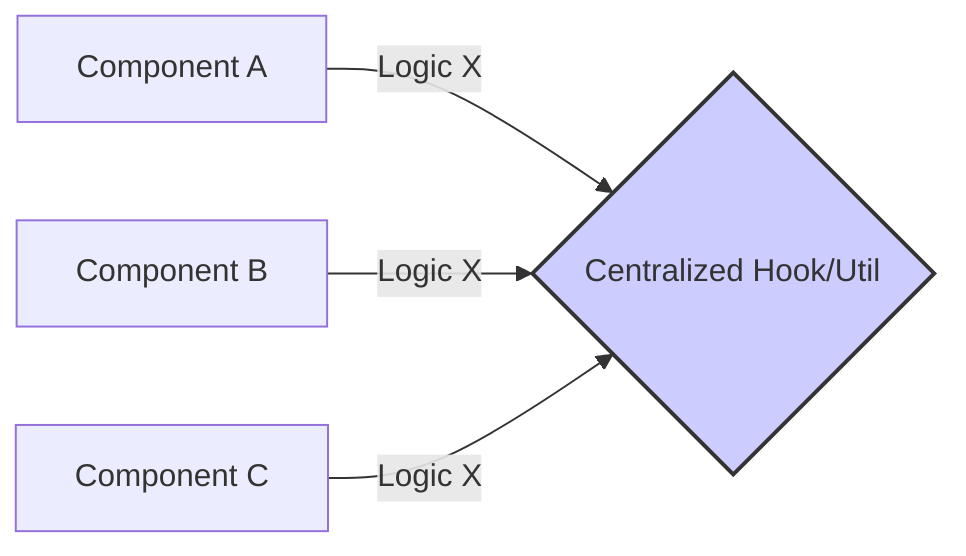

# Topic 6: DRY (Don't Repeat Yourself)

## 1. PROBLEM
Duplicated code is the root of most bugs. If you have the same validation logic in five different forms, and the business rules change, you must remember to update all five places. Missing even one leads to inconsistent behavior and difficult-to-trace errors.

## 2. CONCEPT
"Every piece of knowledge must have a single, unambiguous, authoritative representation within a system."

In Frontend development, DRY applies to:
- **UI Logic:** Move shared logic into Custom Hooks.
- **Utilities:** Centralize formatting, math, or date logic into pure functions.
- **Styling:** Use design tokens and shared CSS classes/components.
- **API:** Centralize request headers and error handling in a single service layer.

## 3. REAL-WORLD FRONTEND EXAMPLE
**Form Validation:** Instead of writing `if (!email.includes('@'))` in every component, create a `validateEmail` utility or a `useForm` hook that handles validation rules in one place.

## 4. CODE EXAMPLE (React + TypeScript)
See [DRYExample.tsx](file:///c:/Users/tushar.seth/Desktop/LLD/Frontend%20Low%20Level%20Design/1.%20Design%20Principles/06-DRY/DRYExample.tsx) for the implementation.

```typescript
// Shared logic in a hook
const useLocalStorage = (key: string) => {
  const [val, setVal] = useState(localStorage.getItem(key));
  const update = (newVal: string) => {
    localStorage.setItem(key, newVal);
    setVal(newVal);
  };
  return [val, update];
};

// Used in multiple components without repeating logic
const ComponentA = () => {
  const [theme, setTheme] = useLocalStorage('theme');
  // ...
};
```

## 5. WHEN TO USE
- When you find yourself copy-pasting code.
- When multiple components share the same business rules or data processing.
- When you want to ensure consistency across the application.

## 6. WHEN NOT TO USE
- **Premature Abstraction:** Don't try to make everything generic before you've seen the duplication at least 2-3 times (Rule of Three).
- **Coupling unrelated things:** Just because two components look the same doesn't mean they share the same responsibility. Forcing them into a single "DRY" component can make future changes impossible if their paths diverge.

## 7. CONNECTS TO
- **Custom Hook Pattern** (The primary tool for DRY in React).
- **Utility Functions** (Standard JavaScript centralization).
- **Higher-Order Components (HOC)** (An older way to share logic).

## 8. INTERVIEW QUESTIONS

### BEGINNER
**Q: What is the main goal of DRY?**
**Ideal Answer:** Maintainability. By having logic in one place, you only have to fix bugs or add features in one place, reducing the chance of regressions.

### INTERMEDIATE
**Q: What is the "Rule of Three" in DRY?**
**Ideal Answer:** It suggests that you should only abstract code after you've duplicated it three times. Doing it sooner often leads to over-engineering and "Wrong Abstractions" that are harder to fix than duplicated code.

### ADVANCED
**Q: When is duplication better than abstraction?** [FIRE]
**Ideal Answer:** When the abstraction creates tight coupling between two unrelated features. If two components happen to have the same styling but serve different business purposes, forcing them into a single "DryComponent" will break when one feature needs a change that the other doesn't. In this case, "A little duplication is better than a little coupling."

### RAPID FIRE
1. **Q: Is DRY only about code?** 
   A: No, it's about knowledge and logic. Documentation and database schemas should also be DRY.
2. **Q: Does DRY increase the number of abstractions?** 
   A: Yes, it usually introduces hooks, utils, or services.
3. **Q: Can DRY improve bundle size?** 
   A: Yes, by reusing code instead of repeating it, you can reduce the total KBs shipped.

---

## VISUALIZATION


