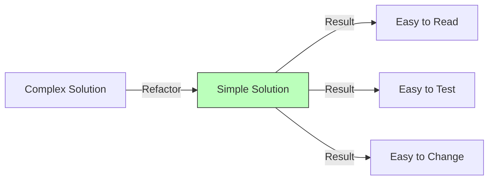

# Topic 7: KISS (Keep It Simple, Stupid)

## 1. PROBLEM
Developers often try to show off by using complex patterns, deep inheritance, or "clever" one-liners. This leads to code that is hard to read for others (or even your future self). Over-engineered systems are brittle, take longer to build, and are much harder to debug when things go wrong.

## 2. CONCEPT
"Most systems work best if they are kept simple rather than made complicated."

In React, KISS means:
- **State Management:** Use `useState` before reaching for Redux or XState.
- **Components:** Write simple functions before using HOCs or Render Props.
- **Logic:** Use simple `if/else` instead of complex bitwise operations or nested ternary operators.
- **Styling:** Use standard CSS/Flexbox before introducing complex animation libraries or heavy UI frameworks.

## 3. REAL-WORLD FRONTEND EXAMPLE
**Conditional Rendering:** Instead of a complex object mapping with dynamic keys to render different components, a simple `if` or `switch` statement is often more readable and easier to modify for the next developer.

## 4. CODE EXAMPLE (React + TypeScript)
See [KISSExample.tsx](file:///c:/Users/tushar.seth/Desktop/LLD/Frontend%20Low%20Level%20Design/1.%20Design%20Principles/07-KISS/KISSExample.tsx) for the implementation.

```typescript
// VIOLATION: Overly "clever" and hard to read
const status = ['Inactive', 'Active', 'Pending'][state === 'active' ? 1 : state === 'pending' ? 2 : 0];

// COMPLIANCE: Simple and clear
let statusLabel = 'Inactive';
if (state === 'active') statusLabel = 'Active';
if (state === 'pending') statusLabel = 'Pending';
```

## 5. WHEN TO USE
- Every single time you write code.
- During code reviews to challenge unnecessary complexity.
- When working in a team where different skill levels exist.

## 6. WHEN NOT TO USE
- "Simple" should not mean "Incomplete." If a problem is inherently complex (like a spreadsheet engine or a 3D renderer), you cannot make it trivial. KISS means avoiding *unnecessary* complexity, not avoiding necessary architectural structure.

## 7. CONNECTS TO
- **YAGNI** (You Ain't Gonna Need It).
- **Clean Code Principles**.
- **Refactoring** (The process of making code simpler).

## 8. INTERVIEW QUESTIONS

### BEGINNER
**Q: Why is KISS important in a team environment?**
**Ideal Answer:** Because code is read more often than it is written. Simple code reduces the onboarding time for new developers and minimizes misunderstandings that lead to bugs.

### INTERMEDIATE
**Q: How do you balance between "Clean Code" (which can be verbose) and KISS?**
**Ideal Answer:** Clean Code and KISS usually work together. However, if a "Clean Code" pattern (like creating 5 files for a simple button) makes the system harder to navigate without providing real flexibility, then it violates KISS. The goal is "simplicity for the reader."

### ADVANCED
**Q: You see a developer using a complex library for a task that could be done with 10 lines of vanilla JS. How do you approach this?**
**Ideal Answer:** I would ask for the rationale. Is there an edge case the library handles that I'm missing? If not, I'd suggest the vanilla approach to reduce bundle size and dependency debt. "The best code is the code you didn't have to write (or install)."

### RAPID FIRE
1. **Q: Is a one-liner always KISS?** 
   A: Often not. A long one-liner is usually much harder to read than a 4-line `if/else`.
2. **Q: Does KISS mean avoiding design patterns?** 
   A: No. Patterns exist to simplify complex problems. Using a pattern where it isn't needed is the violation.
3. **Q: What is the enemy of KISS?** 
   A: Ego. Trying to write "smart" code instead of "helpful" code.

---

## VISUALIZATION


