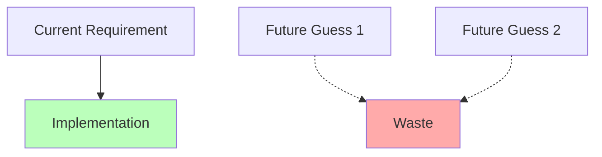

# Topic 8: YAGNI (You Ain't Gonna Need It)

## 1. PROBLEM
Developers often spend hours or days building "generic" systems or "future-proof" features that never actually get used. This is a waste of company time, increases the surface area for bugs, and clutters the codebase with dead code or complex abstractions that serve no current purpose.

## 2. CONCEPT
"Always implement things when you actually need them, never when you just foresee that you need them."

In Frontend development, YAGNI means:
- **State:** Don't add a "loading" state to a button if the action is instantaneous and has no requirement for it.
- **Props:** Don't pass 10 optional props to a component "just in case" someone wants to customize the border-radius or padding later.
- **Libraries:** Don't install a heavy charting library if you're only rendering one simple bar chart; use a simple SVG or CSS.
- **Architecture:** Don't build a complex plugin system if you only have two types of components.

## 3. REAL-WORLD FRONTEND EXAMPLE
**The "Generic" Table:** A developer spends a week building a table component that supports sorting, filtering, pagination, and multi-row selection for a page that only needs to display 5 rows of static data. Result: A week of wasted time and a component that is now 10x harder to modify for a simple style change.

## 4. CODE EXAMPLE (React + TypeScript)
See [YAGNIExample.tsx](file:///c:/Users/tushar.seth/Desktop/LLD/Frontend%20Low%20Level%20Design/1.%20Design%20Principles/08-YAGNI/YAGNIExample.tsx) for the implementation.

```typescript
// Don't build this until you actually have multiple themes
const useThemeManager = () => {
  // ... 50 lines of theme switching logic
};

// Just do this for now
const Theme = { color: 'blue' };
```

## 5. WHEN TO USE
- When planning new features.
- When debating whether to make a component "reusable" or "generic."
- When considering adding a new dependency.

## 6. WHEN NOT TO USE
- **Foundation Work:** Don't use YAGNI as an excuse to skip essential setup (like TypeScript, Linting, or a basic Folder Structure). These are not "features," they are the environment.
- **API Design:** When designing a public API or a core library used by many teams, a bit of foresight is necessary to avoid breaking changes later. However, even then, keep it minimal.

## 7. CONNECTS TO
- **KISS** (Simple is usually YAGNI-compliant).
- **MVP** (Minimum Viable Product).
- **Agile Methodology** (Build, Measure, Learn).

## 8. INTERVIEW QUESTIONS

### BEGINNER
**Q: What does YAGNI stand for?**
**Ideal Answer:** You Ain't Gonna Need It. It means you should only build what is required for the current task, not what you think might be needed in the future.

### INTERMEDIATE
**Q: How does YAGNI relate to the "Lean" startup philosophy?**
**Ideal Answer:** Both focus on avoiding waste. In Lean, waste is anything that doesn't provide value to the customer. Building unused features is the ultimate waste of engineering resources.

### ADVANCED
**Q: How do you handle a request from a stakeholder to "make it future-proof"?**
**Ideal Answer:** I explain that the best way to be "future-proof" is to write clean, simple, and modular code that is *easy to change*. Building complex features today for a tomorrow that might never happen is actually "future-cluttering."

### RAPID FIRE
1. **Q: Does YAGNI mean writing "quick and dirty" code?** 
   A: No. Code should still be clean and well-structured, just not over-featured.
2. **Q: Can YAGNI save money?** 
   A: Yes, by reducing development time and maintenance costs.
3. **Q: What happens if you build it and you *do* need it later?** 
   A: You build it then, with the full context and requirements of that time, which usually results in a better implementation.

---

## VISUALIZATION


