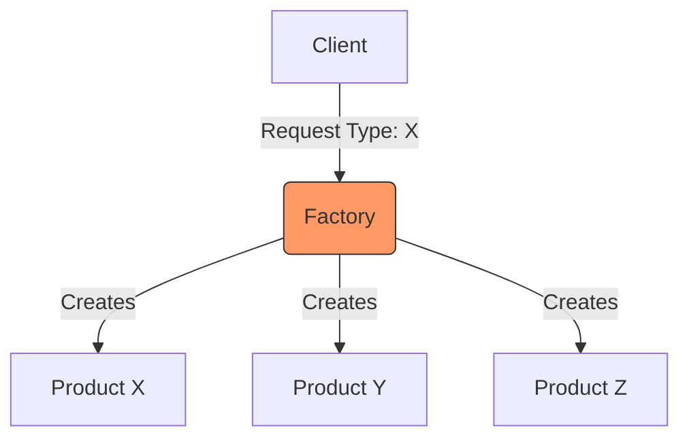

# Topic 9: Factory Pattern

## 1. PROBLEM
When building complex UIs, you often need to render different components based on data coming from an API (e.g., a "Form Builder" or a "Dashboard"). If you hardcode `if/else` logic in every part of your app to decide which component to show, your code becomes repetitive and hard to maintain when new component types are added.

## 2. CONCEPT
The Factory pattern provides a way to delegate the instantiation of objects to a specialized function or class. The client doesn't need to know the specific class being created; it only specifies the "type" or configuration.

In React, a **Component Factory** is a function that returns a component based on a prop or a key.

## 3. REAL-WORLD FRONTEND EXAMPLE
**CMS Renderer:** A Headless CMS returns a JSON array of "Blocks" (e.g., `Hero`, `Gallery`, `Testimonials`). A `BlockFactory` maps these string names to actual React components and renders them in order.

## 4. CODE EXAMPLE (React + TypeScript)
See [FactoryExample.tsx](file:///c:/Users/tushar.seth/Desktop/LLD/Frontend%20Low%20Level%20Design/2.%20Creational%20Patterns/09-Factory/FactoryExample.tsx) for the implementation.

```typescript
const components = {
  text: TextInput,
  select: SelectInput,
  checkbox: CheckboxInput
};

const FormFieldFactory = ({ type, props }) => {
  const Component = components[type];
  return <Component {...props} />;
};
```

## 5. WHEN TO USE
- When rendering dynamic UIs based on configuration or API data.
- When you want to decouple the "what to render" from the "how to render."
- When creating a library of similar but distinct UI elements (like a Button library).

## 6. WHEN NOT TO USE
- If you only have 2 or 3 static components. A simple conditional render is cleaner.
- If the components don't share a common interface/purpose. Don't force unrelated components into the same factory.

## 7. CONNECTS TO
- **Strategy Pattern** (Similar, but Factory focuses on creation, Strategy focuses on behavior).
- **Abstract Factory** (A factory of factories, used for even more complex hierarchies).

## 8. INTERVIEW QUESTIONS

### BEGINNER
**Q: What is a Factory Pattern in simple terms?**
**Ideal Answer:** It's a "creator" function. You give it a type (like 'button') and it returns the specific object or component you need, hiding the logic of how that object is made.

### INTERMEDIATE
**Q: How does the Factory pattern improve OCP (Open/Closed Principle)?**
**Ideal Answer:** By using a factory, you can add new component types by simply updating the factory's mapping object. The rest of your application code remains "closed for modification" because it only interacts with the factory interface.

### ADVANCED
**Q: Design a dynamic form builder using the Factory pattern.**
**Ideal Answer:** I would define a JSON schema for fields. I'd create a `FieldFactory` that takes a field type (text, date, number) and returns the corresponding React component. I would then map over the schema and use the factory to render each field. This makes adding a new field type as easy as creating a new component and registering it in the factory.

### RAPID FIRE
1. **Q: Is a switch statement required for a Factory?** 
   A: No, a lookup object (map) is often cleaner and more performant in JS.
2. **Q: Can a Factory return different types of data?** 
   A: Usually, it should return objects that implement a common interface.
3. **Q: Does Factory help with bundle size?** 
   A: It can facilitate code-splitting (using `React.lazy`) within the factory to only load components when needed.

---

## VISUALIZATION


