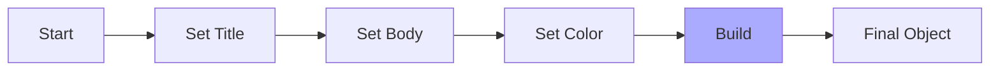

# Topic 10: Builder Pattern

## 1. PROBLEM
Some objects or configurations require many parameters to initialize (a "Telescoping Constructor"). If you have a function or class that takes 15 optional arguments, it becomes impossible to read and easy to pass arguments in the wrong order. 

```typescript
// Anti-pattern: Telescoping Constructor
new Modal("Title", "Body", true, false, "red", 500, null, () => {}, "Large");
```

## 2. CONCEPT
The Builder pattern allows you to construct complex objects step-by-step. It uses a "fluent interface" (method chaining) to make the code readable and self-documenting. You only set the parameters you care about, and then call a `.build()` method to get the final result.

## 3. REAL-WORLD FRONTEND EXAMPLE
**Complex Query Builders:** Tools like `QueryBuilder` or `TableFilterBuilder` where users can add multiple conditions (where, limit, sort, select) step-by-step before executing the query.

## 4. CODE EXAMPLE (React + TypeScript)
See [BuilderExample.tsx](file:///c:/Users/tushar.seth/Desktop/LLD/Frontend%20Low%20Level%20Design/2.%20Creational%20Patterns/10-Builder/BuilderExample.tsx) for the implementation.

```typescript
const searchParams = new SearchBuilder()
  .setCategory('electronics')
  .setPriceRange(100, 500)
  .sortBy('rating')
  .build();
```

## 5. WHEN TO USE
- When creating objects with many optional properties.
- When you want to ensure that an object is only "built" once it is in a valid state.
- When you want to create different representations of the same construction process.

## 6. WHEN NOT TO USE
- For simple objects with only 2 or 3 properties. Just use a standard interface or object literal.
- If the object doesn't need to be built step-by-step (i.e., all data is available at once).

## 7. CONNECTS TO
- **Fluent Interface** (The coding style used by Builders).
- **Composite Pattern** (Builders are often used to construct complex trees of objects).

## 8. INTERVIEW QUESTIONS

### BEGINNER
**Q: What is the main advantage of the Builder pattern?**
**Ideal Answer:** Readability and maintainability. It avoids "Constructor Overload" and makes it very clear what each parameter represents through named methods.

### INTERMEDIATE
**Q: How does the Builder pattern differ from the Factory pattern?**
**Ideal Answer:** Factory focuses on creating an object in *one shot* (you ask for a 'PrimaryButton' and you get it). Builder focuses on constructing an object *step-by-step* (set title, set body, set color, THEN build).

### ADVANCED
**Q: Can the Builder pattern be implemented using functional programming instead of classes?**
**Ideal Answer:** Yes, using a "Reducer" approach or a "Pipe" of functions. You can have a sequence of functions that take an object and return a new version of it with updated properties. The final "build" step would just be the evaluation of that object.

### RAPID FIRE
1. **Q: What is a "Fluent Interface"?** 
   A: A style of API that relies on method chaining (returning `this`).
2. **Q: Does Builder help with immutability?** 
   A: Yes, if the builder methods return a new instance of the builder instead of mutating the current one.
3. **Q: Is `Object.assign` a simple builder?** 
   A: In a way, yes, as it allows merging properties, but it lacks the validation and step-by-step logic of a true Builder.

---

## VISUALIZATION


