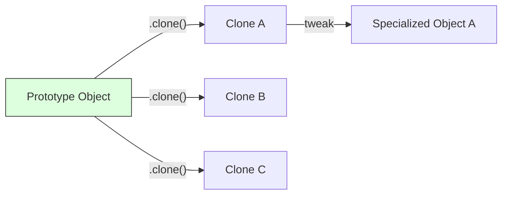

# Topic 11: Prototype Pattern

## 1. PROBLEM
Creating a new object from scratch can be "expensive" if it requires complex calculations, deep configuration, or network requests. Sometimes you already have an object that is 90% identical to what you need next. Repeating the whole creation process is inefficient.

## 2. CONCEPT
The Prototype pattern specifies the kind of objects to create using a prototypical instance, and creates new objects by copying this prototype. In JavaScript, every object has a prototype, but as a design pattern, we focus on providing a `.clone()` method to duplicate an object's state.

## 3. REAL-WORLD FRONTEND EXAMPLE
**"Duplicate Row" in a Spreadsheet:** When a user clicks "Duplicate," you don't want to re-run all validation and formatting logic for a blank row. You just clone the existing row object and let the user tweak the values.

## 4. CODE EXAMPLE (React + TypeScript)
See [PrototypeExample.tsx](file:///c:/Users/tushar.seth/Desktop/LLD/Frontend%20Low%20Level%20Design/2.%20Creational%20Patterns/11-Prototype/PrototypeExample.tsx) for the implementation.

```typescript
const baseConfig = { theme: 'dark', lang: 'en', permissions: ['read'] };

// Shallow clone using spread
const userConfig = { ...baseConfig, userId: 123 };

// Deep clone using structuredClone (Modern JS)
const deepCloned = structuredClone(baseConfig);
```

## 5. WHEN TO USE
- When the cost of creating a new object is high.
- When you want to keep the "default" state separate from the "active" state.
- When implementing features like "Undo/Redo" or "Version Control" where you need snapshots of an object.

## 6. WHEN NOT TO USE
- For simple objects where `new Object()` is fast and easy.
- If the object has circular references or non-cloneable properties (like DOM nodes or active socket connections), as cloning becomes very complex.

## 7. CONNECTS TO
- **Flyweight Pattern** (Prototype clones objects; Flyweight shares them).
- **Memento Pattern** (Prototype can be used to store snapshots for Memento).

## 8. INTERVIEW QUESTIONS

### BEGINNER
**Q: How does JavaScript natively implement the Prototype pattern?**
**Ideal Answer:** Through the `prototype` chain. Every object has an internal link to another object (its prototype). If a property isn't found on the object itself, JS looks up the prototype chain.

### INTERMEDIATE
**Q: What is the difference between a Shallow Clone and a Deep Clone?**
**Ideal Answer:** A shallow clone only copies the first level of properties; if a property is an object/array, it still points to the same memory reference. A deep clone recursively copies all levels, ensuring the new object is entirely independent.

### ADVANCED
**Q: Why might `JSON.parse(JSON.stringify(obj))` be a "bad" way to implement the Prototype pattern?**
**Ideal Answer:** It loses functions, `Date` objects (converted to strings), `undefined` values, and circular references. Modern alternatives like `structuredClone()` or libraries like `Lodash.cloneDeep()` are much safer.

### RAPID FIRE
1. **Q: Does `Object.assign()` perform a deep clone?** 
   A: No, it is a shallow copy.
2. **Q: Is the Prototype pattern common in modern React?** 
   A: Yes, we use it every time we spread state (`{...prevStat}`) to create a new state object.
3. **Q: Can you clone a class instance easily?** 
   A: Not with a simple spread; you usually need a custom `.clone()` method to preserve the class methods and constructor logic.

---

## VISUALIZATION


