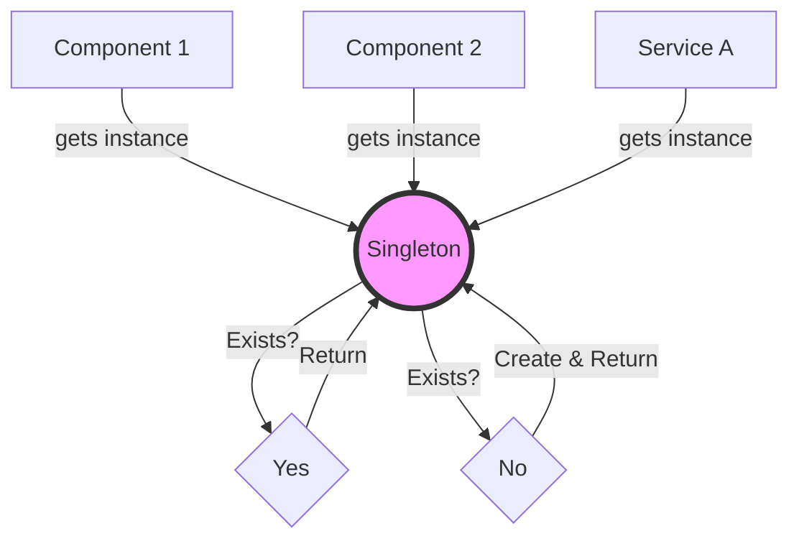

# Topic 12: Singleton Pattern

## 1. PROBLEM
Some resources should only exist once in an application to avoid conflicts, save memory, or maintain a single source of truth. For example, having multiple instances of a `DatabaseConnection` or an `AppConfig` would lead to inconsistent data and wasted connections.

## 2. CONCEPT
The Singleton pattern restricts the instantiation of a class to one single instance. It usually provides a `getInstance()` method that checks if an instance already exists; if so, it returns it; if not, it creates it.

In Modern JavaScript, **ES Modules** are naturally singletons. When you export an object or a class instance from a file, it is cached by the module system, and every file that imports it gets the exact same reference.

## 3. REAL-WORLD FRONTEND EXAMPLE
**State Management Stores:** Redux or MobX stores are typically singletons. You want the entire app to share one single store so that data is consistent across all components.

## 4. CODE EXAMPLE (React + TypeScript)
See [SingletonExample.tsx](file:///c:/Users/tushar.seth/Desktop/LLD/Frontend%20Low%20Level%20Design/2.%20Creational%20Patterns/12-Singleton/SingletonExample.tsx) for the implementation.

```typescript
// singleton.ts
class AppConfig {
  static instance = new AppConfig();
  apiKey = '12345';
}
export default AppConfig.instance;

// component.tsx
import config from './singleton';
console.log(config.apiKey);
```

## 5. WHEN TO USE
- Global state management.
- Configuration settings for the app.
- Shared services (Logging, Analytics, API wrappers).
- Managing shared resources like a Web Worker or a WebSocket connection.

## 6. WHEN NOT TO USE
- When you might need multiple instances in the future.
- **Testing:** Singletons are notoriously hard to test because they maintain state across tests. You have to manually reset the singleton between every test run.
- When **Dependency Injection** is a better fit (passing instances via props/context).

## 7. CONNECTS TO
- **Abstract Factory** (Often implemented as a Singleton).
- **Facade Pattern** (Facades are often singletons).

## 8. INTERVIEW QUESTIONS

### BEGINNER
**Q: What is the primary purpose of a Singleton?**
**Ideal Answer:** To ensure that a class has only one instance and to provide a global point of access to that instance.

### INTERMEDIATE
**Q: Why are ES Modules considered "Singletons by default"?**
**Ideal Answer:** Because the JavaScript engine caches the module the first time it is imported. Any subsequent imports of the same module in different files return the same exported value, ensuring only one instance exists.

### ADVANCED
**Q: Why do some people consider Singleton to be an "Anti-pattern"?**
**Ideal Answer:** Primarily because it introduces **Global State**, which makes code harder to debug and test. It also violates the **Single Responsibility Principle** because the class is responsible for both its primary task AND managing its own lifecycle/instance count.

### RAPID FIRE
1. **Q: How do you prevent someone from calling `new Singleton()`?** 
   A: By making the constructor `private`.
2. **Q: Is the `window` object a singleton?** 
   A: Yes, there is only one global `window` object in the browser.
3. **Q: Does React Context create a singleton?** 
   A: No, you can have multiple `Provider` instances of the same context in different parts of the tree.

---

## VISUALIZATION


