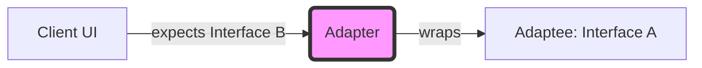

# Topic 13: Adapter Pattern

## 1. PROBLEM
You have a perfectly working UI component that expects a specific set of props. However, the data coming from your backend or a 3rd-party library is formatted differently. Instead of rewriting your UI component (which might be used in 20 other places), you need a way to make the data "fit."

## 2. CONCEPT
The Adapter pattern acts as a wrapper or a bridge between two incompatible interfaces. It transforms the interface of one object so that it matches what the client expects.

In Frontend, we use **Data Adapters** to map API responses to UI-friendly models.

## 3. REAL-WORLD FRONTEND EXAMPLE
**Analytics Adapter:** Your app tracks events using `Google Analytics`, but you want to switch to `Mixpanel`. Instead of changing every `trackEvent()` call in your components, you create an adapter that takes the generic event and "adapts" it to the specific format required by the current provider.

## 4. CODE EXAMPLE (React + TypeScript)
See [AdapterExample.tsx](file:///c:/Users/tushar.seth/Desktop/LLD/Frontend%20Low%20Level%20Design/3.%20Structural%20Patterns/13-Adapter/AdapterExample.tsx) for the implementation.

```typescript
// The UI expects: { name: string }
// The API returns: { first_name: string, last_name: string }

const apiToUiAdapter = (data) => ({
  name: `${data.first_name} ${data.last_name}`
});

<MyComponent {...apiToUiAdapter(apiResponse)} />
```

## 5. WHEN TO USE
- When integrating 3rd-party libraries that don't match your app's data structures.
- When working with legacy APIs that you cannot change.
- When you want to decouple your UI from the specific shape of the backend data.

## 6. WHEN NOT TO USE
- If you have control over both sides, it's better to refactor them to be compatible directly rather than adding a layer of indirection.
- If the translation logic is extremely complex, consider whether you need a **Facade** or a **Mapper** service instead.

## 7. CONNECTS TO
- **Facade Pattern** (Facade simplifies an interface; Adapter changes it).
- **Proxy Pattern** (Proxy controls access; Adapter changes the interface).
- **Mapper Pattern** (Often used interchangeably in data transformation).

## 8. INTERVIEW QUESTIONS

### BEGINNER
**Q: What is the main goal of the Adapter pattern?**
**Ideal Answer:** Compatibility. It allows two objects with different interfaces to work together without changing their source code.

### INTERMEDIATE
**Q: Where is the Adapter pattern most commonly used in a React app?**
**Ideal Answer:** In the Service layer or inside Hooks that fetch data. We often "adapt" the JSON response from an API into a clean, typed object before it ever reaches the component state.

### ADVANCED
**Q: How does the Adapter pattern support the Dependency Inversion Principle (DIP)?**
**Ideal Answer:** By using adapters, our high-level UI components can depend on a stable, internal interface. If the low-level API changes, we only need to update the adapter, leaving the high-level logic untouched. This ensures that our UI doesn't depend on the "details" of the API response.

### RAPID FIRE
1. **Q: Is an Adapter a wrapper?** 
   A: Yes, it wraps the incompatible object to provide a compatible interface.
2. **Q: Can an Adapter be a simple function?** 
   A: Yes, in JavaScript, a mapping function is the simplest form of an adapter.
3. **Q: Does Adapter help with unit testing?** 
   A: Yes, you can adapt your mocks to match the production interface perfectly.

---

## VISUALIZATION


