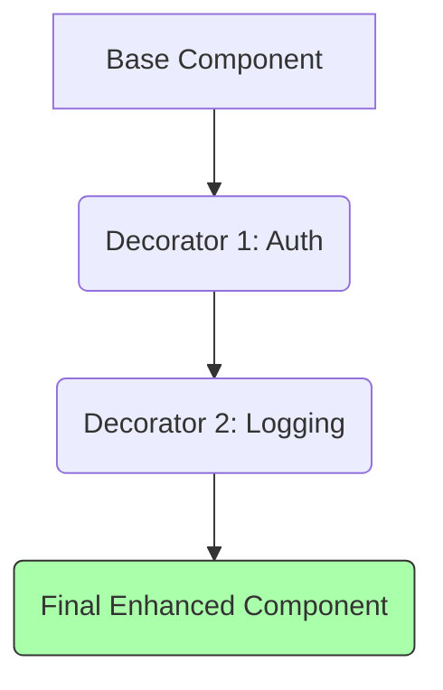

# Topic 14: Decorator Pattern

## 1. PROBLEM
You have a base component (e.g., a `Button`) and you want to add different features to it (e.g., `withTooltip`, `withLogging`, `withAuthCheck`). If you try to build all these variations using inheritance, you'll end up with a mess of classes (`AuthLoggedTooltipButton`). You need a way to wrap the component and add features dynamically.

## 2. CONCEPT
The Decorator pattern allows you to add behavior to an object without affecting the behavior of other objects from the same class. It uses composition instead of inheritance to "wrap" the original object.

In React, the Decorator pattern is implemented via **Higher-Order Components (HOCs)** or **Composition**.

## 3. REAL-WORLD FRONTEND EXAMPLE
**Permission Wrapper:** You have many buttons and links. Some should only be visible to Admins. Instead of adding `if (user.role === 'admin')` inside every component, you create a `withAdminOnly` decorator that wraps any component and handles the check.

## 4. CODE EXAMPLE (React + TypeScript)
See [DecoratorExample.tsx](file:///c:/Users/tushar.seth/Desktop/LLD/Frontend%20Low%20Level%20Design/3.%20Structural%20Patterns/14-Decorator/DecoratorExample.tsx) for the implementation.

```typescript
const withAnalytics = (Component) => (props) => {
  useEffect(() => { trackView(props.id); }, []);
  return <Component {...props} />;
};

const EnhancedView = withAnalytics(BasicView);
```

## 5. WHEN TO USE
- When you want to add cross-cutting concerns (logging, analytics, auth) to many components.
- When you want to keep the base component simple and "pure."
- When you need to add behavior at runtime.

## 6. WHEN NOT TO USE
- If you only need to add behavior to one specific component. Just put the logic inside it.
- **HOC Pitfalls:** Too many HOCs can lead to "Wrapper Hell" and make debugging difficult (the component tree becomes very deep).
- In modern React, **Custom Hooks** often replace the need for Decorators for logic-sharing.

## 7. CONNECTS TO
- **Higher-Order Components (HOC)** (The direct React implementation).
- **Proxy Pattern** (Decorator adds behavior; Proxy controls access).
- **Adapter Pattern** (Decorator changes behavior; Adapter changes interface).

## 8. INTERVIEW QUESTIONS

### BEGINNER
**Q: What is a Decorator in React?**
**Ideal Answer:** It's usually a function (HOC) that takes a component and returns a new component with added functionality (like extra props or lifecycle logic) without modifying the original component.

### INTERMEDIATE
**Q: Why is composition preferred over inheritance for the Decorator pattern?**
**Ideal Answer:** Inheritance creates a rigid hierarchy. If you want a button that is both "Logged" and "Auth-Protected," inheritance makes you choose a parent. Composition allows you to wrap the component in both decorators: `withAuth(withLogging(Button))`.

### ADVANCED
**Q: How do Custom Hooks compare to the Decorator pattern (HOCs)?** [FIRE]
**Ideal Answer:** HOCs (Decorators) wrap the UI and can inject props or change the render output. Hooks share *logic* but leave the UI structure to the component. Hooks are generally preferred today because they avoid "Wrapper Hell" and keep the component tree flatter and easier to read.

### RAPID FIRE
1. **Q: Does a Decorator change the interface?** 
   A: No, it should ideally preserve the original interface while adding new behavior.
2. **Q: Can you apply multiple decorators to one object?** 
   A: Yes, that is the main power of the pattern (chaining).
3. **Q: Is `memo()` a decorator?** 
   A: Yes! It wraps a component to add a performance "behavior" (skipping re-renders).

---

## VISUALIZATION


