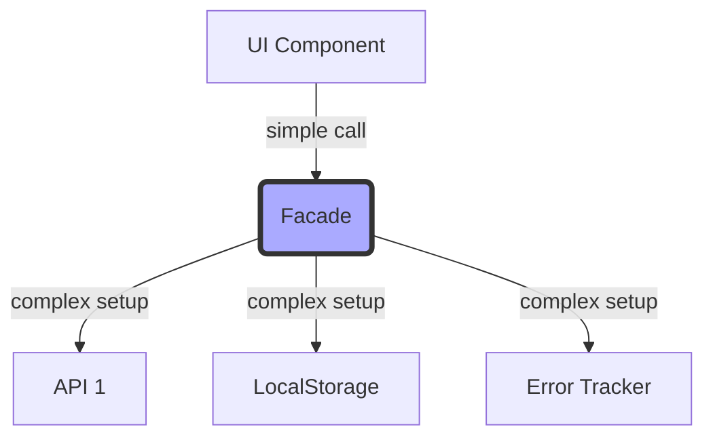

# Topic 15: Facade Pattern

## 1. PROBLEM
Modern applications rely on many complex subsystems: multiple APIs, LocalStorage, Web Workers, and 3rd-party libraries (like D3 or complex charting tools). If your UI components interact directly with these complex systems, they become bloated, hard to read, and tightly coupled to the specific library implementation.

## 2. CONCEPT
A Facade provides a simplified, higher-level interface to a larger body of code (a subsystem). It doesn't add new functionality; it just makes the existing functionality easier to use by hiding the "plumbing."

## 3. REAL-WORLD FRONTEND EXAMPLE
**The `API` Service:** Instead of using `fetch()` or `axios` directly in every component (and handling headers, error parsing, and base URLs every time), you create an `apiService.js` facade. Components just call `apiService.getUsers()`, completely unaware of whether you use Axios, Fetch, or a mock under the hood.

## 4. CODE EXAMPLE (React + TypeScript)
See [FacadeExample.tsx](file:///c:/Users/tushar.seth/Desktop/LLD/Frontend%20Low%20Level%20Design/3.%20Structural%20Patterns/15-Facade/FacadeExample.tsx) for the implementation.

```typescript
// The Facade
const Analytics = {
  logEvent: (name, data) => {
    Sentry.capture(name, data);
    GoogleAnalytics.send(name, data);
    Mixpanel.track(name, data);
  }
};

// The Component (Clean and simple)
<button onClick={() => Analytics.logEvent('CLICK_BUY')}>Buy</button>
```

## 5. WHEN TO USE
- When you want to provide a simple entry point to a complex library.
- When you want to decouple your app from 3rd-party dependencies.
- When your UI logic is getting cluttered with "setup" code for external systems.

## 6. WHEN NOT TO USE
- If the subsystem is already simple. Adding a facade would just be an unnecessary layer of indirection.
- If the client *needs* the full power and complexity of the underlying library (e.g., a highly specialized Chart component that needs direct access to D3's internals).

## 7. CONNECTS TO
- **Adapter Pattern** (Adapter changes interface; Facade simplifies it).
- **Singleton Pattern** (Facades are often implemented as singletons).
- **DIP (Dependency Inversion)** (Facades help you depend on abstractions).

## 8. INTERVIEW QUESTIONS

### BEGINNER
**Q: What is the main purpose of a Facade?**
**Ideal Answer:** Simplicity. It hides the complexity of a system and provides a clean, easy-to-use interface for the client.

### INTERMEDIATE
**Q: How does the Facade pattern help with "Library Lock-in"?**
**Ideal Answer:** If you wrap a library (like a Date library or a Chart library) in a Facade, your components only depend on your Facade. If you decide to switch the underlying library, you only change the code inside the Facade, and the rest of your app remains untouched.

### ADVANCED
**Q: Compare Facade and Adapter patterns.**
**Ideal Answer:** A Facade defines a *new* (simpler) interface, while an Adapter *wraps* an existing interface to make it compatible with another. Facade is about ease of use; Adapter is about making things work together.

### RAPID FIRE
1. **Q: Does a Facade add new logic?** 
   A: Usually no, it just organizes existing logic into a simpler flow.
2. **Q: Is a Custom Hook a Facade?** 
   A: Often, yes! A hook like `useAuth` acts as a facade over complex state and storage logic.
3. **Q: Can a system have multiple facades?** 
   A: Yes, you can have different facades for different use cases or levels of complexity.

---

## VISUALIZATION


