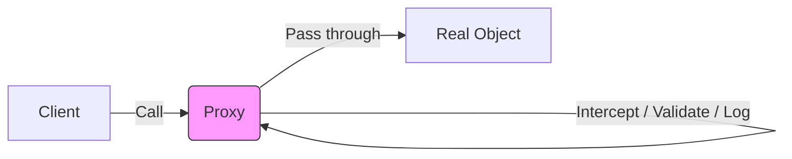

# Topic 16: Proxy Pattern

## 1. PROBLEM
Sometimes you need to control access to an object. Perhaps you want to validate data before it's saved, log every time a property is accessed, or implement "lazy loading" where the real object is only created when someone actually tries to use it. Hardcoding this logic inside the original object violates SRP and makes the object harder to reuse.

## 2. CONCEPT
A Proxy acts as an intermediary for another object (the "Subject"). It has the same interface as the subject. When a client calls the proxy, the proxy can perform some action (logging, validation, caching) and then pass the call to the real subject.

## 3. REAL-WORLD FRONTEND EXAMPLE
**Reactive State (Vue/MobX):** Modern state management libraries like MobX or the "Reactive" API in Vue 3 use Proxies. When you update a property on a state object, the Proxy detects the change and automatically triggers a UI re-render.

## 4. CODE EXAMPLE (React + TypeScript)
See [ProxyExample.tsx](file:///c:/Users/tushar.seth/Desktop/LLD/Frontend%20Low%20Level%20Design/3.%20Structural%20Patterns/16-Proxy/ProxyExample.tsx) for the implementation.

```typescript
const apiProxy = new Proxy(realApi, {
  get: (target, prop) => {
    if (isOffline) return getFromCache(prop);
    return target[prop];
  }
});
```

## 5. WHEN TO USE
- **Validation:** Checking data before setting it on an object.
- **Logging/Profiling:** Tracking which properties are used most often.
- **Caching:** Returning a cached value instead of calling an expensive method.
- **Security:** Hiding certain properties or methods from specific parts of the app.

## 6. WHEN NOT TO USE
- If the logic is simple and only used in one place.
- **Performance:** Proxies introduce a slight overhead for every property access. In extremely high-performance loops (like a game engine or heavy math processing), direct object access is faster.

## 7. CONNECTS TO
- **Decorator Pattern** (Decorator adds behavior; Proxy controls access).
- **Facade Pattern** (Facade simplifies; Proxy represents 1-to-1).
- **Observer Pattern** (Proxies are often used to implement the Observer pattern for state management).

## 8. INTERVIEW QUESTIONS

### BEGINNER
**Q: What is a Proxy in JavaScript?**
**Ideal Answer:** It is an object that wraps another object and allows you to intercept and redefine fundamental operations for that object, like getting or setting properties.

### INTERMEDIATE
**Q: How does a Proxy differ from a simple Wrapper or Decorator?**
**Ideal Answer:** A decorator usually adds new *functionality* or *representation*. A Proxy is usually about *control* and *interception*. Crucially, a JS Proxy can intercept internal operations that a normal wrapper cannot (like `deleteProperty` or `has`).

### ADVANCED
**Q: How does MobX or Vue 3 use Proxies for reactivity?** [FIRE]
**Ideal Answer:** They wrap the state in a Proxy. When a component "reads" a property during its render phase, the Proxy's `get` trap records that this component depends on that property. When the property is "written" to via the `set` trap, the Proxy knows exactly which components need to be re-rendered.

### RAPID FIRE
1. **Q: Can a Proxy be used to implement Private properties?** 
   A: Yes, by throwing an error in the `get` trap if a property starts with an underscore.
2. **Q: Is `Proxy` available in all browsers?** 
   A: It is available in all modern browsers but cannot be polyfilled perfectly for IE11.
3. **Q: Can a Proxy wrap a function?** 
   A: Yes! You can use the `apply` trap to intercept function calls.

---

## VISUALIZATION


