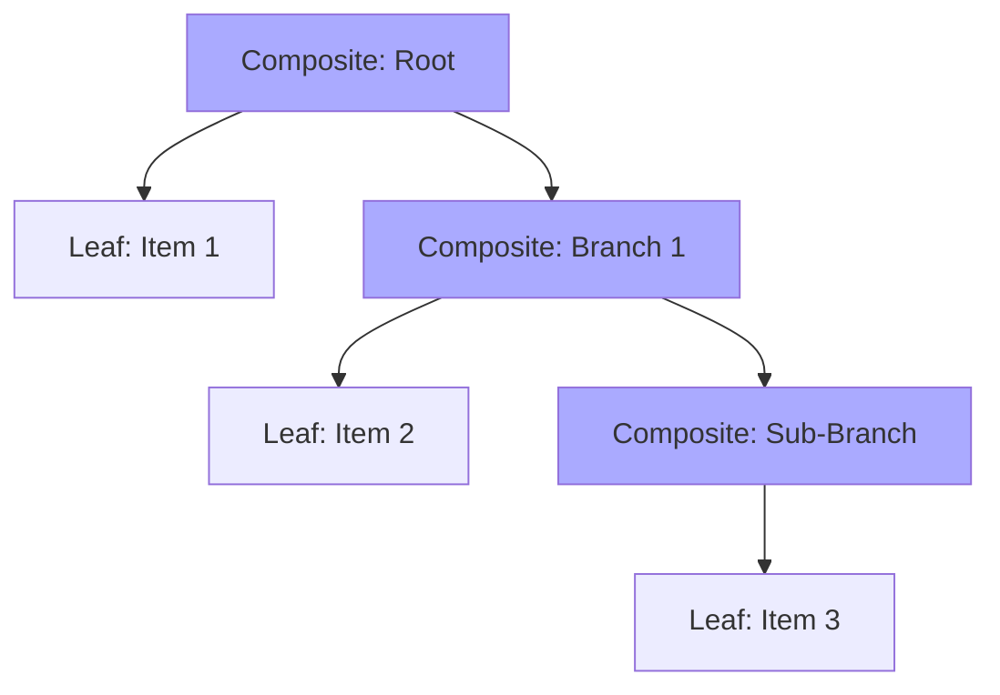

# Topic 17: Composite Pattern

## 1. PROBLEM
When building tree-like structures (menus, file systems, organizational charts), you often have "Leaf" objects (individual items) and "Composite" objects (containers that hold items). If the code that handles these objects has to constantly check `if (isFolder)` or `if (isFile)`, the logic becomes complex and hard to extend.

## 2. CONCEPT
The Composite pattern allows you to compose objects into tree structures to represent part-whole hierarchies. It lets clients treat individual objects and compositions of objects uniformly.

In React, the **Component Tree** itself is a massive implementation of the Composite pattern. A component can render another component, which can render another, and so on.

## 3. REAL-WORLD FRONTEND EXAMPLE
**Nested Navigation Menus:** A menu item can be a simple link (Leaf) or a sub-menu containing more links and more sub-menus (Composite). By using the Composite pattern, you can write a single `renderMenuItem` function that works recursively for both types.

## 4. CODE EXAMPLE (React + TypeScript)
See [CompositeExample.tsx](file:///c:/Users/tushar.seth/Desktop/LLD/Frontend%20Low%20Level%20Design/3.%20Structural%20Patterns/17-Composite/CompositeExample.tsx) for the implementation.

```typescript
const TreeItem = ({ node }) => (
  <div>
    {node.name}
    {node.children && node.children.map(child => (
      <TreeItem key={child.id} node={child} />
    ))}
  </div>
);
```

## 5. WHEN TO USE
- When you need to represent a recursive tree structure.
- When you want the client code to ignore the difference between compositions of objects and individual objects.

## 6. WHEN NOT TO USE
- If your data structure is flat and will never be nested.
- If the "Leaf" and "Composite" objects are so different that they share no common interface or behavior.

## 7. CONNECTS TO
- **Iterator Pattern** (Used to traverse Composite trees).
- **Visitor Pattern** (Used to perform operations on the elements of a Composite tree).
- **Builder Pattern** (Often used to construct complex Composite trees).

## 8. INTERVIEW QUESTIONS

### BEGINNER
**Q: What is the main idea behind the Composite pattern?**
**Ideal Answer:** It's about "Uniformity." You want to be able to treat a single object (like a file) and a group of objects (like a folder) exactly the same way in your code.

### INTERMEDIATE
**Q: How does React's `props.children` enable the Composite pattern?**
**Ideal Answer:** It allows components to be nested within each other to an arbitrary depth. A component doesn't need to know *what* its children are; it just renders them. This allows us to build complex UI hierarchies by composing simple components.

### ADVANCED
**Q: Explain how you would implement a recursive comment system (like Reddit) using the Composite pattern.**
**Ideal Answer:** I would create a `Comment` component. Each comment object would have a `text` property and a `replies` array. The `Comment` component would render its own text and then map over its `replies` array, rendering a `Comment` component for each reply. This recursive structure treats a top-level comment and a reply (which is just another comment) uniformly.

### RAPID FIRE
1. **Q: Is the Composite pattern recursive?** 
   A: Yes, it inherently relies on recursion to handle nesting.
2. **Q: Can a Composite have multiple types of Leaves?** 
   A: Yes, as long as they follow the same base interface.
3. **Q: Does the Composite pattern improve SRP?** 
   A: Yes, by allowing containers to focus on "containing" and leaves to focus on "representing," without either needing to know the details of the other.

---

## VISUALIZATION


