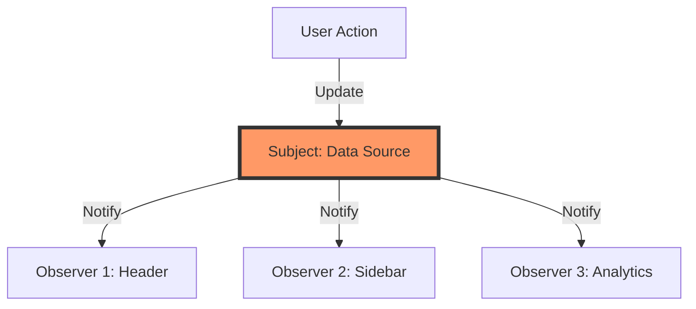

# Topic 18: Observer Pattern

## 1. PROBLEM
In a modern UI, many different parts of the screen often need to respond to the same event. For example, when a user logs in, the "Header" needs to show the avatar, the "Cart" needs to fetch saved items, and the "Notification" center needs to show a welcome message. If you manually call every one of these components from the login function, your code becomes tightly coupled and brittle.

## 2. CONCEPT
The Observer pattern defines a one-to-many relationship. When the "Subject" (the thing being watched) changes, it automatically notifies all its "Observers" (the watchers). The subject doesn't need to know who the observers are or what they do; it just sends out the notification.

In JavaScript, this is the core of **Event Listeners** and **State Management**.

## 3. REAL-WORLD FRONTEND EXAMPLE
**Pub/Sub Systems:** Using a library like `EventEmitter` or a custom "Event Bus" to communicate between components that are far apart in the tree. When a "Price Update" happens in a background worker, it publishes an event, and all "Price Display" components that are currently mounted (the observers) update themselves.

## 4. CODE EXAMPLE (React + TypeScript)
See [ObserverExample.tsx](file:///c:/Users/tushar.seth/Desktop/LLD/Frontend%20Low%20Level%20Design/4.%20Behavioral%20Patterns/18-Observer/ObserverExample.tsx) for the implementation.

```typescript
// native JS Observer
window.addEventListener('resize', () => {
  console.log('I am an observer responding to a resize event');
});
```

## 5. WHEN TO USE
- When a change in one object requires changing others, and you don't know how many objects need to be changed.
- When you want to decouple the event producer from the event consumer.
- For implementing reactive state systems.

## 6. WHEN NOT TO USE
- If you only have one object responding to another. A simple callback prop is much cleaner.
- **Memory Leaks:** If observers don't "unsubscribe" when they are destroyed (or unmounted), they will stay in memory and continue to receive notifications, leading to performance issues and bugs.

## 7. CONNECTS TO
- **Mediator Pattern** (Mediator centralizes communication; Observer distributes it).
- **State Pattern** (Changing state often triggers notifications to observers).
- **Proxy Pattern** (Proxies are often used to detect changes and notify observers).

## 8. INTERVIEW QUESTIONS

### BEGINNER
**Q: What is the main benefit of the Observer pattern?**
**Ideal Answer:** Decoupling. The producer of information doesn't need to know about its consumers. This makes it easy to add or remove "watchers" without touching the producer's code.

### INTERMEDIATE
**Q: How does React's `useEffect` cleanup function help with the Observer pattern?**
**Ideal Answer:** It is used for **Unsubscribing**. When a component (the observer) unmounts, it must stop watching the subject to prevent memory leaks and "state updates on unmounted component" errors.

### ADVANCED
**Q: Explain how Redux implements the Observer pattern.** [FIRE]
**Ideal Answer:** The Redux `store` is the Subject. Components use `store.subscribe()` (usually wrapped by `useSelector` or `connect`) to become Observers. When an action is dispatched and the state changes, the store calls all subscribed listener functions, which then trigger re-renders in the components.

### RAPID FIRE
1. **Q: Is `onClick` an example of the Observer pattern?** 
   A: Yes, the button is the subject, and your handler function is the observer.
2. **Q: What is the difference between Pub/Sub and Observer?** 
   A: In Observer, the subject usually knows its observers. In Pub/Sub, there is an intermediate "Message Broker" so they don't even know each other exists.
3. **Q: Can one object be both a Subject and an Observer?** 
   A: Yes, this is common in "reactive streams" (like RxJS) where an object observes one stream and produces another.

---

## VISUALIZATION


