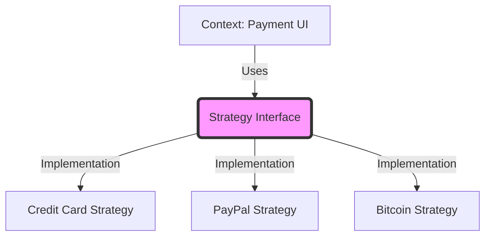

# Topic 19: Strategy Pattern

## 1. PROBLEM
You have a component that needs to perform a task (e.g., sorting a list, validating a form, or processing a payment). However, there are multiple ways to do that task, and the method might change depending on user input or application state. If you put all the logic in one big `switch` statement, the component becomes bloated and hard to maintain as new "strategies" are added.

## 2. CONCEPT
The Strategy pattern encapsulates a family of algorithms (strategies) and makes them interchangeable. The "Context" (your component) doesn't know the details of the algorithm; it just knows how to call a common method on the strategy object it's given.

In React, this is often implemented by passing a function or a configuration object as a prop.

## 3. REAL-WORLD FRONTEND EXAMPLE
**Form Validation:** You have different validation strategies for different countries. Instead of a massive `validate()` function with 200 `if` statements, you create a `USValidationStrategy`, `UKValidationStrategy`, etc. When the user selects their country, you swap the strategy object passed to the form.

## 4. CODE EXAMPLE (React + TypeScript)
See [StrategyExample.tsx](file:///c:/Users/tushar.seth/Desktop/LLD/Frontend%20Low%20Level%20Design/4.%20Behavioral%20Patterns/19-Strategy/StrategyExample.tsx) for the implementation.

```typescript
const sortStrategies = {
  price: (a, b) => a.price - b.price,
  rating: (a, b) => b.rating - a.rating,
  name: (a, b) => a.name.localeCompare(b.name)
};

const sortedData = [...data].sort(sortStrategies[currentSortType]);
```

## 5. WHEN TO USE
- When you have multiple ways to perform a task and want to swap them at runtime.
- When you want to avoid a massive `if/else` or `switch` block in your component logic.
- When you want to decouple the algorithm from the UI that uses it.

## 6. WHEN NOT TO USE
- If you only have one or two very simple algorithms that rarely change. A simple `if` statement is more KISS-compliant.
- If the algorithms are so different that they can't share a common interface.

## 7. CONNECTS TO
- **Factory Pattern** (Factory creates the strategy; Strategy performs the work).
- **Template Method** (Template defines the structure; Strategy provides the specific implementation).
- **OCP (Open/Closed Principle)** (Strategy makes a component open for extension by adding new strategy objects).

## 8. INTERVIEW QUESTIONS

### BEGINNER
**Q: What is the core idea of the Strategy pattern?**
**Ideal Answer:** Interchangability. It's about taking different algorithms for the same task, putting them into separate objects, and making them easily swappable.

### INTERMEDIATE
**Q: How does the Strategy pattern help in following the Open/Closed Principle?**
**Ideal Answer:** Your main component (the context) is "closed for modification" because you don't have to change its code to add a new feature. Instead, you just "extend" the system by creating a new strategy object and passing it in.

### ADVANCED
**Q: Compare Strategy and State patterns.** [FIRE]
**Ideal Answer:** They are structurally similar (both use composition and interchangable objects). However, **Strategy** is usually set once by the client and represents a "choice" of algorithm. **State** objects often transition themselves to the *next* state and represent the "condition" of the object. Strategy is about "how to do it"; State is about "what is happening."

### RAPID FIRE
1. **Q: Does Strategy use inheritance?** 
   A: No, it uses Composition.
2. **Q: Is a callback function a strategy?** 
   A: Yes, it is the simplest form of a strategy pattern.
3. **Q: Can one component use multiple strategies at once?** 
   A: Yes (e.g., a `SortStrategy` and a `FilterStrategy` working together).

---

## VISUALIZATION


