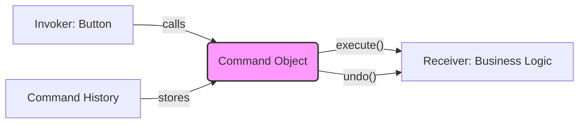

# Topic 20: Command Pattern

## 1. PROBLEM
In complex applications (like a Photo Editor or a SpreadSheet), you have many actions (draw, resize, change color). If the UI button for "Draw" directly contains the drawing logic, it becomes impossible to track the history of actions, implement "Undo," or "Redo." The UI becomes tightly coupled to the business logic.

## 2. CONCEPT
The Command pattern encapsulates all the information needed to perform an action into a single object. This object usually has an `execute()` method and an `undo()` method. By treating actions as objects, you can store them in a list (history), queue them, or send them over a network.

## 3. REAL-WORLD FRONTEND EXAMPLE
**Rich Text Editor (Google Docs):** Every time you bold a word or delete a sentence, a "Command" object is created and added to a stack. When you hit `Ctrl+Z`, the editor simply takes the last command from the stack and calls its `undo()` method.

## 4. CODE EXAMPLE (React + TypeScript)
See [CommandExample.tsx](file:///c:/Users/tushar.seth/Desktop/LLD/Frontend%20Low%20Level%20Design/4.%20Behavioral%20Patterns/20-Command/CommandExample.tsx) for the implementation.

```typescript
const addTextCommand = {
  execute: () => doc.add('Hello'),
  undo: () => doc.removeLast()
};

history.push(addTextCommand);
addTextCommand.execute();
```

## 5. WHEN TO USE
- When you need to implement **Undo/Redo** functionality.
- When you want to decouple the object that invokes the action (a Button) from the object that performs the action (the logic).
- When you want to queue or schedule actions to be performed later.

## 6. WHEN NOT TO USE
- For simple actions that don't need history or decoupling (e.g., toggling a modal).
- If the overhead of creating an object for every action is too high for your use case.

## 7. CONNECTS TO
- **Memento Pattern** (Memento stores the *state*; Command stores the *action* to change state).
- **Composite Pattern** (You can create "Macro Commands" that contain a list of other commands).
- **Observer Pattern** (Commands can notify observers when they finish executing).

## 8. INTERVIEW QUESTIONS

### BEGINNER
**Q: What is a Command object?**
**Ideal Answer:** It's an object that contains everything needed to perform an action (the method to call, the arguments, etc.). It usually has an `execute` and an `undo` method.

### INTERMEDIATE
**Q: How do you implement "Redo" using the Command pattern?**
**Ideal Answer:** You maintain two stacks: an **Undo Stack** and a **Redo Stack**. When an action is performed, it goes into the Undo stack. When you Undo, you pop from Undo, call `undo()`, and push it into the Redo stack. If you then Redo, you pop from Redo, call `execute()`, and push it back into the Undo stack.

### ADVANCED
**Q: How does Redux represent the Command pattern?**
**Ideal Answer:** Redux **Actions** are essentially Commands (they encapsulate what needs to happen and the data needed). The **Reducers** are the ones that know how to "execute" them. While standard Redux doesn't store a history of commands natively for undo/redo, libraries like `redux-undo` use the sequence of actions to travel back and forth in state time.

### RAPID FIRE
1. **Q: Does Command promote SRP?** 
   A: Yes, it separates "triggering an action" from "defining an action."
2. **Q: Can a Command have sub-commands?** 
   A: Yes, this is called a "Macro" or "Composite Command."
3. **Q: Is a `function` a command?** 
   A: A function only has `execute`. A true Command pattern object also knows how to `undo`.

---

## VISUALIZATION


