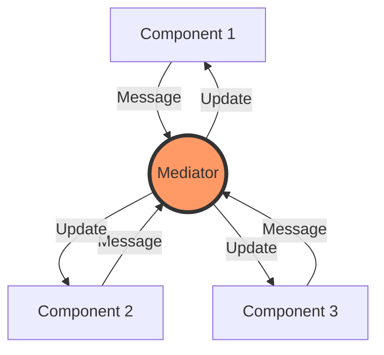

# Topic 21: Mediator Pattern

## 1. PROBLEM
In a complex UI, components often need to talk to each other. For example, selecting an item in a "List" needs to update the "Detail View," highlight a marker on a "Map," and enable a "Delete" button in the "Toolbar." If the List has to know about the DetailView, the Map, and the Toolbar, you get a "Spaghetti" of dependencies. Every time you add a new component, you have to update all existing ones.

## 2. CONCEPT
The Mediator pattern centralizes all communication between objects into a single "Mediator" object. Instead of objects talking directly to each other, they only talk to the mediator. The mediator then coordinates the interactions.

In React, the **Parent Component** or a **State Store (Redux)** often acts as the Mediator.

## 3. REAL-WORLD FRONTEND EXAMPLE
**A Complex Form:** You have multiple inputs (Age, Driving License, Insurance Type). If `Age < 18`, the `Driving License` input should be disabled and `Insurance Type` should be set to "Junior." Instead of the Age input controlling the other inputs, the `FormController` (Mediator) watches all inputs and applies the rules.

## 4. CODE EXAMPLE (React + TypeScript)
See [MediatorExample.tsx](file:///c:/Users/tushar.seth/Desktop/LLD/Frontend%20Low%20Level%20Design/4.%20Behavioral%20Patterns/21-Mediator/MediatorExample.tsx) for the implementation.

```typescript
// Components talk to the Mediator (Parent) via callbacks
const Parent = () => {
  const [data, setData] = useState();
  // The Mediator handles the coordination
  const handleUpdate = (val) => setData(val);
  
  return (
    <>
      <ComponentA onUpdate={handleUpdate} />
      <ComponentB data={data} />
    </>
  );
};
```

## 5. WHEN TO USE
- When a set of objects communicate in well-defined but complex ways.
- When you want to reuse an object but it's hard because it's too tied to other objects.
- When you have many "Many-to-Many" relationships that should be simplified to "One-to-Many."

## 6. WHEN NOT TO USE
- For simple parent-child communication. Standard props are enough.
- **The "God Object" Risk:** Be careful not to let your Mediator become too complex. If it handles every single interaction in the app, it becomes a maintenance nightmare itself.

## 7. CONNECTS TO
- **Observer Pattern** (Mediator often uses Observer to receive events from components).
- **Facade Pattern** (Facade simplifies an interface; Mediator simplifies communication).
- **Container / Presentational Pattern** (The Container acts as the Mediator for its Presentational children).

## 8. INTERVIEW QUESTIONS

### BEGINNER
**Q: What is a Mediator?**
**Ideal Answer:** It's a "Middleman." Instead of components talking directly to each other, they send messages to the Mediator, which then decides who needs to hear what.

### INTERMEDIATE
**Q: How does the Mediator pattern help with "Loose Coupling"?**
**Ideal Answer:** It prevents components from needing to know about each other's existence. A "SearchBox" doesn't need to know there's a "ResultsList." It just tells the Mediator "the search query changed." The ResultsList just waits for the Mediator to give it new data.

### ADVANCED
**Q: Is Redux a Mediator or an Observer?** [FIRE]
**Ideal Answer:** It is **both**. It is a **Mediator** because it centralizes the logic of how actions change state and how that state is distributed. It is an **Observer** because components "subscribe" to the store and are notified when the state changes. This combination is what makes Redux so powerful for managing complex UI interactions.

### RAPID FIRE
1. **Q: Does Mediator promote SRP?** 
   A: Yes, it allows UI components to focus solely on rendering, while the Mediator handles the interaction logic.
2. **Q: Can you have multiple Mediators in one app?** 
   A: Yes, you usually have one mediator per feature or page.
3. **Q: What is the main drawback of a Mediator?** 
   A: It can become a "Single Point of Failure" or a "God Object" if not kept modular.

---

## VISUALIZATION


