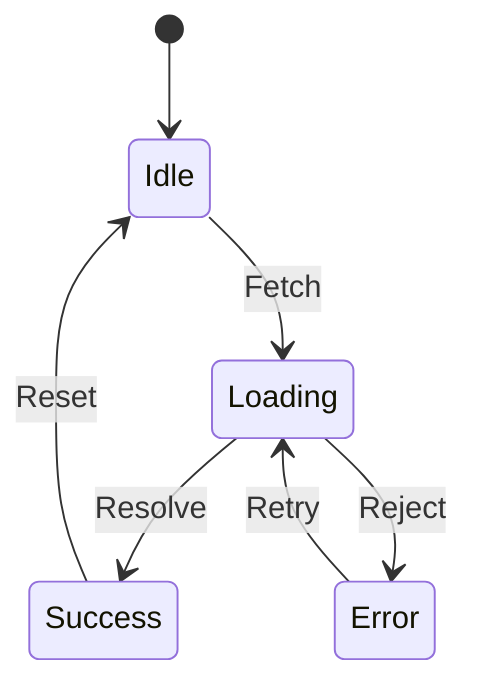

# Topic 22: State Pattern

## 1. PROBLEM
You have a component that behaves differently based on its state (e.g., a "Video Player" that can be Playing, Paused, Loading, or Stopped). If you handle all these behaviors with a giant `if/else` block inside the component, the code becomes a "state-machine mess." Adding a new state (e.g., "Buffering") requires changing logic everywhere.

## 2. CONCEPT
The State pattern allows an object to change its behavior when its internal state changes. Instead of the object knowing how to handle every state, it delegates the work to a "State Object." When the state changes, the object swaps its state object for a new one.

In React, while we use `useState`, the **State Pattern** specifically refers to encapsulating the *logic* of each state into separate objects or classes.

## 3. REAL-WORLD FRONTEND EXAMPLE
**Finite State Machines (XState):** Libraries like XState are a formal implementation of the State pattern. They allow you to define valid states (Idle, Loading, Success, Error) and valid transitions (fetch -> Loading). This prevents "Impossible States" (e.g., being in both Loading and Success states at once).

## 4. CODE EXAMPLE (React + TypeScript)
See [StateExample.tsx](file:///c:/Users/tushar.seth/Desktop/LLD/Frontend%20Low%20Level%20Design/4.%20Behavioral%20Patterns/22-State/StateExample.tsx) for the implementation.

```typescript
const states = {
  idle: { render: () => <button>Start</button>, next: 'loading' },
  loading: { render: () => <Spinner />, next: 'success' },
  success: { render: () => <Checkmark />, next: 'idle' }
};

const currentState = states[status];
return currentState.render();
```

## 5. WHEN TO USE
- When an object's behavior depends on its state, and it must change its behavior at runtime.
- When you have a complex state machine with many states and transitions.
- When you want to avoid massive conditional statements.

## 6. WHEN NOT TO USE
- For simple boolean toggles (e.g., `isOpen`).
- If the states don't have distinct behaviors (they only have different data).

## 7. CONNECTS TO
- **Strategy Pattern** (Strategy handles *how* to do something; State handles *what* the object is doing).
- **Singleton Pattern** (State objects are often singletons).
- **Flyweight Pattern** (If you have many objects sharing the same states).

## 8. INTERVIEW QUESTIONS

### BEGINNER
**Q: What is the goal of the State pattern?**
**Ideal Answer:** To manage complex state logic by moving state-specific behavior into separate objects. This makes the code cleaner and easier to extend with new states.

### INTERMEDIATE
**Q: How does the State pattern help avoid "Impossible States"?**
**Ideal Answer:** By defining explicit states and valid transitions between them. For example, you can't go directly from `Idle` to `Success` without passing through `Loading`. In a giant `if/else` block, it's easy to accidentally set `isLoading = true` and `isSuccess = true` at the same time.

### ADVANCED
**Q: Design a "Multi-step Signup Form" using the State pattern.** [FIRE]
**Ideal Answer:** I would define an interface `FormStep`. Concrete states would be `Step1_Personal`, `Step2_Address`, `Step3_Review`. Each state would have a `render()` method and a `next()` method. The `next()` method would validate the current data and return the next `FormStep` object. This keeps the logic for each step completely isolated.

### RAPID FIRE
1. **Q: Does State pattern promote OCP?** 
   A: Yes, you can add new states without changing the context class or existing states.
2. **Q: Is `useState` the same as the State pattern?** 
   A: `useState` is a mechanism for storing data; the State pattern is an architectural way to organize *logic* based on that data.
3. **Q: Can states trigger their own transitions?** 
   A: Yes, in many implementations, the state object knows which state comes next.

---

## VISUALIZATION


