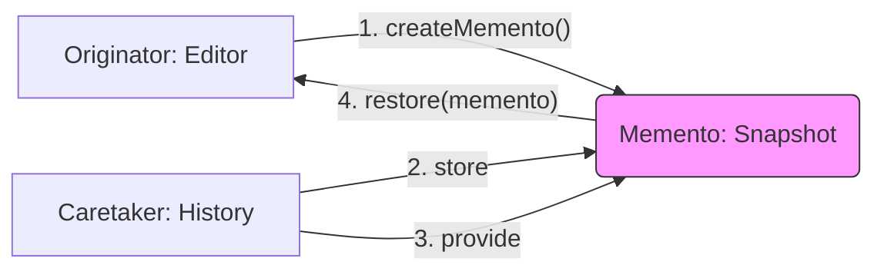

# Topic 23: Memento Pattern

## 1. PROBLEM
You want to implement an "Undo" feature or a "Draft Recovery" system. You could just store every state in a global array, but if the state is complex (e.g., a 3D scene or a canvas with 1000 objects), exposing the internal structure of that state to a "History Manager" violates encapsulation. The history manager shouldn't need to know *how* to reconstruct the object; it should just hold a "black box" that the object can use to restore itself.

## 2. CONCEPT
The Memento pattern involves three roles:
1. **Originator:** The object whose state we want to save (e.g., the Editor). It creates the memento and knows how to restore itself from it.
2. **Memento:** A small object that stores the state of the Originator. It is opaque to everyone except the Originator.
3. **Caretaker:** The object that keeps track of the mementos (the "History Manager"). It never modifies or looks inside a memento.

## 3. REAL-WORLD FRONTEND EXAMPLE
**Browser History:** When you navigate between pages, the browser stores a "Memento" of the page state (scroll position, form data). When you hit the "Back" button, the browser uses that memento to restore the page exactly as it was.

## 4. CODE EXAMPLE (React + TypeScript)
See [MementoExample.tsx](file:///c:/Users/tushar.seth/Desktop/LLD/Frontend%20Low%20Level%20Design/4.%20Behavioral%20Patterns/23-Memento/MementoExample.tsx) for the implementation.

```typescript
// Taking a snapshot
const snapshot = canvas.saveToMemento();
history.push(snapshot);

// Restoring
canvas.restoreFromMemento(history.pop());
```

## 5. WHEN TO USE
- When you need to implement checkpoints, snapshots, or Undo/Redo.
- When direct access to an object's state would expose its internal implementation details (violating encapsulation).

## 6. WHEN NOT TO USE
- If the state is very large and saving many copies would consume too much memory. In this case, use the **Command Pattern** to store *actions* instead of *states*.
- For simple state that is already managed by a central store like Redux (where snapshots are created automatically via immutability).

## 7. CONNECTS TO
- **Command Pattern** (Command stores *how* to change; Memento stores *what* changed).
- **Prototype Pattern** (You can use Prototype to clone the state to create a Memento).
- **Iterator Pattern** (Used to traverse the history of Mementos).

## 8. INTERVIEW QUESTIONS

### BEGINNER
**Q: What is a Memento?**
**Ideal Answer:** It is a "snapshot" of an object's internal state at a specific point in time, used so the object can be restored later.

### INTERMEDIATE
**Q: How does Memento preserve "Encapsulation"?**
**Ideal Answer:** By ensuring that the "Caretaker" (the history manager) doesn't know anything about the content of the snapshot. It just holds a "box." Only the "Originator" (the editor) knows how to open the box and use its contents.

### ADVANCED
**Q: Compare Memento and Command patterns for implementing "Undo."** [FIRE]
**Ideal Answer:** 
- **Memento** saves the entire state (or a delta). It is easier to implement for complex changes but can be memory-heavy.
- **Command** saves the *action* that caused the change. It is memory-efficient but requires you to write logic for the "inverse" of every action.
- Modern apps often use a hybrid: Memento for infrequent "checkpoints" and Command for the steps in between.

### RAPID FIRE
1. **Q: Does the Caretaker modify the Memento?** 
   A: No, it only stores it.
2. **Q: Is Redux Time Travel based on Memento?** 
   A: Yes, since Redux state is immutable, every previous state *is* effectively a Memento.
3. **Q: Can Mementos be saved to LocalStorage?** 
   A: Yes, this is how "Save Draft" features are usually implemented.

---

## VISUALIZATION


