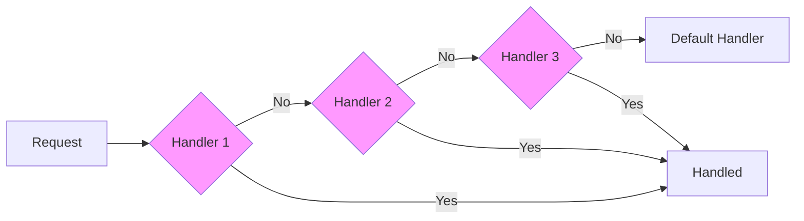

# Topic 24: Chain of Responsibility Pattern

## 1. PROBLEM
You have a request (e.g., a form submission, an error log, or a middleware) that needs to be processed by multiple filters or handlers. If you write a giant `if/else` block that checks every condition, the code becomes very hard to read and modify. If you want to add a new filter, or change the order of filters, you have to rewrite the entire block.

## 2. CONCEPT
The Chain of Responsibility pattern allows you to pass a request along a "chain" of handlers. Each handler decides either to process the request or to pass it to the next handler in the chain. This decouples the sender of the request from the receivers.

In Frontend, **Middleware** (like in Express or Redux) is the most common implementation of this pattern.

## 3. REAL-WORLD FRONTEND EXAMPLE
**Event Bubbling:** In the DOM, when you click a button, the click event starts at the button and "bubbles up" through its parents. Each parent has the chance to handle the event or let it pass through to the next parent. This is a built-in Chain of Responsibility.

## 4. CODE EXAMPLE (React + TypeScript)
See [ChainOfResponsibilityExample.tsx](file:///c:/Users/tushar.seth/Desktop/LLD/Frontend%20Low%20Level%20Design/4.%20Behavioral%20Patterns/24-ChainOfResponsibility/ChainOfResponsibilityExample.tsx) for the implementation.

```typescript
// Middleware Chain
const logger = (req, next) => { console.log(req); next(); };
const auth = (req, next) => { if (req.user) next(); else throw 'Error'; };
const router = (req, next) => { renderPage(req.url); };

// Executing the chain
runChain([logger, auth, router], request);
```

## 5. WHEN TO USE
- When more than one object can handle a request, and the handler isn't known in advance.
- When you want to issue a request to one of several objects without specifying the receiver explicitly.
- When the set of objects that can handle a request should be specified dynamically (at runtime).

## 6. WHEN NOT TO USE
- If the chain is very long and performance is critical (every link adds overhead).
- If you know exactly which object should handle the request. In that case, use a simple function call or a **Strategy**.
- If a request can "fall off" the end of the chain without being handled (you must ensure a "default" or "catch-all" handler exists if necessary).

## 7. CONNECTS TO
- **Decorator Pattern** (Both wrap objects, but Decorator adds behavior; Chain adds "if-else" handling).
- **Composite Pattern** (A handler's parent can be treated as its next handler in a tree structure).
- **Strategy Pattern** (In Chain, any handler can handle the request; in Strategy, exactly one is chosen).

## 8. INTERVIEW QUESTIONS

### BEGINNER
**Q: What is the main idea of the Chain of Responsibility?**
**Ideal Answer:** It's about passing a request through a sequence of potential handlers until one of them deals with it (or they all do). It's like an automated relay race.

### INTERMEDIATE
**Q: How does Redux Middleware represent this pattern?**
**Ideal Answer:** Every middleware in Redux receives an action and a `next` function. The middleware can choose to log the action, modify it, or stop it. If it calls `next(action)`, it passes the responsibility to the next middleware in the chain until it eventually reaches the reducer.

### ADVANCED
**Q: Compare Chain of Responsibility and Decorator.** [FIRE]
**Ideal Answer:** 
- **Decorator** adds responsibilities to an object *without* changing its interface. All decorators in a chain usually execute.
- **Chain of Responsibility** allows handlers to *intercept* and *stop* a request. Often, only one handler in the chain actually performs the final action.

### RAPID FIRE
1. **Q: Is Event Bubbling a Chain of Responsibility?** 
   A: Yes, it's a built-in browser implementation.
2. **Q: Can a handler modify the request before passing it?** 
   A: Yes, this is common in "Transformation" chains.
3. **Q: Does this pattern promote OCP?** 
   A: Yes, you can add or reorder handlers without changing the sender or other handlers.

---

## VISUALIZATION


