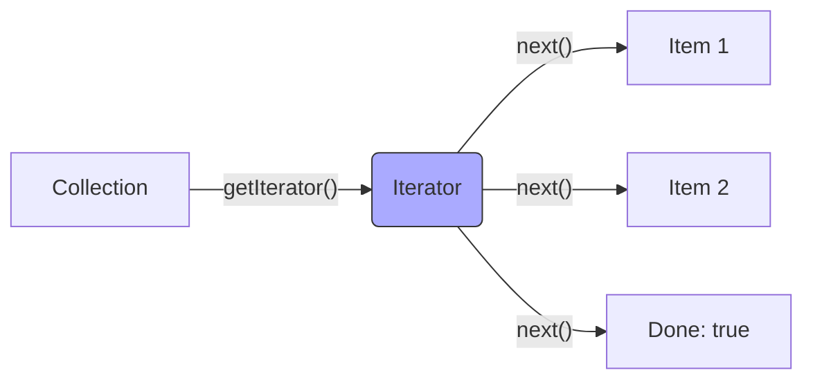

# Topic 25: Iterator Pattern

## 1. PROBLEM
You have different types of collections: Arrays, Maps, Sets, or custom Tree structures. If the code that needs to process these items has to know exactly how to loop through each one (e.g., `for i`, `.forEach`, recursive tree traversal), it becomes tied to the data structure. If you switch from an Array to a Set, you have to rewrite your loops.

## 2. CONCEPT
The Iterator pattern provides a standard way to access elements of a collection one by one without exposing the internal structure of that collection. It defines a common interface (`next()`, `hasNext()`).

In Modern JavaScript, this is built-in via the **Iterator Protocol** (`Symbol.iterator`). Any object that implements this protocol can be used in a `for...of` loop or spread into an array.

## 3. REAL-WORLD FRONTEND EXAMPLE
**Paging Data:** When you fetch a large dataset from an API, you might get a "Page Iterator." Instead of loading 10,000 items at once, the iterator gives you the next 20 items only when you call `.next()`. This keeps your UI responsive and memory usage low.

## 4. CODE EXAMPLE (React + TypeScript)
See [IteratorExample.tsx](file:///c:/Users/tushar.seth/Desktop/LLD/Frontend%20Low%20Level%20Design/4.%20Behavioral%20Patterns/25-Iterator/IteratorExample.tsx) for the implementation.

```typescript
const range = {
  from: 1, to: 5,
  [Symbol.iterator]() {
    return {
      current: this.from,
      last: this.to,
      next() {
        if (this.current <= this.last) {
          return { done: false, value: this.current++ };
        } else {
          return { done: true };
        }
      }
    };
  }
};

for (let num of range) { console.log(num); } // 1, 2, 3, 4, 5
```

## 5. WHEN TO USE
- When you have a complex data structure (like a tree or a graph) and want to hide its traversal logic from the client.
- When you want to provide a uniform way to loop over different types of collections.
- For implementing "Lazy Loading" of data.

## 6. WHEN NOT TO USE
- For simple Arrays. JavaScript's built-in `.map()`, `.filter()`, and `.forEach()` are already optimized and follow the spirit of the pattern.
- If you only ever have one type of collection and it's unlikely to change.

## 7. CONNECTS TO
- **Composite Pattern** (Iterators are used to traverse recursive Composite trees).
- **Visitor Pattern** (Iterator handles the *traversal*; Visitor handles the *operation* performed on each element).
- **Generator Functions** (The modern JS way to create Iterators).

## 8. INTERVIEW QUESTIONS

### BEGINNER
**Q: What does an Iterator do?**
**Ideal Answer:** It provides a way to go through all the elements of a collection one by one, without knowing how the collection stores those elements.

### INTERMEDIATE
**Q: What is the `Symbol.iterator` in JavaScript?**
**Ideal Answer:** It's a special symbol that, when added to an object, defines the default iterator for that object. It allows the object to be used in `for...of` loops, the spread operator `[...]`, and `Array.from()`.

### ADVANCED
**Q: How do Generator functions (`function*`) relate to the Iterator pattern?**
**Ideal Answer:** Generators are "syntactic sugar" for creating iterators. When you call a generator function, it returns an Iterator object. The `yield` keyword is used to provide the "next" value in the sequence and pause execution until the next `.next()` call. This is much easier than manually writing the `next()` and `done` logic.

### RAPID FIRE
1. **Q: Is an Array an Iterator?** 
   A: No, an Array is an **Iterable** (it has a `Symbol.iterator` that *returns* an Iterator).
2. **Q: What are the two properties returned by `next()`?** 
   A: `value` and `done`.
3. **Q: Can an Iterator be infinite?** 
   A: Yes! You can have an iterator that generates numbers forever. Just be careful not to use it in a `for...of` loop without a `break`.

---

## VISUALIZATION


