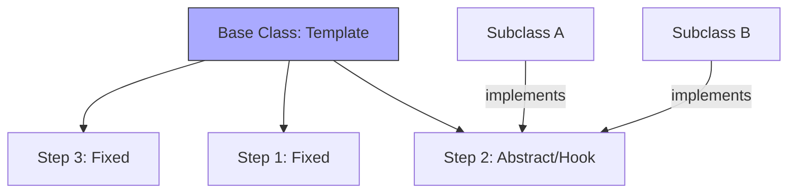

# Topic 26: Template Method Pattern

## 1. PROBLEM
You have multiple algorithms that follow the same sequence of steps (e.g., Load Data -> Parse Data -> Render Data). However, the *way* you load or parse the data might be different for each one. If you copy-paste the whole sequence every time, you violate DRY. If you want to add a new "Logging" step to the sequence, you have to find and update every copy of the algorithm.

## 2. CONCEPT
The Template Method pattern defines the skeleton of an algorithm in a base class (the "Template Method"). It lets subclasses redefine certain steps of the algorithm without changing its overall structure. 

In modern React, this is often achieved through **Render Props** or **Compound Components**, where the parent defines the layout/flow and the children provide the specific content.

## 3. REAL-WORLD FRONTEND EXAMPLE
**The `BaseModal` Component:** A base modal might define the structure (Header -> Body -> Footer). It provides the logic for "Close on ESC" or "Overlay Click." Subclasses (or children) provide the specific title, the specific form in the body, and the specific buttons in the footer. The *Template* (the modal structure) remains the same.

## 4. CODE EXAMPLE (React + TypeScript)
See [TemplateMethodExample.tsx](file:///c:/Users/tushar.seth/Desktop/LLD/Frontend%20Low%20Level%20Design/4.%20Behavioral%20Patterns/26-TemplateMethod/TemplateMethodExample.tsx) for the implementation.

```typescript
// Functional version using a "Template" component
const DataPageTemplate = ({ fetchData, renderItem }) => {
  const [data, setData] = useState([]);
  useEffect(() => { fetchData().then(setData); }, []);
  
  return (
    <Layout>
      {data.map(item => renderItem(item))}
    </Layout>
  );
};
```

## 5. WHEN TO USE
- When several classes contain almost identical algorithms with some minor differences.
- When you want to control the exact sequence of an algorithm but allow flexibility in the details.

## 6. WHEN NOT TO USE
- If the algorithms are fundamentally different. Don't force them into a single template just because they have one step in common.
- If the "Template" becomes too complex with too many optional "Hooks" or "Abstract Methods." It becomes hard for subclasses to know what they are supposed to override.

## 7. CONNECTS TO
- **Strategy Pattern** (Strategy swaps the *entire* algorithm; Template swaps *parts* of it).
- **Factory Pattern** (The Template Method often calls a Factory Method to create the objects it needs).
- **Hooks (React)** (Hooks can be seen as a way to provide "custom steps" to a component's lifecycle template).

## 8. INTERVIEW QUESTIONS

### BEGINNER
**Q: What is a "Template Method"?**
**Ideal Answer:** It is a method that defines a series of steps for a task. Some of those steps are implemented in the base class, and others are left for the "sub-classes" or "children" to fill in.

### INTERMEDIATE
**Q: How does the Template Method pattern differ from the Strategy pattern?**
**Ideal Answer:** Strategy uses **Composition** (you pass in a completely different object). Template Method uses **Inheritance** (you extend a base class and override specific methods). Strategy is more flexible at runtime; Template is better for enforcing a rigid process structure.

### ADVANCED
**Q: Is "React Composition" (passing components as props) a type of Template Method pattern?**
**Ideal Answer:** In a functional sense, yes. The "Parent" component acts as the template, defining where the Header, Content, and Footer go. The "Children" or "Props" act as the concrete implementation of those steps. This provides the same benefits (reusable structure, flexible content) without the downsides of class-based inheritance.

### RAPID FIRE
1. **Q: Does Template Method use inheritance?** 
   A: In its classic form, yes. In functional programming, we use higher-order functions or composition.
2. **Q: What is a "Hook" in the context of the Template Method?** 
   A: It is an optional step in the base class that has a default implementation but can be overridden by a subclass.
3. **Q: Can you have multiple template methods in one class?** 
   A: Yes, for different algorithms or processes.

---

## VISUALIZATION


