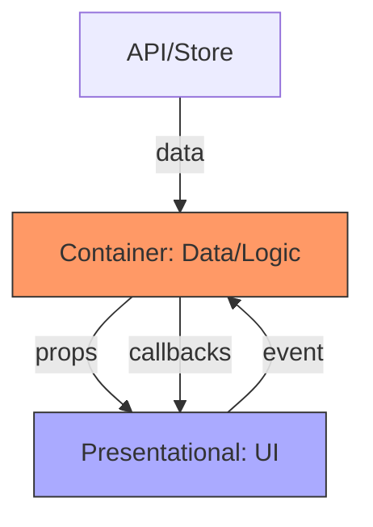

# Topic 27: Container / Presentational Pattern

## 1. PROBLEM
As React components grow, they often become "God Components" that handle everything: API calls, complex state transitions, data formatting, and UI styling. This makes the component impossible to test (because it requires an API) and impossible to reuse (because it's tied to a specific data source).

## 2. CONCEPT
Coined by Dan Abramov, this pattern splits a component into two parts:
1. **Container:** Concerned with **how things work**. It fetches data, handles state, and passes data/callbacks to its children. It usually doesn't have any styles or DOM markup of its own (except maybe a wrapping div).
2. **Presentational:** Concerned with **how things look**. It receives everything via props and renders the UI. It doesn't know about APIs, Redux, or business logic.

In modern React, **Custom Hooks** often take the place of Containers, but the conceptual split remains essential.

## 3. REAL-WORLD FRONTEND EXAMPLE
**A User Profile Page:** The `UserProfileContainer` fetches the user data from a GraphQL API and handles the "Edit" form submission. The `UserProfileView` (Presentational) just displays the name, avatar, and a "Save" button. You can easily test the `UserProfileView` by passing mock props, without needing a GraphQL server.

## 4. CODE EXAMPLE (React + TypeScript)
See [ContainerPresentationalExample.tsx](file:///c:/Users/tushar.seth/Desktop/LLD/Frontend%20Low%20Level%20Design/5.%20Frontend%20Patterns/27-ContainerPresentational/ContainerPresentationalExample.tsx) for the implementation.

```typescript
// Presentational
const Header = ({ title, onBack }) => (
  <nav>
    <button onClick={onBack}>Back</button>
    <h1>{title}</h1>
  </nav>
);

// Container
const NavigationContainer = () => {
  const history = useHistory();
  const title = getTitleFromUrl(window.location.href);
  return <Header title={title} onBack={() => history.goBack()} />;
};
```

## 5. WHEN TO USE
- When you want to reuse the same UI with different data sources.
- When you want to unit test UI components without complex mocks for APIs or stores.
- When your components are exceeding 150-200 lines and becoming "God Components."

## 6. WHEN NOT TO USE
- For small, simple components. Don't split a 20-line component into two 10-line files.
- If you find yourself "Prop Drilling" (passing data through 5 layers of presentational components). In that case, use **Context** or **Hooks**.

## 7. CONNECTS TO
- **Custom Hooks** (Hooks are the modern way to implement "Container" logic).
- **SRP (Single Responsibility)** (This pattern is the direct application of SRP to components).
- **DIP (Dependency Inversion)** (Presentational components depend on abstractions/props, not specific APIs).

## 8. INTERVIEW QUESTIONS

### BEGINNER
**Q: What is a "Presentational Component"?**
**Ideal Answer:** It is a component that only cares about the UI. It receives all its data and callbacks via props and doesn't have any dependencies on external data sources like APIs or state management stores.

### INTERMEDIATE
**Q: How do Custom Hooks change the Container/Presentational pattern?**
**Ideal Answer:** Hooks allow us to extract logic (the "Container" part) without creating a separate wrapper component. We still maintain the split: the Hook handles the logic, and the Component handles the UI. This results in a flatter component tree and more readable code.

### ADVANCED
**Q: You have a legacy app with "Higher-Order Components" (HOCs) acting as containers. How do you refactor them to a more modern pattern?**
**Ideal Answer:** I would extract the logic inside the HOC into a **Custom Hook**. Then, I would update the components to call that hook directly. This moves the logic from a "Wrapper" (HOC) to a "Consumer" (Hook) model, which is easier to follow and test.

### RAPID FIRE
1. **Q: Are Presentational components usually Functional components?** 
   A: Yes, they are almost always pure functions.
2. **Q: Can a Container have its own styles?** 
   A: Ideally no; it should delegate all styling to its presentational children.
3. **Q: Does this pattern help with performance?** 
   A: Yes, it makes it easier to use `React.memo` on presentational components because their props are explicit and simple.

---

## VISUALIZATION


