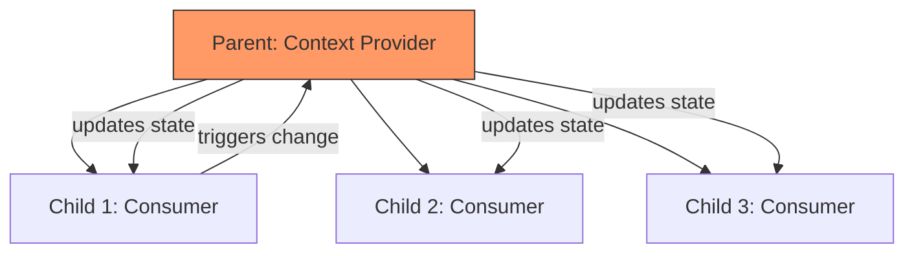

# Topic 28: Compound Component Pattern

## 1. PROBLEM
When building complex UI elements like Tabs or Select menus, you often end up with a single component that takes a massive "configuration" object as a prop.

```typescript
// Anti-pattern: "Prop Explosion"
<Tabs items={[{ title: 'T1', content: 'C1' }, { title: 'T2', content: 'C2' }]} />
```

This is inflexible. What if you want to add an icon to the second tab header? Or change the background of one specific tab content? You have to keep adding more props to the `items` object, making the API very hard to use.

## 2. CONCEPT
Compound components allow you to build a complex component from several smaller components that share state implicitly. Instead of one giant component, you provide a set of sub-components that the user can arrange as they see fit. This provides a highly declarative and flexible API.

In React, this is achieved using **React Context** to share state from the parent to the sub-components.

## 3. REAL-WORLD FRONTEND EXAMPLE
**UI Libraries (Reach UI, Radix UI):** Almost all modern UI libraries use this pattern. A `Menu` component consists of `Menu.Button`, `Menu.List`, and `Menu.Item`. The user decides where the list should appear and how the items should look, while the `Menu` parent handles the logic of opening/closing and keyboard navigation.

## 4. CODE EXAMPLE (React + TypeScript)
See [CompoundComponentExample.tsx](file:///c:/Users/tushar.seth/Desktop/LLD/Frontend%20Low%20Level%20Design/5. Frontend Patterns/28-CompoundComponent/CompoundComponentExample.tsx) for the implementation.

```typescript
// Clean, Declarative API
<Select>
  <Select.Label>Choose a fruit</Select.Label>
  <Select.Button />
  <Select.Option value="apple">Apple</Select.Option>
  <Select.Option value="orange">Orange</Select.Option>
</Select>
```

## 5. WHEN TO USE
- When building reusable UI components like Tabs, Accordions, Modals, or Selects.
- When you want to provide maximum flexibility to the developer using your component.
- When you want to avoid "Prop Explosion" and keep your component API clean.

## 6. WHEN NOT TO USE
- For simple components that only have one or two variations.
- If the sub-components are too tightly coupled and will *never* be rearranged.

## 7. CONNECTS TO
- **Provider Pattern** (Compound components use a Provider internally to share state).
- **Slot Pattern** (Both patterns focus on flexible content placement).
- **Composite Pattern** (Treating a group of components as a single unit).

## 8. INTERVIEW QUESTIONS

### BEGINNER
**Q: What is a Compound Component?**
**Ideal Answer:** It is a pattern where multiple components work together to form a single UI unit. They share state internally so the user doesn't have to pass props between them manually.

### INTERMEDIATE
**Q: How do you share state between sub-components in a Compound Component?**
**Ideal Answer:** Primarily using **React Context**. The parent component provides the state and update functions via a Context Provider, and the sub-components consume that context using `useContext`.

### ADVANCED
**Q: How do you handle "Sub-component Validation"? (e.g., ensuring `Select.Option` is only used inside `Select`)**
**Ideal Answer:** Inside the sub-component, I check if the context is `null`. If it is, it means the sub-component was rendered outside of its parent provider, and I throw a descriptive error: `Error: Select.Option must be used within a Select component.`

### RAPID FIRE
1. **Q: Does this pattern help with accessibility (A11y)?** 
   A: Yes, because the parent can handle complex keyboard navigation and ARIA attributes for all its children automatically.
2. **Q: Can you use `React.Children.map` instead of Context?** 
   A: Yes, but it only works for direct children. Context is much more flexible for deep nesting.
3. **Q: Is `Accordion.Header` a static property?** 
   A: Yes, assigning it to the `Accordion` object is a common convention to show they belong together.

---

## VISUALIZATION


