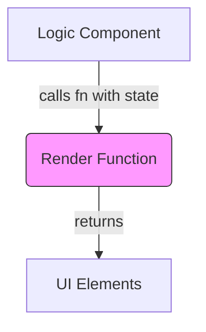

# Topic 29: Render Props Pattern

## 1. PROBLEM
You have logic that you want to share across multiple components (e.g., tracking mouse position, handling window resize, or managing a complex form state). Before Hooks existed, you either used HOCs (which caused "Wrapper Hell") or you were stuck repeating the logic. You need a way to encapsulate the logic but let the component decide what the UI should look like.

## 2. CONCEPT
A "render prop" is a prop on a component that is a function that returns a React element. The component calls this function instead of implementing its own render logic. This allows the component to "expose" its internal state or logic to the consumer.

## 3. REAL-WORLD FRONTEND EXAMPLE
**React Router:** In older versions, the `Route` component used a `render` prop: `<Route path="/home" render={(props) => <Home {...props} />} />`. The Route handled the matching logic, but you provided the component to show.
**Formik:** A popular form library that uses the render prop pattern to provide form state (`values`, `errors`, `touched`) to your custom form UI.

## 4. CODE EXAMPLE (React + TypeScript)
See [RenderPropsExample.tsx](file:///c:/Users/tushar.seth/Desktop/LLD/Frontend%20Low%20Level%20Design/5. Frontend Patterns/29-RenderProps/RenderPropsExample.tsx) for the implementation.

```typescript
<DataFetcher 
  url="/api/data" 
  render={(data) => <ul>{data.map(i => <li key={i.id}>{i.name}</li>)}</ul>} 
/>
```

## 5. WHEN TO USE
- When you want to share stateful logic between components.
- When you want to build a "Logic Provider" component that doesn't care about the UI.
- When you need more flexibility than a simple "Container/Presentational" split.

## 6. WHEN NOT TO USE
- In modern React, **Custom Hooks** have largely replaced the need for Render Props for logic sharing.
- If the render function becomes too large, it can make the JSX hard to read and debug.

## 7. CONNECTS TO
- **Custom Hooks** (The modern alternative).
- **HOCs (Higher-Order Components)** (The older alternative).
- **Strategy Pattern** (The render prop is essentially a "rendering strategy" passed to the component).

## 8. INTERVIEW QUESTIONS

### BEGINNER
**Q: What is a "Render Prop"?**
**Ideal Answer:** It is a prop that is a function. The component uses this function to render its UI, passing internal data or state back to the function as arguments.

### INTERMEDIATE
**Q: Why were Render Props preferred over HOCs?**
**Ideal Answer:** 
1. **No Prop Name Collisions:** HOCs can overwrite props if two HOCs use the same name. Render props are just function arguments, so you name them whatever you want.
2. **Clear Data Flow:** You can see exactly where the data is coming from in the JSX.
3. **No "Wrapper Hell":** You don't end up with 10 layers of components in your DevTools.

### ADVANCED
**Q: When would you still use a Render Prop instead of a Custom Hook?** [FIRE]
**Ideal Answer:** When the logic is tied to the **DOM**. For example, a "Tooltip" or "Dropdown" component might need to measure its position relative to a parent element using `refs`. Since refs are part of the rendering cycle, a Render Prop (or a Compound Component) can be more natural than a Hook, which would require multiple `useEffect` calls and state syncs.

### RAPID FIRE
1. **Q: Does the prop have to be named `render`?** 
   A: No, it can be named anything, including `children`.
2. **Q: Can you pass multiple render props?** 
   A: Yes (e.g., `renderHeader` and `renderFooter`).
3. **Q: Does a render prop create a new component?** 
   A: No, it's just a function call during the render phase of the existing component.

---

## VISUALIZATION


