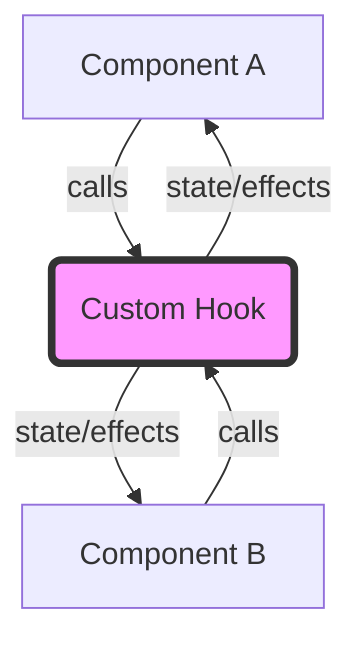

# Topic 30: Custom Hook Pattern

## 1. PROBLEM
Before Hooks (React 16.8), sharing stateful logic (like fetching data, subscribing to an event, or managing a timer) required complex patterns like HOCs or Render Props. These patterns often forced you to restructure your components, leading to "Wrapper Hell" and making the logic harder to follow.

## 2. CONCEPT
Custom Hooks allow you to extract component logic into reusable functions. A custom hook is just a JavaScript function whose name starts with ”use” and that may call other Hooks. It allows you to use React state and lifecycle features outside of a component, making the logic easy to test and share.

## 3. REAL-WORLD FRONTEND EXAMPLE
**`useAuth`:** A hook that checks if a user is logged in, manages the token in LocalStorage, and provides a `login()` and `logout()` function. Any component in the app can simply call `const { user, login } = useAuth()` to access authentication logic.

## 4. CODE EXAMPLE (React + TypeScript)
See [CustomHookExample.tsx](file:///c:/Users/tushar.seth/Desktop/LLD/Frontend%20Low%20Level%20Design/5. Frontend Patterns/30-CustomHook/CustomHookExample.tsx) for the implementation.

```typescript
const useFetch = (url) => {
  const [data, setData] = useState(null);
  useEffect(() => {
    fetch(url).then(res => res.json()).then(setData);
  }, [url]);
  return data;
};
```

## 5. WHEN TO USE
- When you want to share stateful logic between multiple components.
- When a component's logic is becoming too complex and needs to be broken down.
- When you want to create a clean, declarative API for a side effect (like `useMediaQuery` or `useDebounce`).

## 6. WHEN NOT TO USE
- For logic that doesn't use any React hooks (`useState`, `useEffect`, etc.). Just use a regular utility function.
- If the hook is only used in one component and is very simple. Over-extracting can make the code harder to navigate.

## 7. CONNECTS TO
- **SRP (Single Responsibility)** (Hooks allow you to isolate specific responsibilities).
- **Facade Pattern** (A custom hook acts as a facade over complex state/effect logic).
- **Observer Pattern** (Hooks often subscribe to external data sources and update the component).

## 8. INTERVIEW QUESTIONS

### BEGINNER
**Q: What are the two main rules of Hooks?**
**Ideal Answer:** 
1. Only call Hooks at the top level (don't call them inside loops, conditions, or nested functions).
2. Only call Hooks from React function components or custom Hooks.

### INTERMEDIATE
**Q: Does using a custom Hook share state between two components?**
**Ideal Answer:** No. Custom Hooks share **stateful logic**, not state itself. Each call to a Hook creates a completely isolated state. If two components use `useCounter()`, they each get their own independent count. To share state, you would need to use **Context** or a state management library.

### ADVANCED
**Q: How would you test a custom Hook that has no UI?**
**Ideal Answer:** I would use a library like `@testing-library/react-hooks`. It provides a `renderHook` function that allows you to "mount" the hook in a virtual component and inspect its return values and side effects without needing a real DOM.

### RAPID FIRE
1. **Q: Must a custom hook start with "use"?** 
   A: Yes, this is how ESLint knows to enforce the rules of hooks.
2. **Q: Can a hook return JSX?** 
   A: Technically yes, but it's generally considered bad practice. Hooks should return data or functions.
3. **Q: Can a hook call another hook?** 
   A: Yes, that is how they are composed!

---

## VISUALIZATION


