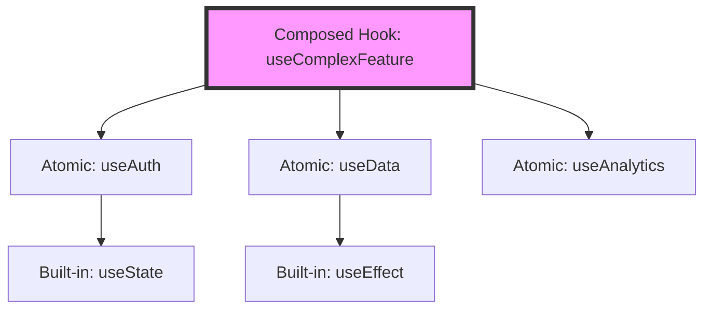

# Topic 31: Hook Composition Pattern

## 1. PROBLEM
As your application logic grows, even "Custom Hooks" can become massive "God Hooks" that are hard to test and maintain. If a `useUser` hook handles authentication, profile data fetching, and preference management all in one 300-line file, it becomes a maintenance nightmare.

## 2. CONCEPT
Hook Composition is the process of building complex hooks by combining smaller, "atomic" hooks. This is the logic-equivalent of the **Composite Pattern**. Each small hook handles one specific concern (SRP), and the composed hook coordinates them to provide a higher-level feature.

## 3. REAL-WORLD FRONTEND EXAMPLE
**`useForm`:** A complex form hook might be composed of:
- `useValidation`: Handles error states.
- `useSubmission`: Handles API calls and loading states.
- `useDirtyCheck`: Tracks if the user has changed anything.
The `useForm` hook just brings these together to provide a simple API to the component.

## 4. CODE EXAMPLE (React + TypeScript)
See [HookCompositionExample.tsx](file:///c:/Users/tushar.seth/Desktop/LLD/Frontend%20Low%20Level%20Design/5. Frontend Patterns/31-HookComposition/HookCompositionExample.tsx) for the implementation.

```typescript
const useAuthUser = () => {
  const { token } = useAuth(); // Atomic hook 1
  const { data } = useFetchUser(token); // Atomic hook 2
  const { log } = useLogger(); // Atomic hook 3

  useEffect(() => { log(data); }, [data]);

  return data;
};
```

## 5. WHEN TO USE
- When a custom hook exceeds 50-100 lines of code.
- When you find yourself repeating the same logic inside multiple custom hooks.
- When you want to make your logic highly testable by breaking it into small pieces.

## 6. WHEN NOT TO USE
- For very simple logic. Don't create three hooks if one 10-line hook does the job.
- **Over-abstraction:** If the chain of composition becomes so deep that it's hard to find where the actual `useState` or `useEffect` is happening.

## 7. CONNECTS TO
- **Composite Pattern** (Building complex things from simpler ones).
- **SRP (Single Responsibility)** (Each atomic hook has one job).
- **Facade Pattern** (The composed hook acts as a facade for the atomic ones).

## 8. INTERVIEW QUESTIONS

### BEGINNER
**Q: Can one custom hook call another custom hook?**
**Ideal Answer:** Yes! This is exactly what Hook Composition is. It's the standard way to build complex logic in modern React.

### INTERMEDIATE
**Q: What is the main benefit of composing hooks?**
**Ideal Answer:** Reusability and Testability. You can test each small hook independently, and you can reuse those small hooks in different combinations throughout your application.

### ADVANCED
**Q: How do you handle dependencies between composed hooks? (e.g., Hook B needs data from Hook A)**
**Ideal Answer:** You pass the output of Hook A as an argument to Hook B. This makes the dependency explicit and ensures that Hook B will re-run correctly whenever the data from Hook A changes (due to React's reactivity system).

### RAPID FIRE
1. **Q: Does hook composition affect performance?** 
   A: Minimally. React is very efficient at tracking hooks.
2. **Q: Can you compose built-in hooks?** 
   A: Yes, every custom hook is a composition of built-in hooks like `useState`.
3. **Q: Is there a limit to how many hooks you can compose?** 
   A: No technical limit, but keep it readable for your team!

---

## VISUALIZATION


