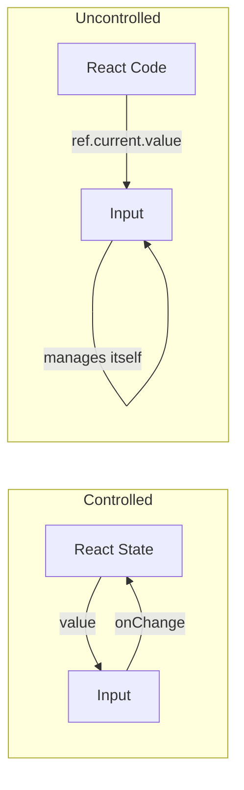

# Topic 32: Controlled vs Uncontrolled Components

## 1. PROBLEM
Forms are the most complex part of any frontend app. You have to decide whether React should be the "Single Source of Truth" for every keystroke, or if you should let the browser handle the input and only "pull" the data when you need it (e.g., on submit). Choosing the wrong one can lead to performance issues or buggy validation logic.

## 2. CONCEPT
- **Controlled Components:** React manages the state of the input. Every time the user types, an `onChange` handler updates a React state variable, which then updates the `value` prop of the input. React has full control.
- **Uncontrolled Components:** The DOM manages the state. You use a `ref` to access the value of the input when you need it. React doesn't know what's in the input until you ask the DOM.

## 3. REAL-WORLD FRONTEND EXAMPLE
**Search Bar:** A "Search-as-you-type" feature must be **Controlled** because you need the state to trigger API calls or filter a list on every keystroke.
**File Upload:** A `<input type="file" />` is always **Uncontrolled** because its value is read-only and can only be set by the user, not by React.

## 4. CODE EXAMPLE (React + TypeScript)
See [ControlledUncontrolledExample.tsx](file:///c:/Users/tushar.seth/Desktop/LLD/Frontend%20Low%20Level%20Design/5. Frontend Patterns/32-ControlledUncontrolled/ControlledUncontrolledExample.tsx) for the implementation.

```typescript
// Controlled
<input value={name} onChange={e => setName(e.target.value)} />

// Uncontrolled
<input ref={inputRef} />
const val = inputRef.current.value;
```

## 5. WHEN TO USE
### Controlled
- Instant field validation.
- Conditionally disabling the submit button based on input.
- Enforcing specific input formats (e.g., credit card masks).
- Syncing multiple inputs together.

### Uncontrolled
- Simple forms where you only care about the data on "Submit."
- Integrating with non-React libraries that manage their own DOM state.
- When performance is a bottleneck (avoiding re-renders on every keystroke for 100+ inputs).

## 6. WHEN NOT TO USE
- Don't use **Controlled** for massive forms with hundreds of inputs if you are experiencing lag (each keystroke re-renders the whole form).
- Don't use **Uncontrolled** if you need to respond to input changes immediately.

## 7. CONNECTS TO
- **Observer Pattern** (Controlled components observe state changes).
- **Memento Pattern** (Uncontrolled components can be "restored" using `defaultValue`).
- **Proxy Pattern** (Some form libraries use Proxies to make Controlled components more performant).

## 8. INTERVIEW QUESTIONS

### BEGINNER
**Q: What is a "Single Source of Truth" in a Controlled component?**
**Ideal Answer:** It means the React **State** is the only place where the current value of the input is stored. The DOM input element just displays what the state tells it to.

### INTERMEDIATE
**Q: How do you set a default value in an Uncontrolled component?**
**Ideal Answer:** You use the `defaultValue` prop instead of `value`. This tells the DOM what the initial value should be, but then lets the DOM handle it from there. Using `value` on an uncontrolled component without an `onChange` handler will make the input read-only and trigger a warning in React.

### ADVANCED
**Q: Why might you choose Uncontrolled components for performance optimization?** [FIRE]
**Ideal Answer:** In a Controlled component, every single keystroke triggers a re-render of the component (and potentially its children). In a large, complex form, this can lead to "input lag." By using Uncontrolled components with `refs`, the DOM handles the typing state, and React only re-renders when the final data is submitted or specifically requested, saving hundreds of unnecessary render cycles.

### RAPID FIRE
1. **Q: Can a component be both controlled and uncontrolled?** 
   A: No, it should be one or the other to avoid conflicting sources of truth.
2. **Q: Which is the "Recommended" way in React?** 
   A: React documentation recommends **Controlled** components for most cases.
3. **Q: Is `useRef` only for uncontrolled components?** 
   A: No, it has many uses, but it is the primary tool for accessing uncontrolled input values.

---

## VISUALIZATION


