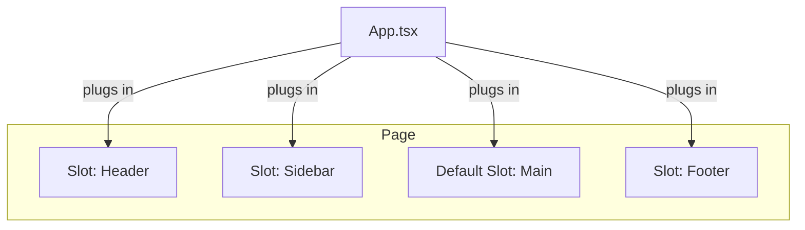

# Topic 33: Slot Pattern

## 1. PROBLEM
You have a reusable layout component (e.g., a `Card` or a `Modal`). You want to allow users to customize the header, the body, and the footer independently. If you only use `props.children`, all content is lumped together. If you use a single "config" prop, it becomes hard to pass complex JSX and components.

## 2. CONCEPT
The Slot pattern allows a component to define named "slots" (usually as props that accept `ReactNode`). The consumer can then "plug in" components or JSX into those specific locations. This is very similar to `<slot>` in Web Components or Vue.

In React, we simply use props like `header={...}` or `sidebar={...}`.

## 3. REAL-WORLD FRONTEND EXAMPLE
**A Data Table:** A table component might have slots for `header`, `footer`, and `rowAction`. This allows the user of the table to provide a custom search bar in the header and custom "Edit/Delete" buttons for every row without the Table component needing to know anything about them.

## 4. CODE EXAMPLE (React + TypeScript)
See [SlotExample.tsx](file:///c:/Users/tushar.seth/Desktop/LLD/Frontend%20Low%20Level%20Design/5. Frontend Patterns/33-Slot/SlotExample.tsx) for the implementation.

```typescript
const Card = ({ titleSlot, contentSlot, actionSlot }) => (
  <div className="card">
    <div className="title">{titleSlot}</div>
    <div className="content">{contentSlot}</div>
    <div className="actions">{actionSlot}</div>
  </div>
);
```

## 5. WHEN TO USE
- When building Layout components (Dashboards, Modals, Cards).
- When a component has multiple distinct areas for customization.
- To avoid deep "Prop Drilling" where you pass children through many layers.

## 6. WHEN NOT TO USE
- For simple components with only one content area. Just use `props.children`.
- If the slots require complex state sharing with the parent. In that case, **Compound Components** are a better fit.

## 7. CONNECTS TO
- **Compound Component Pattern** (Both patterns provide flexible UI, but Compound uses context for state sharing).
- **Render Props Pattern** (A slot can be a function/render prop if it needs data from the parent).
- **Template Method Pattern** (The component provides the template/structure, and slots provide the implementation).

## 8. INTERVIEW QUESTIONS

### BEGINNER
**Q: What is the "Slot" pattern in React?**
**Ideal Answer:** It's a pattern where a component accepts React elements as props (besides just `children`) and places them in specific "slots" within its layout.

### INTERMEDIATE
**Q: How does the Slot pattern improve "Composition"?**
**Ideal Answer:** It allows us to decouple the *structure* of a component from its *content*. The parent component doesn't need to know what a "Sidebar" or "Header" looks like; it just knows where to put them. This makes the parent much more reusable across different parts of the app.

### ADVANCED
**Q: Compare Slots and Compound Components.** [FIRE]
**Ideal Answer:** 
- **Slots** are best for **Layout and Structure**. They are simple props that place content. They don't easily share state with the parent.
- **Compound Components** are best for **Behavior and State**. They use Context to allow children to communicate with the parent and each other (like a Tab list and Tab panels). 
- Often, you will use both: a Slot for the layout and Compound Components for the logic.

### RAPID FIRE
1. **Q: Can a slot have a default value?** 
   A: Yes, you can provide a default component if the prop is not passed.
2. **Q: Is `children` a slot?** 
   A: Yes, it is the default, unnamed slot in React.
3. **Q: Can a slot be an array of components?** 
   A: Yes, you can pass an array of elements to a slot prop.

---

## VISUALIZATION


