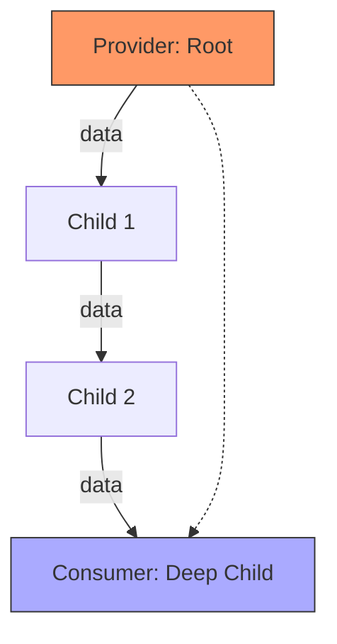

# Topic 34: Provider Pattern

## 1. PROBLEM
You have global data (e.g., the current User, a Theme, or a Language) that many components throughout the app need to access. If you pass this data down as props, you end up with **Prop Drilling**—passing the same data through 5 or 10 layers of components that don't actually use it themselves. This makes the code messy and very hard to refactor.

## 2. CONCEPT
The Provider pattern allows you to "provide" data at a high level in the component tree. Any component nested within that provider can then "consume" the data directly, regardless of how deep they are.

In React, this is implemented using `React.createContext()`, which gives you a `Provider` and a way to consume (usually via the `useContext` hook).

## 3. REAL-WORLD FRONTEND EXAMPLE
**Theming (Styled Components):** Libraries like Styled Components use the Provider pattern to give every styled component access to a central "Theme" object.
**Auth:** A `UserProvider` at the root of the app that holds the logged-in user's info and provides it to the Header, Profile, and Checkout pages.

## 4. CODE EXAMPLE (React + TypeScript)
See [ProviderExample.tsx](file:///c:/Users/tushar.seth/Desktop/LLD/Frontend%20Low%20Level%20Design/5. Frontend Patterns/34-Provider/ProviderExample.tsx) for the implementation.

```typescript
const App = () => (
  <AuthProvider>
    <Navigation />
    <MainContent />
  </AuthProvider>
);

const Profile = () => {
  const { user } = useContext(AuthContext);
  return <div>{user.name}</div>;
};
```

## 5. WHEN TO USE
- For truly "Global" or "App-wide" state.
- To avoid prop-drilling more than 2-3 levels deep.
- For static configurations that are shared by many components.

## 6. WHEN NOT TO USE
- For local component state. Don't use Context just to avoid passing props to a direct child.
- **Performance:** When the value in a Provider changes, **every** component that consumes that context will re-render. If you have a massive state object in a single provider, it can cause significant performance issues.

## 7. CONNECTS TO
- **Singleton Pattern** (Providers often provide a "Singleton" state or service to the tree).
- **Compound Component Pattern** (Compound components use a Provider internally).
- **Observer Pattern** (Consuming components "observe" changes in the provider).

## 8. INTERVIEW QUESTIONS

### BEGINNER
**Q: What is "Prop Drilling"?**
**Ideal Answer:** It is the process of passing data from a parent component down through multiple layers of children to reach a component that actually needs it. It's a problem because it makes components hard to reuse and the code hard to maintain.

### INTERMEDIATE
**Q: How does the Provider pattern solve Prop Drilling?**
**Ideal Answer:** By using React Context, the Provider "teleports" the data to any component that needs it. Components can just "reach up" and grab the data they need using `useContext`, skipping all the middle-man components.

### ADVANCED
**Q: How do you optimize a Provider to prevent unnecessary re-renders?** [FIRE]
**Ideal Answer:** 
1. **Split Contexts:** Instead of one giant `AppContext`, create smaller contexts (e.g., `UserContext`, `ThemeContext`). This ensures that a theme change doesn't re-render components only interested in the user.
2. **Memoization:** Ensure the `value` passed to the provider is memoized (using `useMemo`) so it doesn't create a new object reference on every render of the parent.

### RAPID FIRE
1. **Q: Can you have nested Providers?** 
   A: Yes, and children will consume from the "closest" provider above them.
2. **Q: Is Context a replacement for Redux?** 
   A: For simple global state, yes. For complex state with many updates and debugging needs, Redux/Zustand are still better.
3. **Q: Can a component consume multiple contexts?** 
   A: Yes, you can call `useContext` as many times as you need.

---

## VISUALIZATION


