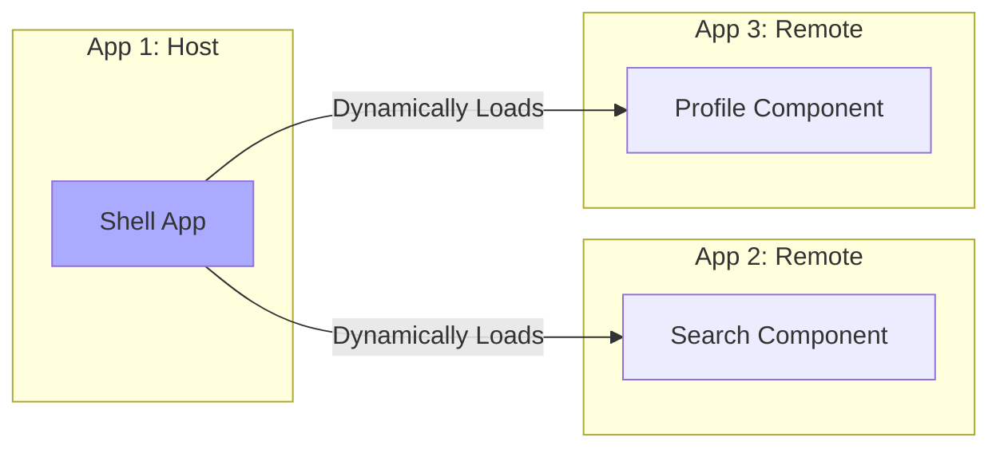

# Topic 35: Module Federation Pattern

## 1. PROBLEM
In large organizations, multiple teams work on different parts of a single application (e.g., Checkout, Search, Profile). In a traditional Monolith, if one team makes a change, the entire app must be rebuilt and redeployed. This slows down development and increases the risk of side effects. "Micro-frontends" solve this, but sharing common code (like a design system) between independent apps is historically very difficult.

## 2. CONCEPT
Module Federation (introduced in Webpack 5) allows a JavaScript application to dynamically load code from another application at runtime.
- **Host:** The main application that "consumes" remote modules.
- **Remote:** An independent application that "exposes" modules for others to use.
- **Shared:** Common libraries (like React) that both apps use. Module Federation ensures that only one copy of React is loaded in the browser.

## 3. REAL-WORLD FRONTEND EXAMPLE
**Amazon-like Site:** The "Product Page" is the **Host**. The "Recommendation Engine" is a **Remote** app managed by the Data Science team. The "Cart" is another **Remote** app managed by the Payments team. Each team can deploy their own app independently without touching the Product Page code.

## 4. CODE EXAMPLE (React + TypeScript)
See [ModuleFederationExample.tsx](file:///c:/Users/tushar.seth/Desktop/LLD/Frontend%20Low%20Level%20Design/5. Frontend Patterns/35-ModuleFederation/ModuleFederationExample.tsx) for the implementation.

```javascript
// webpack.config.js (Simplified)
new ModuleFederationPlugin({
  name: "app1",
  remotes: {
    app2: "app2@http://localhost:3002/remoteEntry.js",
  },
  shared: { react: { singleton: true }, "react-dom": { singleton: true } },
});
```

## 5. WHEN TO USE
- In large-scale applications with multiple autonomous teams.
- When you want to share a common Design System library across multiple independent apps.
- When you want to achieve independent deployment cycles for different features.

## 6. WHEN NOT TO USE
- For small apps or teams. It adds significant complexity to the build and deployment pipeline.
- If you don't have a strong DevOps/Infrastructure foundation to manage multiple independent deployments and versioning.

## 7. CONNECTS TO
- **Micro-frontends** (The architecture enabled by Module Federation).
- **Singleton Pattern** (Module Federation uses a singleton strategy for shared libraries like React).
- **Facade Pattern** (A Host app often uses a Facade to interact with multiple Remote modules).

## 8. INTERVIEW QUESTIONS

### BEGINNER
**Q: What is Module Federation?**
**Ideal Answer:** It's a feature that allows a JavaScript app to dynamically run code from another app at runtime. It's the modern way to build Micro-frontends.

### INTERMEDIATE
**Q: What are "Host" and "Remote" apps?**
**Ideal Answer:** The **Remote** app is the one that "exports" its components or logic. The **Host** app is the one that "imports" and uses those components. An app can be both a host and a remote at the same time.

### ADVANCED
**Q: How does Module Federation handle version conflicts in shared libraries?** [FIRE]
**Ideal Answer:** It uses a "Shared" configuration. You can specify `singleton: true`, which forces all apps to use the same version of a library (e.g., React). If versions differ, it uses "Semantic Versioning" (SemVer) to try and find a compatible version. If no compatible version is found, it can fall back to loading multiple versions (though this is bad for performance).

### RAPID FIRE
1. **Q: Is Module Federation specific to React?** 
   A: No, it works with any JavaScript framework (Vue, Angular, Vanilla JS).
2. **Q: Does it improve build times?** 
   A: Yes, because you only need to rebuild the specific micro-app that changed.
3. **Q: How is it different from an IFrame?** 
   A: IFrames are completely isolated. Module Federation allows apps to share memory, state, and libraries, making it much more integrated.

---

## VISUALIZATION


