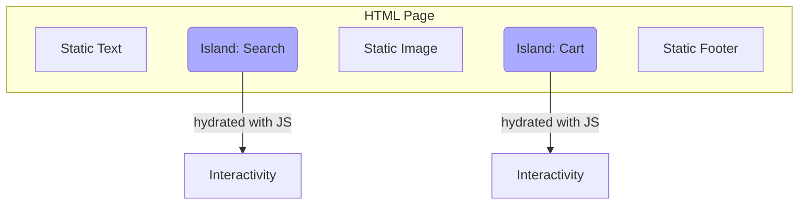

# Topic 36: Islands Architecture

## 1. PROBLEM
Modern "Single Page Applications" (SPAs) often ship a massive JavaScript bundle to the browser. Even if 90% of the page is static text, the browser has to download, parse, and execute the entire bundle before the page becomes interactive (this is called "Hydration"). This leads to poor performance, especially on mobile devices or slow networks.

## 2. CONCEPT
The Islands Architecture (popularized by **Astro** and **Fresh**) flips the SPA model. The entire page is rendered as static HTML on the server. Only specific, small areas that *require* interactivity are "hydrated" with JavaScript. These areas are called "Islands." The rest of the page remains pure HTML/CSS.

## 3. REAL-WORLD FRONTEND EXAMPLE
**A Blog Post:**
- The Article Text, Title, and Images are static HTML.
- The "Like" button is an **Island**.
- The "Comments" section is an **Island**.
- The "Newsletter Signup" is an **Island**.
Result: The user can read the article almost instantly because the main content requires 0KB of JavaScript.

## 4. CODE EXAMPLE (React + TypeScript)
See [IslandsArchitectureExample.tsx](file:///c:/Users/tushar.seth/Desktop/LLD/Frontend%20Low%20Level%20Design/5. Frontend Patterns/36-IslandsArchitecture/IslandsArchitectureExample.tsx) for the implementation.

```typescript
// Astro Example (Conceptual)
<html>
  <StaticHeader />
  <main>
    <ArticleContent /> <!-- Static HTML -->
    <Newsletter client:visible /> <!-- Island hydrated only when visible -->
  </main>
</html>
```

## 5. WHEN TO USE
- For content-heavy sites (Blogs, Portals, Documentation, E-commerce).
- When "Time to Interactive" (TTI) and "First Contentful Paint" (FCP) are critical for SEO or user experience.
- When you want to use different frameworks (React, Vue, Svelte) on the same page.

## 6. WHEN NOT TO USE
- For highly interactive web apps (like a Dashboard, a Google Sheet, or a Figma-like tool) where almost every element needs state and JS.
- If you don't have a Server-Side Rendering (SSR) setup.

## 7. CONNECTS TO
- **Module Federation** (Islands can be loaded from different remote sources).
- **Strategy Pattern** (Islands can use different hydration strategies: `onLoad`, `onVisible`, `onIdle`).
- **Component Pattern** (Each island is a self-contained component).

## 8. INTERVIEW QUESTIONS

### BEGINNER
**Q: What is an "Island" in this architecture?**
**Ideal Answer:** An island is a small, independent component on a page that is interactive (uses JavaScript), while the surrounding page content is just static HTML.

### INTERMEDIATE
**Q: How does Islands Architecture improve performance compared to standard SSR?**
**Ideal Answer:** Standard SSR still sends the entire JS bundle to the client to "hydrate" the whole page. Islands Architecture only sends JS for the specific interactive parts. This drastically reduces the JavaScript execution time on the client.

### ADVANCED
**Q: Explain "Partial Hydration."** [FIRE]
**Ideal Answer:** It is the process where only specific parts of the DOM tree are "attached" to React/JavaScript event listeners. In a traditional SPA, the entire tree is hydrated. In Islands/Partial Hydration, the framework only hydrates the "Islands," leaving the static parts untouched. This saves CPU and memory.

### RAPID FIRE
1. **Q: Does Islands Architecture help SEO?** 
   A: Yes, by providing fast-loading, pure HTML content for search engines to crawl.
2. **Q: Can islands share state?** 
   A: Yes, usually through external state stores (like Nano Stores) or Custom Events, as they don't share a single React root.
3. **Q: Is Astro the only framework for this?** 
   A: No, Fresh (Deno), Qwik, and Slinkity are other popular options.

---

## VISUALIZATION


