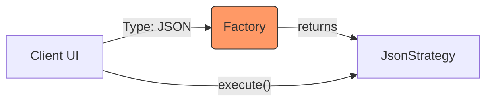

# Topic 37: Strategy + Factory Pattern

## 1. PROBLEM
You have multiple ways to perform a task (Strategies), and you need a clean way to select and create the correct strategy at runtime based on user input or configuration. If you put the creation logic and the algorithm logic in the same place, you violate SRP.

## 2. CONCEPT
- **Factory:** Responsible for the **Selection and Creation** of the strategy object.
- **Strategy:** Responsible for the **Implementation** of the algorithm.

By combining them, the client code becomes extremely clean. It just asks the Factory for a "Processor" and then tells that processor to "Process," without knowing which specific implementation it's using.

## 3. REAL-WORLD FRONTEND EXAMPLE
**File Uploader:** You support uploading to `S3`, `Google Cloud`, and `Local Server`.
1. The **Factory** looks at the app configuration and returns the correct `UploadStrategy`.
2. The **Strategy** handles the specific API calls and authentication for that provider.
3. The **Component** just calls `uploader.upload(file)`, making it completely provider-agnostic.

## 4. CODE EXAMPLE (React + TypeScript)
See [StrategyFactoryExample.tsx](file:///c:/Users/tushar.seth/Desktop/LLD/Frontend%20Low%20Level%20Design/6. Pattern Combinations/37-StrategyFactory/StrategyFactoryExample.tsx) for the implementation.

```typescript
// The Power of Combination
const strategy = PaymentFactory.get('paypal'); // Factory Creation
strategy.process(100); // Strategy Execution
```

## 5. WHEN TO USE
- When you have a set of interchangeable algorithms.
- When the logic to choose which algorithm to use is complex or depends on external configuration.
- When you want to follow OCP perfectly: add a new strategy and update the factory mapping, leaving the rest of the app untouched.

## 6. WHEN NOT TO USE
- If you only have one strategy.
- If the choice of strategy is trivial (e.g., a simple boolean).

## 7. CONNECTS TO
- **DIP (Dependency Inversion)** (The client depends on the Strategy interface).
- **SRP (Single Responsibility)** (Factory = Creation, Strategy = Execution).

## 8. INTERVIEW QUESTIONS

### BEGINNER
**Q: How do Factory and Strategy work together?**
**Ideal Answer:** The Factory is the "decider"—it picks the right tool for the job. The Strategy is the "tool"—it actually does the job.

### INTERMEDIATE
**Q: Why not just put the Factory logic inside the Strategy class?**
**Ideal Answer:** That would violate SRP. A strategy should only know how to perform its specific algorithm. It shouldn't know about other strategies or how to choose between them.

### ADVANCED
**Q: Design a "Validation Engine" using Strategy and Factory.** [FIRE]
**Ideal Answer:** I'd have a `ValidationFactory` that takes a field type (email, phone, password). It returns a `ValidatorStrategy` object. Each strategy has a `validate(value)` method. This allows me to dynamically get the right validator for any form field and execute it, making the form component very generic.

### RAPID FIRE
1. **Q: Does this combination reduce `if/else` in components?** 
   A: Yes, it moves them from the UI to the Factory.
2. **Q: Is this pattern common in enterprise apps?** 
   A: Yes, it's a standard for managing multiple integrations or variations.
3. **Q: Can the Factory return a Singleton Strategy?** 
   A: Yes, this is a very common optimization.

---

## VISUALIZATION


