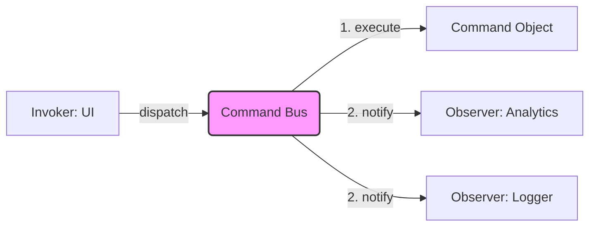

# Topic 38: Observer + Command Pattern

## 1. PROBLEM
You want to track every action a user takes in your app (for analytics or audit logs) without littering every button click with `trackAction()` calls. You need a centralized way to execute actions and automatically notify "watchers" that the action happened.

## 2. CONCEPT
- **Command:** Encapsulates the action (the "What").
- **Observer:** Notifies interested parties (the "Watchers") that a command has been executed.

When a command is dispatched, it is executed, and then all observers are notified of the command. This is excellent for decoupling side effects (like logging or analytics) from the main business logic.

## 3. REAL-WORLD FRONTEND EXAMPLE
**Redux DevTools:** When you dispatch an **Action** (Command), Redux performs the update, and the **DevTools** (Observer) is notified so it can update the state history and the UI timeline. The business logic (Reducers) doesn't know the DevTools exists.

## 4. CODE EXAMPLE (React + TypeScript)
See [ObserverCommandExample.tsx](file:///c:/Users/tushar.seth/Desktop/LLD/Frontend%20Low%20Level%20Design/6. Pattern Combinations/38-ObserverCommand/ObserverCommandExample.tsx) for the implementation.

```typescript
const commandBus = new CommandBus();
commandBus.subscribe(analyticsLogger); // Observer

const cmd = new PurchaseCommand(item); // Command
commandBus.dispatch(cmd); // Executes AND Notifies
```

## 5. WHEN TO USE
- When you need to centralize the execution of actions.
- When you want to add "Global Listeners" for specific types of actions (e.g., Toast notifications for every Error command).
- For building logging, analytics, or undo/redo systems.

## 6. WHEN NOT TO USE
- For simple component-level interactions.
- If the overhead of a central Command Bus is too much for a small application.

## 7. CONNECTS TO
- **Mediator Pattern** (The Command Bus acts as a Mediator).
- **Memento Pattern** (Observers can use Memento to save state after a command).

## 8. INTERVIEW QUESTIONS

### BEGINNER
**Q: What is the relationship between Command and Observer here?**
**Ideal Answer:** The Command is the message, and the Observer is the receiver. When a command is triggered, the system automatically sends a notification to all registered observers.

### INTERMEDIATE
**Q: How does this combination help with Analytics?**
**Ideal Answer:** Instead of adding analytics code inside every button or function, you just make every button dispatch a Command. You then have one `AnalyticsObserver` that listens to all commands and sends the relevant data to your server. This keeps your business logic clean.

### ADVANCED
**Q: Explain how this combination facilitates "Cross-Cutting Concerns."** [FIRE]
**Ideal Answer:** Cross-cutting concerns are features like Logging, Security, and Analytics that apply across the whole app. By combining Command and Observer, you create a "central pipe." You can plug in any number of observers to this pipe to handle these concerns without ever touching the actual feature code. This is a very clean implementation of the **Aspect-Oriented Programming (AOP)** concept.

### RAPID FIRE
1. **Q: Is this similar to Middleware?** 
   A: Yes, it provides a similar "hook" into the action lifecycle.
2. **Q: Can observers stop a command?** 
   A: Usually no; that would be the **Chain of Responsibility** pattern.
3. **Q: Is the Command Bus a Singleton?** 
   A: Usually yes, to ensure all parts of the app use the same bus.

---

## VISUALIZATION


