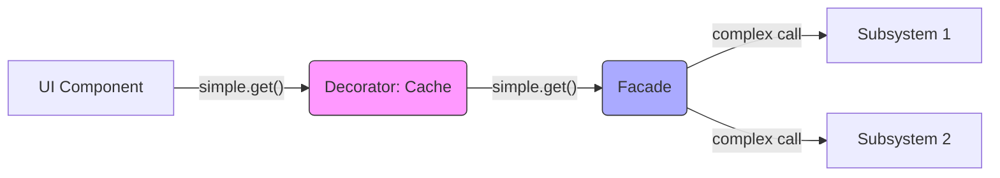

# Topic 39: Decorator + Facade Pattern

## 1. PROBLEM
You have a complex subsystem that you've simplified using a **Facade**. However, you now want to add "cross-cutting" features like caching, logging, or retry-logic. If you put this logic directly into the Facade, it becomes complex and bloated again, defeating the purpose of the Facade.

## 2. CONCEPT
- **Facade:** Provides a **simplified interface** to a complex system.
- **Decorator:** Adds **extra responsibilities** (caching, logging) to the Facade without changing its simple interface.

By combining them, you keep your API simple for the UI components while secretly adding powerful infrastructure features under the hood.

## 3. REAL-WORLD FRONTEND EXAMPLE
**The `Storage` Service:**
1. You have a `StorageFacade` that simplifies working with LocalStorage, SessionStorage, and Cookies.
2. You wrap it in a `withEncryptionDecorator` that automatically encrypts data before saving and decrypts after reading.
3. Your components just call `Storage.save('key', 'val')`, unaware that the data is being encrypted.

## 4. CODE EXAMPLE (React + TypeScript)
See [DecoratorFacadeExample.tsx](file:///c:/Users/tushar.seth/Desktop/LLD/Frontend%20Low%20Level%20Design/6. Pattern Combinations/39-DecoratorFacade/DecoratorFacadeExample.tsx) for the implementation.

```typescript
const api = withCaching(apiFacade); // Add caching to the simple interface
const data = await api.getUser(1); // Still a simple call!
```

## 5. WHEN TO USE
- When you have a Facade and want to add infrastructure features like Caching, Logging, or Metrics.
- When you want to keep the "Business Logic" (the Facade) separate from the "Infrastructure Logic" (the Decorators).
- When you want to toggle features (like logging) on and off at runtime by wrapping/unwrapping the facade.

## 6. WHEN NOT TO USE
- If the Facade is already doing everything it needs to do.
- If the decorators significantly change the interface (use an **Adapter** instead).

## 7. CONNECTS TO
- **Proxy Pattern** (A Decorator on a Facade is often implemented using a Proxy).
- **SRP (Single Responsibility)** (Facade = Interface simplification; Decorator = Infrastructure logic).

## 8. INTERVIEW QUESTIONS

### BEGINNER
**Q: What is a Facade vs a Decorator?**
**Ideal Answer:** A Facade makes a system *easier* to use. A Decorator makes a system *more powerful* by adding features.

### INTERMEDIATE
**Q: Why use a Decorator instead of just adding code to the Facade?**
**Ideal Answer:** To follow SRP and OCP. If you add logging to the Facade, you're changing the Facade's code. With a Decorator, you leave the Facade's code alone and just "wrap" it. This makes it easy to add or remove logging without risking bugs in the core Facade logic.

### ADVANCED
**Q: How would you implement a "Retry" mechanism for an API Facade using this pattern?** [FIRE]
**Ideal Answer:** I would create a `withRetry` decorator function. It would take the `ApiFacade` as an argument. It would return a new object with the same methods. Inside those methods, it would call the original facade's methods inside a `try/catch` block within a loop. If a call fails, it increments a counter and retries. This adds robust error handling to every API call while the UI remains blissfully unaware of the complexity.

### RAPID FIRE
1. **Q: Does the client know they are using a decorated facade?** 
   A: No, the interface should be identical.
2. **Q: Can you stack decorators on a facade?** 
   A: Yes! `withLogging(withCaching(UserFacade))`.
3. **Q: Is this pattern good for unit testing?** 
   A: Yes, you can test the facade alone, or test the decorators with a mock facade.

---

## VISUALIZATION


