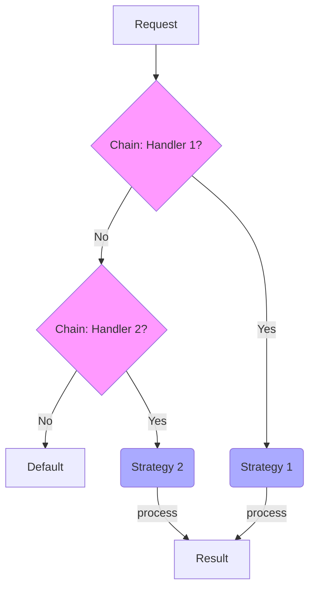

# Topic 40: Chain of Responsibility + Strategy Pattern

## 1. PROBLEM
You have a complex request that could be handled by many different handlers (e.g., an "Image Upload" system that handles PNG, JPG, GIF). Each format requires a completely different processing algorithm. If you put the "Which format is this?" logic and the "How to process JPG" logic in the same place, you get a giant, unmaintainable mess.

## 2. CONCEPT
- **Chain of Responsibility:** Responsible for **Routing** the request to the correct handler. Each link in the chain checks "Can I handle this?".
- **Strategy:** Responsible for the **Specific Algorithm** used once the correct handler is found.

This combination separates the "Who" from the "How." The Chain finds the expert, and the Expert uses their Strategy.

## 3. REAL-WORLD FRONTEND EXAMPLE
**A Dynamic Dashboard Widget System:**
1. You have a `WidgetChain` that looks at a widget's data type (`chart`, `table`, `news`).
2. The chain finds the correct `WidgetHandler`.
3. The `WidgetHandler` then uses a specific `RenderingStrategy` (e.g., `D3Strategy` for charts, `AgGridStrategy` for tables) to render the content.

## 4. CODE EXAMPLE (React + TypeScript)
See [ChainStrategyExample.tsx](file:///c:/Users/tushar.seth/Desktop/LLD/Frontend%20Low%20Level%20Design/6. Pattern Combinations/40-ChainStrategy/ChainStrategyExample.tsx) for the implementation.

```typescript
// The Chain routes
const handler = chain.findHandler(fileType);

// The Strategy executes
handler.useStrategy(uploadStrategy).execute(file);
```

## 5. WHEN TO USE
- When you have many potential handlers for a request and each handler uses a distinct algorithm.
- When you want to decouple the selection logic (the chain) from the processing logic (the strategies).
- When you want to easily add both new types of requests and new processing methods.

## 6. WHEN NOT TO USE
- If the routing logic and the algorithms are both simple.
- If the number of combinations is small (e.g., only 2 formats and 1 way to process each).

## 7. CONNECTS TO
- **Factory Pattern** (The Chain can use a Factory to create the strategies).
- **Template Method** (The Chain defines the sequence; Strategy provides the details).

## 8. INTERVIEW QUESTIONS

### BEGINNER
**Q: What is the difference between "Who" and "How" in this combination?**
**Ideal Answer:** The **Chain** decides "Who" (which handler) is responsible for the request. The **Strategy** decides "How" that handler actually performs the task.

### INTERMEDIATE
**Q: How does this combination improve "Maintainability"?**
**Ideal Answer:** If you want to add a new file format, you just add a new link to the **Chain**. If you want to change *how* an existing format is processed, you just update its **Strategy**. You never have to touch both at the same time, reducing the risk of regressions.

### ADVANCED
**Q: Design a "Payment Routing System" for an international E-commerce site.** [FIRE]
**Ideal Answer:** I'd have a `CurrencyChain`. Link 1 checks if the currency is `USD`, Link 2 checks for `EUR`, etc. Each link, once it matches the currency, uses a `PaymentStrategy` specific to that region (e.g., `StripeStrategy` for USD, `AdyenStrategy` for EUR). This allows the system to scale to hundreds of countries and dozens of payment providers without becoming a "God Object."

### RAPID FIRE
1. **Q: Does this combination use more memory?** 
   A: Yes, due to more objects/classes, but it's negligible compared to the maintenance benefits.
2. **Q: Can one handler use multiple strategies?** 
   A: Yes, it could choose a strategy based on another condition (like device type).
3. **Q: Is this pattern good for Middleware?** 
   A: Yes, especially if the middleware needs to perform different actions for different routes.

---

## VISUALIZATION


