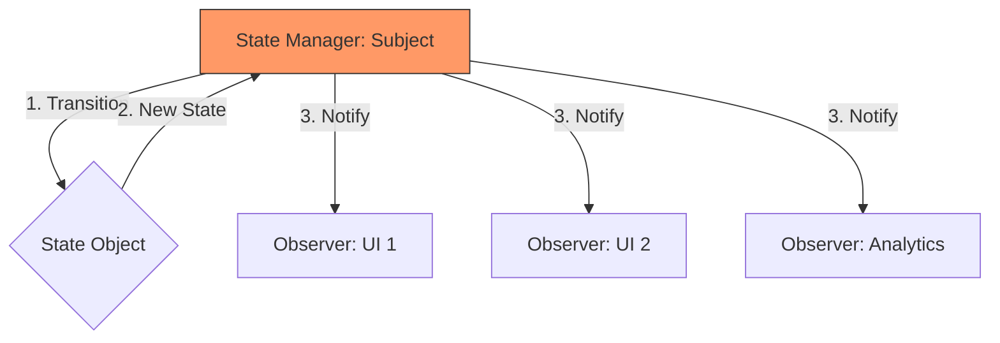

# Topic 41: State + Observer Pattern

## 1. PROBLEM
You have a complex state machine (e.g., a "User Onboarding" flow or a "Checkout" process). Many different UI components need to react whenever the state of that process changes. If the state machine has to manually tell every component to update, it becomes tightly coupled to the UI.

## 2. CONCEPT
- **State:** Manages the **Internal Logic** and transitions (e.g., what happens when you click "Next").
- **Observer:** Manages the **Communication**. Whenever the state transitions, all observers are automatically notified and receive the new state object.

This is the most powerful combination for building complex, reactive applications.

## 3. REAL-WORLD FRONTEND EXAMPLE
**XState with React:** A state machine (State Pattern) manages the complex logic of a multi-step form. The `useMachine` hook (Observer) subscribes the component to the machine. Every time the machine transitions to a new state, the component re-renders with the new state values.

## 4. CODE EXAMPLE (React + TypeScript)
See [StateObserverExample.tsx](file:///c:/Users/tushar.seth/Desktop/LLD/Frontend%20Low%20Level%20Design/6. Pattern Combinations/41-StateObserver/StateObserverExample.tsx) for the implementation.

```typescript
const machine = createStateMachine(); // State Pattern
machine.subscribe((state) => {        // Observer Pattern
  updateUI(state);
});
```

## 5. WHEN TO USE
- When you have a complex process with multiple states (Idle, Loading, Success, Error).
- When many independent components need to stay in sync with that process.
- When you want to decouple the state transition logic from the UI notification logic.

## 6. WHEN NOT TO USE
- For simple, local component state.
- If the state changes so frequently (e.g., mouse movement) that the observer notifications cause performance bottlenecks.

## 7. CONNECTS TO
- **Strategy Pattern** (States often use strategies to perform their specific tasks).
- **Mediator Pattern** (The State Manager acts as a Mediator between different states and their observers).

## 8. INTERVIEW QUESTIONS

### BEGINNER
**Q: How do State and Observer work together?**
**Ideal Answer:** The State pattern handles the "Rules" (what state comes next), and the Observer pattern handles the "News" (telling everyone that the state changed).

### INTERMEDIATE
**Q: Why use this combination instead of just a global variable?**
**Ideal Answer:** A global variable doesn't have "Behavior" (State pattern) and doesn't "Notify" (Observer pattern). By combining them, you get a system that is both smart (it knows the rules of the process) and reactive (it keeps the UI up to date).

### ADVANCED
**Q: Explain how a "Video Streaming" app would use this combination.** [FIRE]
**Ideal Answer:** 
- The **State Pattern** manages the playback status: `Playing`, `Paused`, `Buffering`, `Seeking`. Each state knows what to do (e.g., in `Buffering`, it shows a spinner; in `Playing`, it hides it).
- The **Observer Pattern** allows different parts of the app to listen: the `PlayButton` icon changes from a triangle to a square, the `Timeline` updates its progress, and the `Analytics` tracker records the viewing duration.
- When the buffer fills up, the `BufferingState` automatically transitions to `PlayingState`, and the `Observer` system tells all these components to update at once.

### RAPID FIRE
1. **Q: Is this pattern used in Redux?** 
   A: Yes, Redux reducers are a simplified State pattern, and the store subscription is the Observer pattern.
2. **Q: Does it prevent "Impossible States"?** 
   A: Yes, the State pattern ensures only valid transitions occur.
3. **Q: Can one state be observed by multiple components?** 
   A: Yes, that is the primary goal of the Observer part.

---

## VISUALIZATION


